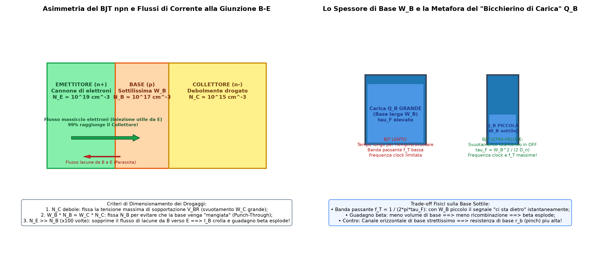

Il **Transistore Bipolare a Giunzione (BJT)** è un dispositivo a tre terminali (Emettitore, Base, Collettore) basato sull'iniezione e sul trasporto di portatori minoritari attraverso una base sottilissima.
Nelle tecnologie integrate, l'integrazione di BJT con transistori [MOS](./MOS.md) dà origine alla famiglia **BiCMOS**.

---

### 1. Asimmetria Strutturale e Criterio di Progettazione dei Drogaggi

Un BJT reale $npn$ è fortemente **asimmetrico**: le due giunzioni $E-B$ e $B-C$ hanno profili di drogaggio e compiti fisici completamente diversi.



#### La sequenza di dimensionamento: Si parte dal Collettore
Quando si progetta un BJT, il dimensionamento segue una logica ingegneristica precisa a ritroso:

1. **Il Collettore ($N_C$ poco drogato) fissa la Tensione di Sopportazione:**
   Il cliente impone la massima tensione inversa di rottura $V_{BR}$ che il componente deve reggere a riposo.
   Poiché la larghezza della regione di svuotamento vale:
   $$W \approx \sqrt{\frac{2\epsilon V_R}{q} \left(\frac{1}{N_B} + \frac{1}{N_C}\right)}$$
   con $N_B \gg N_C$, la formula dipende quasi unicamente da $N_C$:
   $$W_C \approx \sqrt{\frac{2\epsilon V_R}{q N_C}}$$
   Si sceglie un drogaggio di collettore **molto debole ($N_C$ basso, circa $10^{15}\text{ cm}^{-3}$)**: in questo modo la zona di svuotamento si allarga quasi tutta nel collettore, sopportando forti tensioni senza arrivare al [Breakdown](./Breakdown%20e%20Diodo%20Zener.md) per valanga o tunnel.

2. **La Base ($N_B$ drogaggio intermedio) evita il Punch-Through:**
   Per il principio di neutralità di carica all'interfaccia, la carica svuotata nella base deve eguagliare quella nel collettore:
   $$W_B \cdot N_B = W_C \cdot N_C$$
   Drogando la base in modo intermedio ($N_B \approx 10^{17}\text{ cm}^{-3}$), la regione di svuotamento entra solo marginalmente nella base, evitando che la "mangi" tutta fino a toccare l'emettitore (fenomeno distruttivo del **Punch-Through**).

3. **L'Emettitore ($N_E$ iper-drogato $\approx 100 \times N_B$) massimizza il Guadagno $\beta$:**
   L'emettitore è il **"cannone" che deve sparare cariche**. 
   Nella giunzione $B-E$ polarizzata in diretta si hanno due correnti contrapposte:
   * Il **flusso utile di elettroni** iniettati dall'Emettitore verso la Base.
   * Il **flusso parassita di lacune** che dalla Base entrano nell'Emettitore.
   
   Le lacune che scappano dalla base devono essere reintegrate dal contatto metallico di base, aumentando la corrente di ingresso $I_B$ e abbattendo il guadagno di corrente $\beta = \frac{I_C}{I_B}$.
   Drogando l'emettitore **100 volte più della base ($N_E \approx 10^{19}\text{ cm}^{-3}$)**, il 99% della corrente è composto esclusivamente da elettroni: $I_B$ diventa minuscola e il guadagno $\beta$ sale oltre 100!

---

### 2. Spessore della Base ($W_B$): Velocità, Guadagno e la Metafora del Bicchierino

Lo spessore della base $W_B$ è il parametro più critico di tutto il transistore:

* **Tempo di transito in base ($\tau_F$) e Banda Passante ($f_T$):**
  Le cariche attraversano la base per pura diffusione in un tempo medio:
  $$\tau_F \approx \frac{W_B^2}{2 D_n}$$
  La frequenza di taglio (banda passante) vale $f_T \approx \frac{1}{2\pi \tau_F}$. Se dimezziamo $W_B$, il tempo di transito si riduce di **4 volte**, permettendo all'amplificatore di "starci dietro" con segnali ad altissima frequenza.
* **Velocità di Clock nel Digitale (La Metafora del Bicchierino):**
  Quando il BJT è acceso (stato ON), nella base è immagazzinata una carica di portatori minoritari pari a $Q_B = I_C \cdot \tau_F$.
  * Per accendere il transistore c'è un **"bicchierino di carica" da riempire**.
  * Per spegnerlo (stato OFF) bisogna **svuotare completamente il bicchierino**.
  * Più $W_B$ è sottile, più il bicchierino $Q_B$ è microscopico, consentendo tempi di commutazione ON/OFF ultra-rapidi per elevate frequenze di clock.
* **Guadagno di corrente ($\beta$):**
  In una base sottilissima, i portatori arrivano al collettore quasi all'istante: la probabilità di ricombinarsi con le lacune è quasi nulla $\implies \beta$ esplode.
* **I Contro (Trade-off):**
  Poiché la base è uno strato ultra-sottile, la corrente di base che deve muoversi orizzontalmente per raggiungere il contatto metallico trova un canale molto stretto: la **resistenza serie di base $r_b$ (*base pinch resistance*) aumenta**, peggiorando il rumore termico e la tensione di Early $V_A$.

---

### 3. BJT Verticale vs BJT Laterale (Perché vince il Verticale?)

Nelle tecnologie planari sul silicio (BiCMOS) il transistore bipolare può essere realizzato in due configurazioni strutturali:

```
A) BJT NPN VERTICALE:
       S          C          B          E          B          C
       │          │          │          │          │          │
   ┌───┴───┐  ┌───┴───┐  ┌───┴───┐  ┌───┴───┐  ┌───┴───┐  ┌───┴───┐
   │  p+   │  │  n+   │  │   p   │  │  n+   │  │   p   │  │  n+   │
   └───────┘  └───┬───┘  └───┬───┘  └───┬───┘  └───┬───┘  └───┬───┘
                  │          │          │          │          │
                  │          └──────────┼──────────┘          │
                  │               Base p superficiale          │
                  │                     │                     │
                  └──────────────► Pozzo n- (Collettore) ◄─────┘
                  ┌───────────────────────────────────────────┐
                  │          n+ Buried Layer (Autostrada)     │
                  └───────────────────────────────────────────┘
                               Substrato p (S)

B) BJT PNP LATERALE:
       S          B          C          E          C          B
       │          │          │          │          │          │
   ┌───┴───┐  ┌───┴───┐  ┌───┴───┐  ┌───┴───┐  ┌───┴───┐  ┌───┴───┐
   │  p+   │  │  n+   │  │   p   │  │   p   │  │   p   │  │  n+   │
   └───────┘  └───┬───┘  └───┬───┘  └───┬───┘  └───┬───┘  └───┬───┘
                  │       Collettore   Emettitore Collettore   │
                  │            │            │          │       │
                  │            └──────◄ ◄ ──┴── ► ► ───┘       │
                  │               Corrente laterale            │
                  └──────────────►  Pozzo n- (Base)  ◄─────────┘
                  ┌───────────────────────────────────────────┐
                  │          n+ Buried Layer (Schermo)        │
                  └───────────────────────────────────────────┘
                               Substrato p (S)
```

1. **BJT NPN Verticale (Il Vincitore assoluto):**
   * **Flusso cariche:** dall'alto verso il basso (perpendicolare alla superficie) attraverso la Base $p$ fino al Collettore $n^-$.
   * **Controllo dello spessore $W_B$:** è determinato dalla differenza di profondità tra l'impianto ionico di base e quello di emettitore, regolato termicamente nei forni di diffusione.
   * Si possono realizzare basi spesse **poche decine di nanometri con precisione atomica**, ottenendo $\tau_F$ minuscolo, altissima frequenza $f_T$ ed elevato guadagno $\beta$.
   * **Strato sepolto ($n^+$ buried layer):** fa da "autostrada" a resistenza quasi nulla per raccogliere gli elettroni e deviarli verso i contatti $C$, abbattendo $R_C$.
2. **BJT PNP Laterale:**
   * **Flusso cariche:** orizzontale/laterale tra l'Emettitore centrale ($p$) e il Collettore circostante ($p$) attraverso la Base ($n\text{-well}$).
   * **Controllo dello spessore $W_B$:** è fissato dalla **distanza fotolitografica tra le maschere** ($\lambda$). La base è inevitabilmente più larga rispetto a quella verticale $\implies$ tempo di transito più lungo, maggior ricombinazione e guadagno $\beta$ più modesto.
   * **Ruolo dello strato sepolto ($n^+$ buried layer):** agisce da **schermo elettrostatico**: impedisce alle lacune dell'Emettitore di essere iniettate verticalmente nel substrato $p$, sopprimendo il parassita verticale verso massa.

👉 Per il confronto globale tra le tecnologie: [Confronto Tecnologie CMOS e BiCMOS](../Tecnologia%20e%20Fabbricazione/Confronto%20Tecnologie%20CMOS%20e%20BiCMOS.md).

---

### 4. Tecnologia BiCMOS: Fake BiCMOS vs Real BiCMOS

La tecnologia **BiCMOS** integra transistori bipolari BJT e transistori [MOS](./MOS.md) sullo stesso chip, unendo l'elevata velocità e capacità di pilotaggio del BJT con i consumi statici quasi nulli del CMOS.

#### A. Fake BiCMOS (A costo zero, ma prestazioni scarse)
* Si realizza il BJT verticale **utilizzando esclusivamente le maschere del processo CMOS standard**: l'$n\text{-well}$ fa da Collettore, la $p\text{-base}$ da Base, e l'impianto $n^+$ da Emettitore.
* **Problema gravissimo:** l'$n\text{-well}$ ha un drogaggio moderato/basso ($n^-$). La corrente iniettata dall'emettitore scende verso il basso, deve percorrere un lungo tragitto orizzontale nel silicio debolmente drogato e risalire verso il contatto di collettore.
* **Conseguenza:** la **resistenza serie di collettore $R_C$ è altissima**. Il transistore satura subito sotto carico e la costante $R_C C$ ne devasta la velocità.
  👉 Approfondimento: [Difficoltà nel fare un componente ideale](../Scaling%20e%20Limiti%20Fisici/Difficolt%C3%A0%20nel%20fare%20un%20componente%20ideale.md)

#### B. Real BiCMOS (Maschere dedicate per abbattere $R_C$)
Per ottenere BJT ad alte prestazioni si aggiungono passi di processo dedicati:
1. **Strato Sepolto ($n^+$ Buried Layer):** prima di crescere lo strato epitassiale, si esegue un impianto ionico ad altissima energia per creare una lamina sepolta $n^+$ altamente conduttiva sul fondo. La corrente scende da $E$ e trova subito un'autostrada a resistenza quasi nulla.
2. **Pozzo Profondo di Collettore / Sinker a "Imbuto" (Slide 136):**
   Per collegare il contatto metallico superficiale di Collettore ($C$) allo strato sepolto senza ripassare dalla $n\text{-well}$ poco drogata, si realizza un plug verticale fortemente drogato $n^+$ (spesso tramite deposizione di polisilicio conduttivo o diffusione profonda ad alta dose).
   Questo "imbuto" conduttivo garantisce una resistenza serie $R_C$ quasi nulla.

---

### 5. Il BJT Connesso a Diodo

Cortocircuitando Base e Collettore ($V_{BC} = 0$), il BJT si comporta come un [Diodo](./Diodo.md) a due terminali ideale con **fattore di idealità $\eta \approx 1.00$ costante su 6-8 decadi di corrente**.
* Le cariche ricombinate escono dal morsetto di Base ($I_B$).
* Al Collettore viene raccolta esclusivamente la corrente di diffusione pura $I_C = I_S e^{V_{BE}/V_T}$.
* La struttura verticale colloca la giunzione attiva nel bulk monocristallino profondo, lontano dai difetti reticolari dell'ossido superficiale.
👉 Per l'analisi completa: [Diodo](./Diodo.md).

---

*Pagine correlate:*
- [TTL (Transistor-Transistor Logic)](../Famiglie%20Logiche/TTL%20%28Transistor-Transistor%20Logic%29.md)
- [ECL (Emitter-Coupled Logic)](../Famiglie%20Logiche/ECL%20%28Emitter-Coupled%20Logic%29.md)
- [DCTL e Current Hogging](../Famiglie%20Logiche/DCTL%20e%20Current%20Hogging.md)
- [I2L (Integrated Injection Logic)](../Famiglie%20Logiche/I2L%20%28Integrated%20Injection%20Logic%29.md)
- [DTL (Diode-Transistor Logic)](../Famiglie%20Logiche/DTL%20%28Diode-Transistor%20Logic%29.md)
- [HTL (High-Threshold Logic)](../Famiglie%20Logiche/HTL%20%28High-Threshold%20Logic%29.md)
- [RTL e Prodotto Ritardo-Consumo (PDP)](../Famiglie%20Logiche/RTL%20e%20Prodotto%20Ritardo-Consumo%20%28PDP%29.md)
- [Famiglia Logica e Costo per Bit](../Famiglie%20Logiche/Famiglia%20Logica%20e%20Costo%20per%20Bit.md)
- [Soglia Logica e Margine di Rumore](../Famiglie%20Logiche/Soglia%20Logica%20e%20Margine%20di%20Rumore.md)
- [Caratteristica di Trasferimento e Rigenerazione](../Famiglie%20Logiche/Caratteristica%20di%20Trasferimento%20e%20Rigenerazione.md)
- [Diodo](./Diodo.md)
- [Breakdown e Diodo Zener](./Breakdown%20e%20Diodo%20Zener.md)
- [MOS](./MOS.md)
- [Difficoltà nel fare un componente ideale](../Scaling%20e%20Limiti%20Fisici/Difficolt%C3%A0%20nel%20fare%20un%20componente%20ideale.md)
- [Siliciuro](../Tecnologia%20e%20Fabbricazione/Siliciuro.md)
- [Vias](../Tecnologia%20e%20Fabbricazione/Vias.md)
- [Resistore](./Resistore.md)
- [Condensatori](./Condensatori.md)
- [Analogico non si scende di dimensioni](../Scaling%20e%20Limiti%20Fisici/Analogico%20non%20si%20scende%20di%20dimensioni.md)
- [Rapporto Ion Ioff e sottosoglia](../Effetti%20di%20Canale%20Corto/Rapporto%20Ion%20Ioff%20e%20sottosoglia.md)
- [Confronto Tecnologie CMOS e BiCMOS](../Tecnologia%20e%20Fabbricazione/Confronto%20Tecnologie%20CMOS%20e%20BiCMOS.md)
