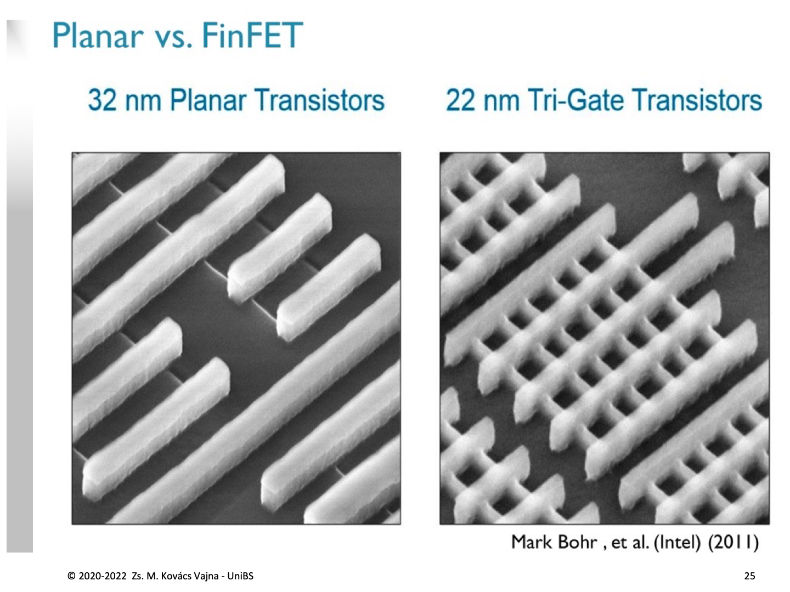
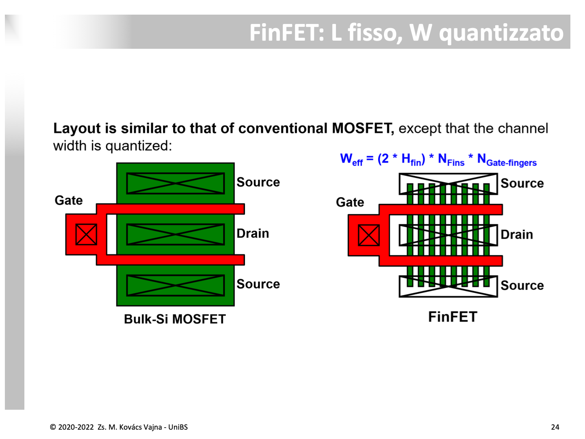
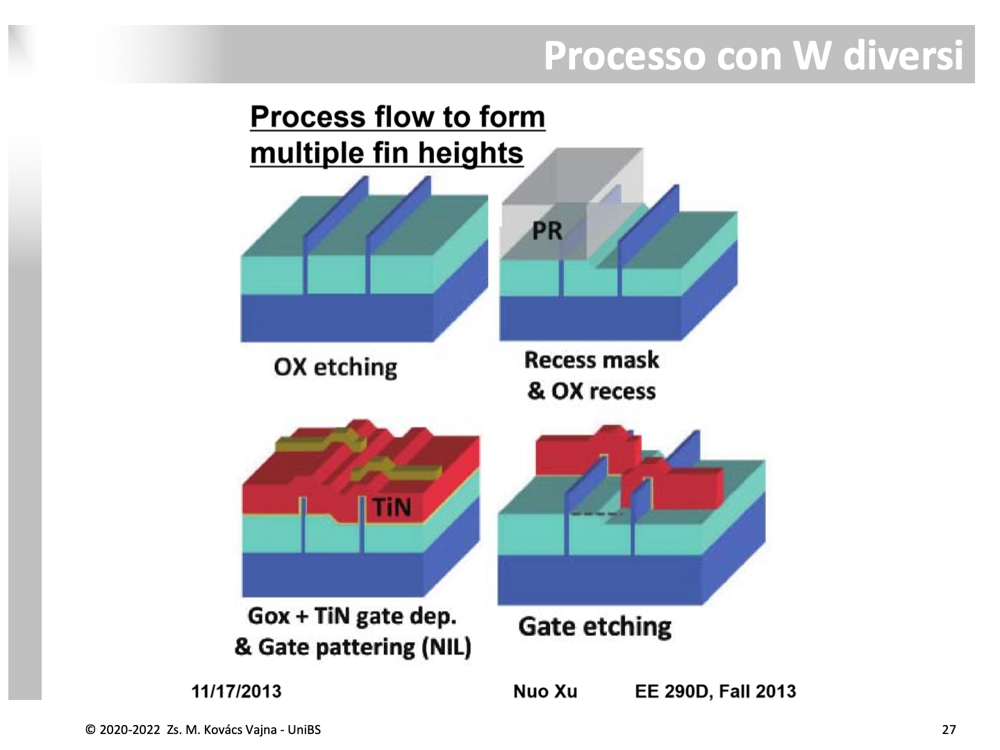
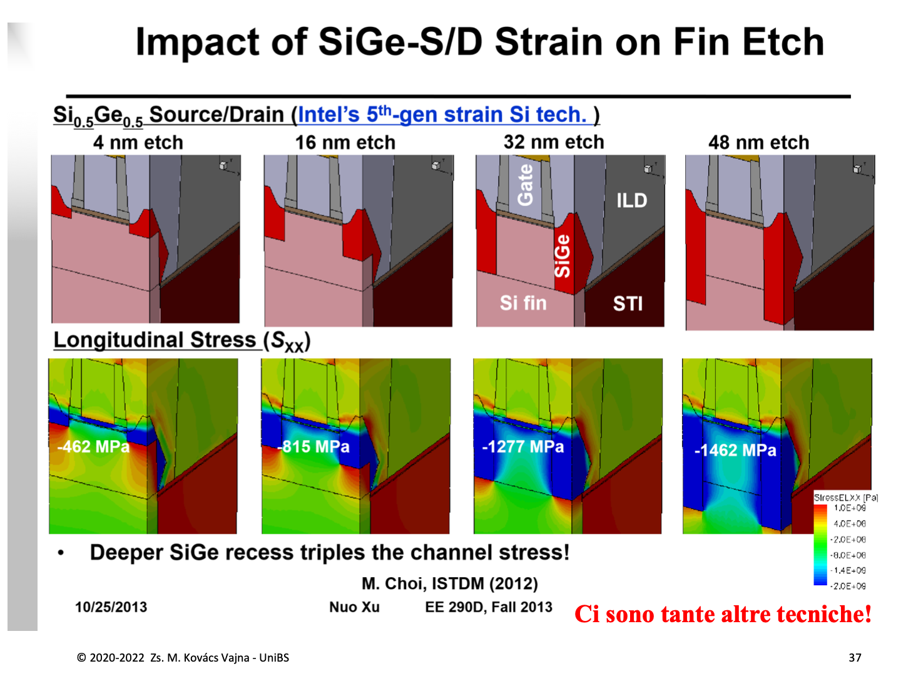

Il transistore **FinFET** (*Fin Field-Effect Transistor*, noto anche commercialmente come **Tri-Gate**) rappresenta la rivoluzione architetturale che ha permesso alla microelettronica di superare il limite fisico dei $22\,\text{nm}$, mandando in pensione il classico MOSFET planare massivo (*bulk*).

Il principio cardine del FinFET è la transizione da una conduzione bidimensionale (piatta) a una **struttura tridimensionale a pinna (Fin)**, in cui il canale di silicio si erge verticalmente dal substrato ed è **abbracciato dal Gate su tre lati** (destra, sinistra e sommità).



---

### 1. Perché sono stati introdotti i FinFET? («A parità di che roba?»)

La domanda ingegneristica fondamentale è: *cosa guadagniamo passando da un transistore piatto a uno 3D?*

#### A. A parità di impronta a terra (*Footprint*): Canale triplicato ($W \times 3$)
Nei MOS planari tradizionali, se si desidera raddoppiare o triplicare la corrente $I_{ON}$, occorre allargare la larghezza $W$ del canale disegnato sul silicio, occupando più superficie orizzontale di chip.

Nel FinFET, invece, il canale si sviluppa in **altezza**:
* A terra, la pinna occupa una larghezza microscopica: solo il suo spessore fisico $W_{\text{fin}}$ (circa $6 - 10\,\text{nm}$).
* La corrente utile scorre però su **tre superfici**: le due pareti laterali verticali (ciascuna di altezza $H_{\text{fin}}$) più la faccia superiore ($W_{\text{fin}}$).
* La **larghezza efficace di canale** per ogni singola pinna è:
  $$W_{\text{eff}} = 2 \cdot H_{\text{fin}} + W_{\text{fin}}$$
  *(Se la sommità della pinna è isolata da un hard mask spesso, il dispositivo agisce come Double-Gate puro con $W_{\text{eff}} = 2 H_{\text{fin}}$).*

```
   MOS PLANARE (2D)                        FinFET TRI-GATE (3D)
 (Largo W sul silicio)                 (Impronta a terra: solo Wfin!)

       Gate                                      Gate
   ┌───────────┐                              ┌──────────┐
───┴───────────┴───                           │  ┌────┐  │ ◄── 2 pareti verticali
     Canale (W)                               │  │Fin │  │     di altezza Hfin
   ─────────────                              │  │(Si)│  │
     Substrato                                │  └────┘  │ ◄── Larghezza Wfin a terra
                                              └────┬─────┘
                                             Substrato / STI
```

**Esempio numerico:**
Se la pinna è alta $H_{\text{fin}} = 42\,\text{nm}$ ed è spessa a terra $W_{\text{fin}} = 8\,\text{nm}$:
$$W_{\text{eff}} = 2 \times 42\,\text{nm} + 8\,\text{nm} = \mathbf{92\,\text{nm}}$$
Sul chip si occupa una striscia di soli **$8\,\text{nm}$**, ma elettricamente il transistore guida corrente come se fosse largo **$92\,\text{nm}$**! 
A parità di area di chip, il FinFET eroga una corrente di ON ($I_{ON}$) enormemente superiore (**densità di corrente 3D**).

#### B. Abbattimento dei Consumi (Scaling aggressivo di $V_{DD}$)
Grazie al controllo elettrostatico su tre lati, il fattore di sottosoglia scende a $m \to 1$ e il [Subthreshold Swing](../Effetti%20di%20Canale%20Corto/Rapporto%20Ion%20Ioff%20e%20sottosoglia.md) raggiunge i $62 - 65\,\text{mV/dec}$ (contro gli $85 - 100\,\text{mV/dec}$ dei planari).
* Una pendenza così ripida permette di abbassare la tensione di soglia ($V_{\text{th}} \approx 0.25 - 0.3\,\text{V}$) mantenendo correnti di riposo $I_{\text{OFF}}$ bassissime.
* Con una soglia bassa, la tensione di alimentazione può essere abbassata a **$V_{DD} = 0.7 - 0.8\,\text{V}$** (rispetto a $1.0 - 1.2\,\text{V}$ del planare).
* Poiché la potenza dinamica scala con il quadrato della tensione ($P_{\text{dyn}} \propto V_{DD}^2$), questo garantisce un **risparmio energetico fino al $50\%$ a parità di velocità di calcolo**.

---

### 2. Il Superamento dei Limiti del MOS Planare

Sotto i $25\,\text{nm}$, il MOSFET planare massivo è andato incontro a un vicolo cieco:

1. **Soppressione del [DIBL](../Effetti%20di%20Canale%20Corto/DIBL.md) e del Punch-Through:**
   * Nel planare le linee di campo elettrico del Drain passano attraverso il substrato profondo al di sotto della superficie (*sub-surface leakage*), abbassando la barriera del Source da sotto.
   * Nel FinFET, il canale è una lamina sottilissima di silicio stretta in una morsa dal Gate metallico: **non esiste alcun percorso sotterraneo non schermato**. Le linee di campo del Drain vengono intercettate ed eliminate dal Gate.
2. **Canale Non Drogato (*Undoped Channel*) e Fine dell'RDF:**
   * Nei planari, per contrastare il DIBL bisognava drogare ferocemente il canale ($N_A > 10^{18}\,\text{cm}^{-3}$), causando un crollo della mobilità ($\mu \downarrow$) per scattering coulombiano e gravi problemi di variabilità statistica da droganti casuali (**RDF - *Random Dopant Fluctuation***, dove pochi atomi di differenza tra due transistor vicini sballano $V_{\text{th}}$).
   * Nel FinFET, grazie all'eccellente accoppiamento elettrostatico, **il silicio della pinna è intrinseco (non drogato)**:
     * Zero ioni droganti $\implies$ **mobilità dei portatori $\mu$ massima**.
     * Zero atomi casuali $\implies$ **variabilità statistica di $V_{\text{th}}$ quasi azzerata**.

---

### 3. La Quantizzazione della Larghezza $W$

Nel layout dei FinFET, la larghezza del canale **non è più una variabile continua** selezionabile liberamente dal progettista:



Dato che ogni pinna fornisce un contributo fisso di larghezza pari a $2 H_{\text{fin}} + W_{\text{fin}}$, la larghezza totale di un transistor a $N_{\text{fins}}$ pinne e $N_{\text{fingers}}$ dita di gate vale:
$$W_{\text{eff}} = (2 \cdot H_{\text{fin}} + W_{\text{fin}}) \cdot N_{\text{fins}} \cdot N_{\text{gate-fingers}}$$

* La corrente può essere aumentata solo a "scatti discreti" aggiungendo pinne intere ($1, 2, 3...$).
* Questo introduce un forte vincolo di quantizzazione nel dimensionamento di celle logiche minime (inverter standard, celle SRAM 6T) e blocchi analogici.

#### Il Processo per Pinne ad Altezze Multiple (*Multiple Fin Heights*)
Per offrire maggiore flessibilità ai progettisti (ad esempio per differenziare celle veloci da celle a basso consumo, o bilanciare NMOS e PMOS), si utilizzano flussi di fabbricazione con **altezze di pinna differenziate sullo stesso die**:



1. **OX Etching:** Si incidono le pinne nel silicio e si riempiono gli spazi con ossido di isolamento STI.
2. **Recess Mask & OX Recess:** Si applica una maschera di photoresist (**PR**) su una regione del chip e si esegue un ulteriore attacco chimico di scavo dell'ossido (**recess**) sulla regione scoperta. Le pinne scoperte a maggiore profondità avranno una parte utile esposta più alta ($H_{\text{fin}}$ maggiore), mentre le altre rimarranno più basse.
3. **Gox + TiN Gate Deposition & Patterning:** Si depositano l'ossido di gate ultra-sottile e il metallo di gate ([TiN](../Tecnologia%20e%20Fabbricazione/Siliciuro.md)) sagomandoli tramite litografia avanzata.
4. **Gate Etching:** Si completa la rimozione del metallo superfluo, ottenendo transistor con valori di $W$ differenziati a parità di numero di pinne.

---

### 4. Ingegneria della Deformazione nei FinFET: SiGe-S/D Recess

Per massimizzare la mobilità delle lacune nei FinFET di tipo P (pMOS), si integra la tecnologia del [Silicio Deformato](./Strained%20Silicon%20(Silicio%20Deformato).md) direttamente nella pinna 3D:



* Nelle regioni di Source e Drain della pinna di silicio si esegue uno scavo chimico (*fin recess*).
* Si fa crescere per epitassia una tasca di lega Silicio-Germanio ad alta concentrazione ($\text{Si}_{0.5}\text{Ge}_{0.5}$).
* Poiché il reticolo del $\text{SiGe}$ è più voluminoso del silicio naturale, esercita una fortissima spinta di **compressione longitudinale uniassiale ($S_{xx}$)** lungo il canale della pinna.
* **La legge fondamentale dello scavo:**
  * Profondità scavo $4\,\text{nm} \implies S_{xx} = -462\,\text{MPa}$
  * Profondità scavo $16\,\text{nm} \implies S_{xx} = -815\,\text{MPa}$
  * Profondità scavo $32\,\text{nm} \implies S_{xx} = -1277\,\text{MPa}$
  * Profondità scavo $48\,\text{nm} \implies S_{xx} = \mathbf{-1462\,\text{MPa}}$
  * **"Deeper SiGe recess triples the channel stress!"**: scavare la pinna in profondità prima della crescita epitassiale triplica lo sforzo di compressione sul canale, spingendo la mobilità delle lacune al massimo teorico.

---

### 5. Tabella Comparativa: Planare Bulk vs FD-SOI vs FinFET

| Parametro Fisico | Bulk Planare ($>28\,\text{nm}$) | UTBB FD-SOI ($28 - 22\,\text{nm}$) | FinFET Tri-Gate ($<22\,\text{nm}$) |
| :--- | :--- | :--- | :--- |
| **Geometria del Canale** | 2D Piatta | 2D Film Ultra-sottile ($6\,\text{nm}$) | **3D Pinna Verticale** |
| **Controllo del Gate** | Singolo Gate (Superiore) | Doppio Gate (Front + Back-Gate) | **Tri-Gate (Avvolto su 3 lati)** |
| **Drogaggio del Canale** | Pesante ($>10^{18}\,\text{cm}^{-3}$) | **Nullo (Intrinseco)** | **Nullo (Intrinseco)** |
| **Variabilità RDF** | Molto elevata | Quasi nulla | **Quasi nulla** |
| **Subthreshold Swing ($S$)** | $85 - 100\,\text{mV/dec}$ | $62 - 65\,\text{mV/dec}$ | **$62 - 68\,\text{mV/dec}$** |
| **Larghezza Canale ($W$)** | Continua (disegnabile) | Continua (disegnabile) | **Quantizzata ($N \times W_{\text{fin}}$)** |
| **Densità di Corrente ($I_{ON}/\text{Area}$)** | Standard | Standard | **Moltiplicata per $2 - 3\times$** |
| **Complessità di Processo** | Bassa | Media (costo wafer SOI) | Alta (litografia 3D, spacer) |

---

*Pagine correlate:*
- [High-k e Metal Gate (HKMG)](./High-k%20e%20Metal%20Gate%20(HKMG).md)
- [Strained Silicon (Silicio Deformato)](./Strained%20Silicon%20(Silicio%20Deformato).md)
- [Rapporto Ion/Ioff e Sottosoglia](../Effetti%20di%20Canale%20Corto/Rapporto%20Ion%20Ioff%20e%20sottosoglia.md)
- [DIBL](../Effetti%20di%20Canale%20Corto/DIBL.md)
- [SOI](./SOI.md)
- [MOS](./MOS.md)
- [Layout e Tecniche di Progettazione dei MOS](./Layout%20e%20Tecniche%20di%20Progettazione%20dei%20MOS.md)
