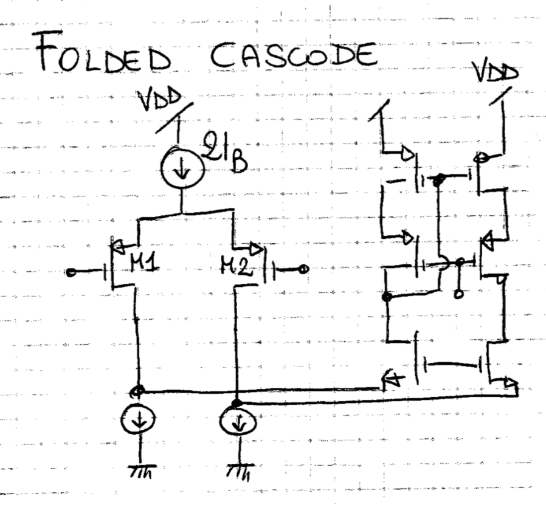
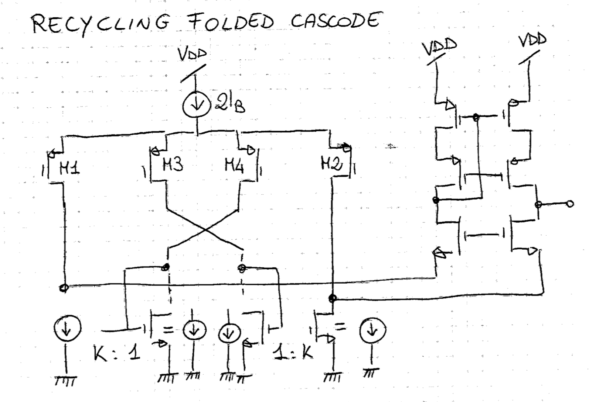
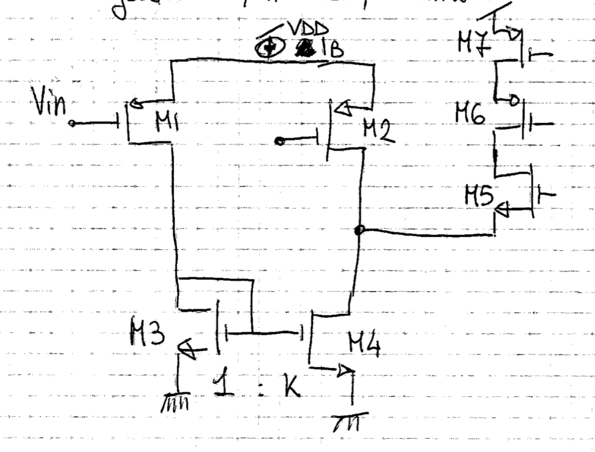

# Folded Cascode e Recycling Folded Cascode (RFC)

Il **Folded Cascode** e la sua variante ottimizzata, il **Recycling Folded Cascode (RFC)**, sono tra le architetture analogiche a singolo stadio più diffuse nella microelettronica integrata per ottenere contemporaneamente elevato guadagno in continua, ampia banda ed estesa dinamica di segnale.

---

### 1. Perché nasce il Folded Cascode?

Nel [Cascode Telescopico](./Coppia%20Differenziale%20e%20Cascode%20Telescopico.md) tutti i transistor sono impilati in verticale tra l'alimentazione $V_{DD}$ e massa (5 transistor in serie: generatore di coda, coppia differenziale, cascode e carico). Con le moderne tensioni di alimentazione ridotte ($V_{DD} \le 1.2\,\text{V}$), ciascun dispositivo richiede una caduta minima pari alla [tensione di overdrive](./Overdrive%20e%20Regioni%20di%20Inversione.md) $V_{ov} = V_{GS} - V_{th}$ per rimanere in saturazione. Lo swing utile di uscita crolla:
$$V_{out,\text{max}} - V_{out,\text{min}} \approx V_{DD} - 5 V_{ov} < 200\,\text{mV}$$

Per risolvere questo collo di bottiglia si introduce il **Folded Cascode**:
* **Ripiegamento (*Folding*):** L'ingresso differenziale e lo stadio cascode vengono realizzati su rami distinti con transistori a polarità complementare (es. coppia d'ingresso PMOS e cascode NMOS, o viceversa).
* **Vantaggi immediati:** 
  1. Si riduce il numero di transistor impilati tra $V_{DD}$ e GND sul ramo di uscita (lo swing passa a circa $V_{DD} - 4 V_{ov}$).
  2. L'intervallo di modo comune in ingresso (*ICMR*) si disaccoppia dal livello di uscita, permettendo persino di includere la massa o $V_{DD}$ nel range di modo comune d'ingresso.

---

### 2. Il "Peccato Originale" del Folded Cascode Classico

Osserviamo lo schema del Folded Cascode classico (Prof.ssa Richelli, Slide 9):

* La coppia d'ingresso PMOS ($M_1, M_2$) è alimentata dal generatore di coda $2I_B$ ($I_B$ per ciascun ramo).
* Ai nodi di folding sono posti due generatori di corrente verso massa ($I_{\text{sink}}$), realizzati con transistor NMOS con Gate a tensione continua fissa $V_{\text{bias}}$.
* Poiché ciascun generatore verso massa deve assorbire sia la corrente del transistor d'ingresso ($I_B$) sia quella necessaria a polarizzare il rispettivo ramo cascode ($I_{\text{cascode}}$), esso conduce una corrente statica molto elevata:
  $$I_{\text{sink}} = I_B + I_{\text{cascode}}$$

#### Lo spreco di potenza e rumore:
1. **Rami "morti" per il segnale AC:** Quei due transistor verso massa hanno il Gate collegato a una tensione DC fissa (massa virtuale in AC). A piccolo segnale la loro variazione di corrente è nulla ($i_{ac} = 0$): **non contribuiscono affatto alla transconduttanza ($g_m$) né al guadagno!**
2. **Consumo elevato:** Bruciano più del $50\%$ dell'intera corrente statica del circuito solo per garantire la polarizzazione DC.
3. **Rumore termico e flicker:** Essendo dispositivi percorsi da molta corrente, iniettano una quota cospicua di [Rumore nel MOSFET](./Rumore%20nel%20MOSFET.md) direttamente nei nodi di segnale.

La transconduttanza complessiva del Folded Cascode classico (con carico a specchio single-ended) rimane semplicemente:
$$G_{m,\text{classico}} = g_{m1,2}$$

---

### 3. L'Idea del Recycling: cosa si "ricicla"?

L'idea alla base del **Recycling Folded Cascode (RFC)** (introdotto nel celebre articolo IEEE di Yan e Sánchez-Sinencio, 2010, e trattato nelle Slide 10-12) è pragmatica:
> *«Possiamo **riciclare** quei transistor e quella corrente di polarizzazione verso massa facendoli diventare transistor attivi che amplificano anch'essi il segnale d'ingresso?»*

Per attuare il riciclo senza consumare $1\,\mu\text{A}$ di corrente in più dall'alimentatore, il circuito subisce due modifiche chiave:

#### A) Sdoppiamento della coppia differenziale (4 transistor)
La coppia differenziale d'ingresso viene sdoppiata in 4 transistor identici:
* L'ingresso $V_{in}^+$ pilota **$M_1$** e **$M_3$**.
* L'ingresso $V_{in}^-$ pilota **$M_2$** e **$M_4$**.

Mantenendo fissa la corrente di coda $2I_B$, ciascuno dei 4 transistor conduce esattamente **metà corrente**:
$$I_D' = \frac{I_B}{2}$$
Dimensionando ciascun transistor con metà larghezza ($W' = W/2$), la tensione di overdrive $V_{ov}$ resta invariata. Di conseguenza, la transconduttanza di ciascun singolo transistorino d'ingresso è:
$$g_{m,\text{nuovo}} = \frac{2 I_D'}{V_{ov}} = \frac{2 (I_B/2)}{V_{ov}} = \mathbf{\frac{1}{2} g_{m,\text{classico}}}$$

#### B) Sostituzione dei generatori DC con specchi di corrente attivi ($1 : K$)
I generatori DC passivi verso massa vengono rimossi e sostituiti da due specchi di corrente NMOS con rapporto dimensionale **$1 : K$** (in genere $K = 3$):
* $M_1$ e $M_2$ continuano a scaricare sui rispettivi nodi di folding (percorso diretto).
* $M_3$ e $M_4$ vengono **incrociati** (*cross-coupled*): scaricano la loro corrente di segnale sui transistor a diodo (dimensione $1$) posti in basso.
* Il ramo d'uscita dello specchio (dimensione $K$) inietta la corrente amplificata direttamente nel nodo di folding opposto.

---

### 4. I Due Percorsi di Segnale e la Transconduttanza di Trasferimento (Slide 12)

Quando applichiamo una tensione di segnale differenziale $v_{in}$, all'uscita si sommano in fase due percorsi paralleli:

1. **Percorso Diretto ($M_1 \to$ Cascode):**  
   Il transistor $M_1$ converte $v_{in}$ in corrente di segnale con transconduttanza dimezzata:
   $$i_{d,\text{dir}} = g_{m1} \cdot v_{in} = \left(\frac{1}{2} g_{m,\text{classico}}\right) v_{in}$$

2. **Percorso Riciclato ($M_1 \to M_3 \to M_4$):**  
   L'altra metà della corrente entra nel diodo $M_3$ e viene **moltiplicata per $K$** dallo specchio di corrente verso il transistor $M_4$:
   $$i_{d4} = K \cdot i_{d,\text{diodo}} = K \cdot \left(\frac{1}{2} g_{m,\text{classico}} \cdot v_{in}\right) = \left(\mathbf{\frac{K}{2} g_{m,\text{classico}}}\right) v_{in}$$

#### La domanda chiave d'esame: *"Perché la $g_m$ di $M_4$ è $\frac{K}{2} g_{m,\text{classico}}$?"*
* **Rigore concettuale:** Non si tratta della transconduttanza intrinseca del transistor NMOS $M_4$ ($g_{m4,\text{intrinseca}} = \frac{\partial I_{D4}}{\partial V_{GS4}} = K g_{m3}$), bensì della **transconduttanza equivalente di trasferimento dell'intero percorso $M_1 \to M_3 \to M_4$ rispetto a $v_{in}$** ($i_{d4} / v_{in}$).
* Tale valore nasce dal prodotto di due fattori distinti:
  $$\text{Fattore sdoppiamento ingresso} \times \text{Fattore guadagno specchio} = \frac{1}{2} \times K = \mathbf{\frac{K}{2}}$$

#### Somma dei contributi al nodo di folding:
I due percorsi si sommano costruttivamente:
$$G_{m,RFC} = \frac{g_{m,\text{classico}}}{2} + \frac{K}{2} g_{m,\text{classico}} = \mathbf{g_{m,\text{classico}} \left(\frac{1 + K}{2}\right)}$$

---

### 5. Perché si sceglie proprio $K = 3$? (Slide 11)

Sostituendo $K = 3$ nella formula:
$$G_{m,RFC} = g_{m,\text{classico}} \left(\frac{1 + 3}{2}\right) = \mathbf{2 \cdot g_{m,\text{classico}}}$$

A **parità identica di corrente totale assorbita dall'alimentatore ($2I_B$)**:
* **Transconduttanza complessiva raddoppiata ($2 \times G_m$).**
* **Guadagno in tensione raddoppiato ($+6\,\text{dB}$):** poiché $A_v \approx G_m \cdot R_{out}$.
* **Banda a guadagno unitario raddoppiata ($GBW$):**
  $$GBW = \frac{G_{m,RFC}}{2\pi C_L} = 2 \times GBW_{\text{classico}}$$
* **Slew Rate ($SR$) drasticamente superiore:** a grande segnale lo specchio $1:K$ moltiplica la massima corrente di scarica della capacità di carico $C_L$.

---

### 6. Perché non scegliere un $K$ enorme (es. $K = 10$ o $50$)?

Come evidenziato nella Slide 11:
> *«Il valore di K influenza il guadagno (...) ma anche il margine di fase (maggiore è K minore è il PM) quindi viene scelto come compromesso tra 2 e 4.»*

* **Origine del polo parassita:** Il transistor d'uscita dello specchio ha larghezza $K$ volte superiore al diodo. Più $K$ aumenta, maggiore diventa la capacità parassita [Capacità parassite nel MOSFET](./Capacit%C3%A0%20parassite%20nel%20MOSFET.md) $C_{gs}$ sul nodo del diodo.
* La frequenza del polo non dominante introdotto dallo specchio vale:
  $$\omega_{p,\text{specchio}} \approx \frac{g_{m,\text{diodo}}}{(1 + K) C_{gs}}$$
* Se $K$ è troppo grande, questo polo si sposta a frequenze basse, avvicinandosi alla frequenza di cross-over ($GBW$) ed erodendo il **Margine di Fase (PM)**, con grave rischio di oscillazioni e instabilità.
* **$K = 3$** rappresenta lo *sweet spot* ottimale: raddoppia le prestazioni mantenendo un margine di fase stabile ($PM \ge 60^\circ$).

---

### 7. Confronto Sinottico

| Parametro | Folded Cascode Normale | Recycling Folded Cascode ($K=3$) |
| :--- | :--- | :--- |
| **Corrente d'alimentazione** | $I_{tot}$ | $I_{tot}$ *(invariata)* |
| **Coppia differenziale** | 2 transistor ($W, I_B$) | 4 transistor ($W/2, I_B/2$) |
| **Transconduttanza $G_m$** | $g_{m,\text{classico}}$ | $\mathbf{2 \cdot g_{m,\text{classico}}}$ |
| **Guadagno $A_v$** | $A_{v0}$ | $\mathbf{2 \cdot A_{v0}}$ ($+6\,\text{dB}$) |
| **Banda $GBW$** | $GBW_0$ | $\mathbf{2 \cdot GBW_0}$ |
| **Slew Rate** | $SR_0$ | $\mathbf{> 2 \cdot SR_0}$ |
| **Margine di Fase ($PM$)** | Più elevato (nessun polo di specchio) | Leggermente ridotto per via del polo a $\omega_{p,\text{specchio}}$ |

---

*Pagine correlate:*
- [Coppia Differenziale e Cascode Telescopico](./Coppia%20Differenziale%20e%20Cascode%20Telescopico.md)
- [Gain Boosting (Regulated Cascode)](./Gain%20Boosting.md)
- [Overdrive e Regioni di Inversione](./Overdrive%20e%20Regioni%20di%20Inversione.md)
- [Rumore nel MOSFET](./Rumore%20nel%20MOSFET.md)
- [Capacità parassite nel MOSFET](./Capacit%C3%A0%20parassite%20nel%20MOSFET.md)
- [Crollo di ro](../Effetti%20di%20Canale%20Corto/Crollo%20di%20ro.md)
