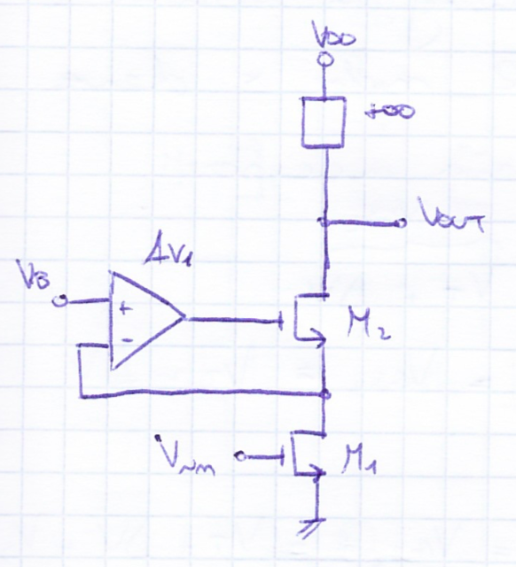

# Gain Boosting (Regulated Cascode)

Il **Gain Boosting** (noto in letteratura anche come *Regulated Cascode*, introdotto originariamente da Bult e Geelen) è una tecnica fondamentale della microelettronica integrata che consente di aumentare la resistenza di uscita di uno stadio [Cascode](./Coppia%20Differenziale%20e%20Cascode%20Telescopico.md) di diversi ordini di grandezza, **senza aggiungere transistor in serie sul percorso principale del segnale** e preservando l'intera dinamica di tensione (*output swing*).

---

### 1. Perché si introduce? Il limite del Cascode a canale corto

Nelle moderne tecnologie CMOS sub-microniche e nanometriche (es. $65\,\text{nm}$, $40\,\text{nm}$ o inferiori), la resistenza differenziale di drain $r_o$ crolla drasticamente a causa degli effetti di canale corto, in particolare la modulazione di lunghezza di canale (CLM) e il [DIBL](../Effetti%20di%20Canale%20Corto/DIBL.md) (vedi [Crollo di ro](../Effetti%20di%20Canale%20Corto/Crollo%20di%20ro.md)).

Il guadagno intrinseco di un singolo dispositivo scende a valori molto modesti:
$$g_m r_o \approx 10 \div 25 \quad (20 \div 28\,\text{dB})$$

In una configurazione cascode standard a 2 transistor ($M_1, M_2$), la resistenza di uscita e il guadagno a vuoto valgono:
$$R_{out,\text{cascode}} \approx g_{m2} r_{o2} r_{o1}$$
$$A_v \approx - g_{m1} R_{out} \approx - (g_m r_o)^2 \approx 40 \div 50\,\text{dB}$$

Questo valore è insufficiente per amplificatori operazionali ad alte prestazioni, dove si richiedono guadagni $\ge 80 \div 100\,\text{dB}$.

#### Perché non impilare un terzo transistor (Triplo Cascode)?
L'approccio intuitivo di aggiungere un terzo transistor in serie ($M_3$ sopra $M_2$) è **impraticabile nei chip moderni**:
* Ciascun transistor in serie per lavorare in saturazione consuma una tensione di overdrive minima [Overdrive e Regioni di Inversione](./Overdrive%20e%20Regioni%20di%20Inversione.md) $V_{ov} = V_{GS} - V_{th} \approx 150 \div 200\,\text{mV}$.
* Con alimentazioni ridotte a $V_{DD} \le 1.0 \div 1.2\,\text{V}$, impilare 3 transistor verso massa e altri 3 verso $V_{DD}$ lascerebbe uno swing utile di uscita praticamente nullo:
  $$V_{out,\text{swing}} \approx V_{DD} - 6 V_{ov} \approx 0\,\text{V}$$

> **La sfida progettuale:** Come moltiplicare la resistenza di uscita del cascode senza aggiungere ulteriori cadute di tensione in serie sul ramo di uscita?  
> **La soluzione:** Il **Gain Boosting**!

---

### 2. Architettura Circuitale (Slide 13)

La topologia di principio (Prof.ssa Richelli, Slide 13) introduce un **amplificatore ausiliario di retroazione ($A_{v1}$)**:

* **$M_1$** è il transistor d'ingresso a Source comune (Source a massa, Gate pilotato da $V_{in}$).
* **$M_2$** è il transistor cascode.
* **Amplificatore ausiliario ($A_{v1}$):**
  * L'ingresso non invertente $(+)$ è collegato a una tensione continua fissa di riferimento $V_B$.
  * L'ingresso invertente $(-)$ è collegato al nodo intermedio (il Drain di $M_1$ / Source di $M_2$).
  * L'uscita pilota direttamente il **Gate di $M_2$**.
* Il carico superiore è rappresentato da un generatore ad altissima impedenza (es. carico cascode PMOS anch'esso con gain boosting o sorgente ideale).

---

### 3. Principio Fisico a Retroazione Negativa (Massa Virtuale)

L'amplificatore ausiliario racchiude il transistor cascode $M_2$ all'interno di un anello di retroazione negativa locale:

1. **Tentativo di perturbazione dall'uscita:**  
   Se la tensione di uscita $V_{OUT}$ sale di un incremento $\Delta V_{OUT}$, per via della conduttanza finita $r_{o2}$ una frazione di questo incremento tenderebbe a far salire il potenziale del nodo intermedio $V_{D1}$.
2. **Reazione dell'anello:**  
   L'amplificatore ausiliario rileva l'aumento sul suo morsetto invertente $(-)$ e abbassa violentemente la tensione sul Gate di $M_2$:
   $$\Delta V_{G2} = - A_{v1} \cdot \Delta V_{D1}$$
3. **Strozzamento di $M_2$:**  
   Poiché il Gate scende mentre il Source tendeva a salire, la tensione Gate-Source di $M_2$ subisce una fortissima riduzione:
   $$\Delta V_{GS2} = \Delta V_{G2} - \Delta V_{D1} = - (A_{v1} + 1) \cdot \Delta V_{D1}$$
   Questo chiude il canale di $M_2$, bloccando vigorosamente qualsiasi variazione di corrente verso massa.
4. **Massa virtuale sul drain di $M_1$:**  
   L'anello forza il nodo intermedio a rimanere rigidamente congelato alla tensione di riferimento:
   $$V_{D1} \approx V_B = \text{costante}$$
   Non potendo variare il potenziale di Drain di $M_1$, l'effetto Early su $M_1$ viene praticamente **annullato**.

---

### 4. Calcolo Analitico della Resistenza di Uscita ($R_{out}$)

Valutiamo la resistenza di uscita a piccolo segnale applicando un generatore di test $v_t$ al nodo di uscita e misurando la corrente entrante $i_t$ (con ingresso $v_{in} = 0$, per cui il canale di $M_1$ si riduce alla sua sola resistenza interna $r_{o1}$):

1. La tensione al nodo di drain di $M_1$ vale:
   $$v_{d1} = i_t \cdot r_{o1}$$
2. L'amplificatore ausiliario impone sul Gate di $M_2$:
   $$v_{g2} = - A_{v1} \cdot v_{d1} = - A_{v1} (i_t r_{o1})$$
3. La tensione $v_{gs2}$ di $M_2$ è quindi:
   $$v_{gs2} = v_{g2} - v_{d1} = - (A_{v1} + 1) \cdot (i_t r_{o1})$$
4. La corrente $i_t$ che attraversa $M_2$ è data dalla legge ai terminali del transistore:
   $$i_t = g_{m2} v_{gs2} + \frac{v_t - v_{d1}}{r_{o2}} = - g_{m2} (A_{v1} + 1) r_{o1} i_t + \frac{v_t - i_t r_{o1}}{r_{o2}}$$
5. Riorganizzando i termini:
   $$v_t = i_t \cdot \Big[ g_{m2} r_{o2} r_{o1} (A_{v1} + 1) + r_{o1} + r_{o2} \Big]$$

Trascurando i termini del prim'ordine rispetto al prodotto cascode amplificato:
$$R_{out} = \frac{v_t}{i_t} \approx g_{m2} r_{o2} r_{o1} \cdot (A_{v1} + 1) \approx \mathbf{A_{v1} \cdot R_{out,\text{cascode}}}$$

> **Risultato fondamentale:** La resistenza di uscita di uno stadio cascode viene **moltiplicata esattamente per il guadagno $A_{v1}$ dell'amplificatore ausiliario**!

---

### 5. Guadagno Complessivo in Tensione

La transconduttanza complessiva dell'ingresso rimane quella del transistore $M_1$ ($G_m \approx g_{m1}$).  
Il guadagno totale in continua è:
$$A_v = - G_m \cdot R_{out} \approx - g_{m1} \cdot \Big( g_{m2} r_{o2} r_{o1} \cdot A_{v1} \Big)$$

Come evidenziato da Anna Richelli nella Slide 13:
> *«Av1 può essere il guadagno ad es. di un source comune.»*

Realizzando l'amplificatore ausiliario con un semplice stadio a Source comune (il cui guadagno vale tipicamente $A_{v1} \approx g_{m,\text{aux}} r_{o,\text{aux}} \approx g_m r_o$):
$$A_v \approx - (g_m r_o) \cdot (g_m r_o)^2 = \mathbf{-(g_m r_o)^3}$$

Si ottiene il guadagno in tensione equivalente a un **triplo cascode** o a una catena a 3 stadi, raggiungendo facilmente **$85 \div 105\,\text{dB}$** in un'architettura a singolo stadio principale.

---

### 6. I Due Vantaggi Cruciali da Sottolineare all'Esame

1. **Massima Dinamica di Uscita (*Output Swing*) Intatta:**  
   Sul ramo principale tra $V_{DD}$ e massa continuano a esserci soltanto **DUE transistor** ($M_1$ e $M_2$).  
   La tensione minima di uscita per mantenere entrambi i dispositivi in saturazione è semplicemente:
   $$V_{OUT,\text{min}} = V_{DS1,\text{sat}} + V_{DS2,\text{sat}} = 2 V_{ov} \approx 0.3\,\text{V}$$
   Non viene sacrificato alcun headroom di tensione!
2. **Eliminazione della Modulazione di Canale su $M_1$:**  
   Poiché l'anello di retroazione congela il Drain di $M_1$ a $V_B$, il transistore di ingresso lavora con una $V_{DS}$ perfettamente costante, eliminando distorsione e variazione di corrente indotte dalle oscillazioni di $V_{OUT}$.

---

### 7. Compromessi Progettuali e Risposta in Frequenza

Nonostante i vantaggi straordinari in continua, l'anello ausiliario introduce complessità dinamica:
* **Doppietto Polo-Zero (*Pole-Zero Doublet*):** L'amplificatore ausiliario possiede una propria funzione di trasferimento con banda finita, introducendo un polo e uno zero ravvicinati nella risposta complessiva dell'OTA.
* **Impatto sul Settling Time:** Se il doppietto cade a frequenze inferiori rispetto alla banda passante a guadagno unitario ($GBW$) dell'amplificatore principale, insorge una componente esponenziale lenta nella risposta al gradino (*slow settling tail*), allungando il tempo necessario per assestare l'uscita con precisione.
* **Regola di progetto:** Per evitare degradazioni della stabilità e del transitorio, la frequenza di taglio dell'amplificatore ausiliario deve essere progettata maggiore o confrontabile con la frequenza a guadagno unitario dello stadio principale:
  $$\omega_{u,\text{aux}} > \omega_{p2,\text{main}}$$

---

*Pagine correlate:*
- [Coppia Differenziale e Cascode Telescopico](./Coppia%20Differenziale%20e%20Cascode%20Telescopico.md)
- [Folded Cascode e Recycling](./Folded%20Cascode%20e%20Recycling.md)
- [Crollo di ro](../Effetti%20di%20Canale%20Corto/Crollo%20di%20ro.md)
- [DIBL](../Effetti%20di%20Canale%20Corto/DIBL.md)
- [Overdrive e Regioni di Inversione](./Overdrive%20e%20Regioni%20di%20Inversione.md)
- [Capacità parassite nel MOSFET](./Capacit%C3%A0%20parassite%20nel%20MOSFET.md)
