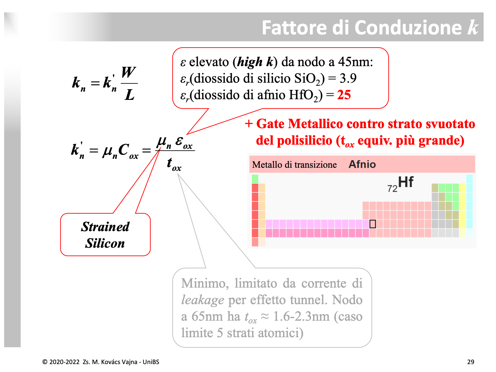
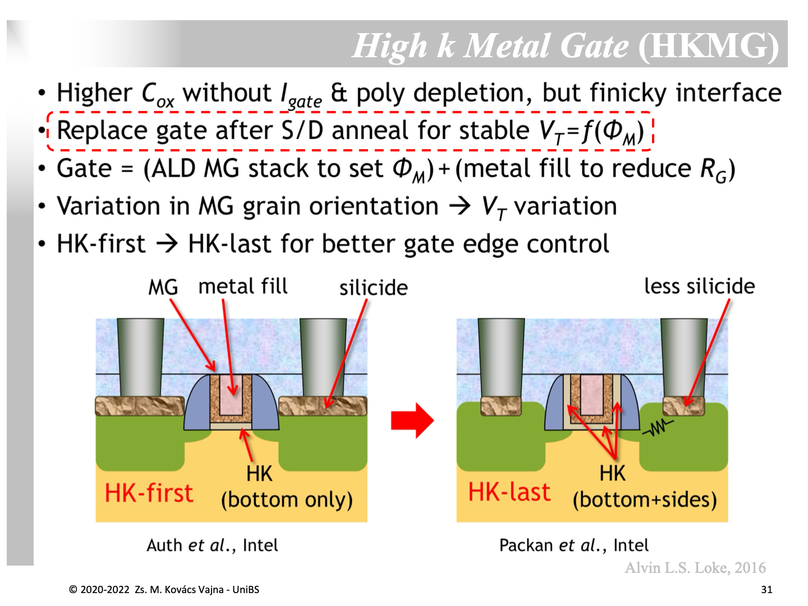
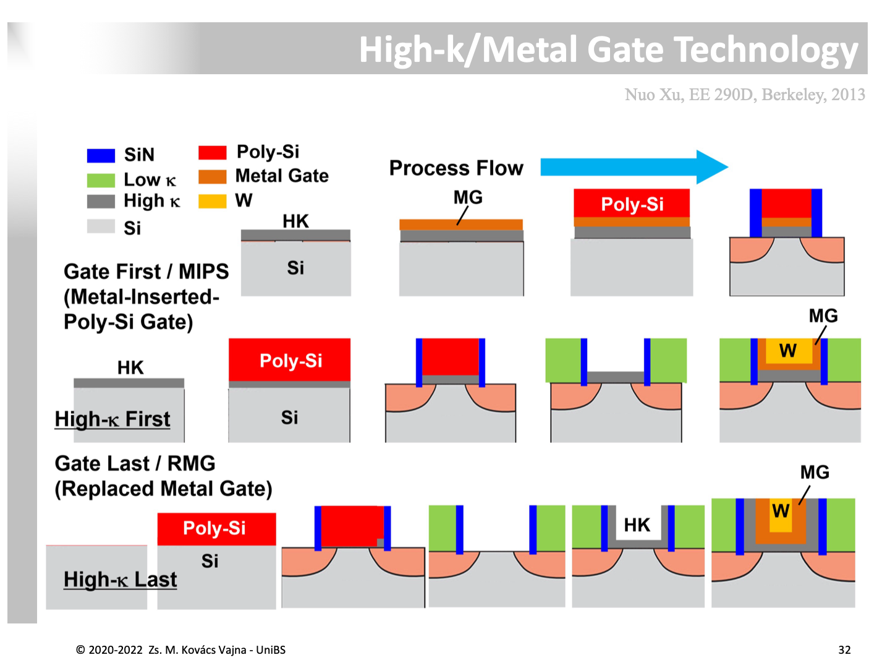

La tecnologia **HKMG** (*High-$\kappa$ Metal Gate*, introdotta a livello industriale a partire dal nodo a $45\,\text{nm}$ da Intel nel 2007) segna il momento storico in cui lo scaling della microelettronica ha dovuto abbandonare i materiali storici utilizzati fin dagli anni '60 — il biossido di silicio ($\text{SiO}_2$) come isolante e il polisilicio drogato come elettrodo di Gate — per scongiurare il blocco dello sviluppo tecnologico.

---

### 1. Il Muro Fisico dello Spessore di Ossido ($t_{ox}$)

Nello scaling classico (legge di Dennard), per aumentare la corrente di conduzione $I_{ON}$ e mantenere il controllo elettrostatico sul canale accorciato ($L$), si riduceva in proporzione lo spessore dell'ossido di Gate:
$$k'_n = \mu_n C_{ox} = \mu_n \frac{\epsilon_{ox}}{t_{ox}}$$

Al nodo tecnologico a $65\,\text{nm}$, lo spessore dell'ossido di silicio termico era sceso a valori compresi tra **$t_{ox} \approx 1.6\,\text{nm}$ e $2.3\,\text{nm}$**, equivalenti a soli **$4 - 5$ strati atomici** di molecole di $\text{SiO}_2$.

#### L'effetto tunnel quantistico diretto (Gate Leakage)
A questi spessori subnanometrici, la barriera di potenziale dell'ossido non agisce più come un isolante classico:
* Gli elettroni quantistici attraversano l'ossido per **tunneling diretto** (*direct quantum tunneling*).
* La corrente di fuga di Gate ($I_{\text{gate}}$) cresce in modo esponenziale rispetto alla riduzione dello spessore:
  $$I_{\text{tunnel}} \propto \exp\left( -2 t_{ox} \frac{\sqrt{2m^* (q\Phi_B - V_{ox})}}{\hbar} \right)$$
* Il chip inizia a dissipare una quantità inaccettabile di potenza statica anche a riposo, con correnti di fuga attraverso il dielettrico che surriscaldano il silicio e scaricano le batterie in pochi minuti.
* **Conclusione fisica:** **$t_{ox}$ non può scendere al di sotto di circa $1.5\,\text{nm}$.**

---

### 2. La Soluzione High-$\kappa$: Aumentare la Permittività Elettrica

Se lo spessore fisico non può essere ulteriormente ridotto, l'unica via per aumentare la capacità $C_{ox}$ senza incorrere nell'effetto tunnel è **sostituire il materiale dielettrico con uno a permittività relativa $\kappa$ ($\epsilon_r$) molto più alta**:
* Biossido di silicio naturale: $\epsilon_r(\text{SiO}_2) = 3.9$
* Biossido di afnio: **$\epsilon_r(\text{HfO}_2) \approx 25$** (un ossido di un metallo di transizione)

#### Il concetto di EOT (*Equivalent Oxide Thickness*)
L'EOT rappresenta lo spessore che dovrebbe avere un ipotetico strato di $\text{SiO}_2$ per fornire la stessa identica capacità per unità di superficie del dielettrico High-$\kappa$ reale:
$$\text{EOT} = t_{\text{phys}} \cdot \frac{\epsilon_{\text{SiO2}}}{\epsilon_{\text{HK}}} = t_{\text{phys}} \cdot \frac{3.9}{25} \approx \frac{t_{\text{phys}}}{6.4}$$

**Il vantaggio pratico:** 
Possiamo fabbricare uno strato di $\text{HfO}_2$ spesso fisicamente $t_{\text{phys}} = 6.4\,\text{nm}$ (sufficientemente spesso da **azzerare completamente l'effetto tunnel e la corrente $I_{\text{gate}}$**), ottenendo però la stessa capacità elettrostatica di un ossido $\text{SiO}_2$ spesso solo **$1\,\text{nm}$** ($\text{EOT} = 1\,\text{nm}$)!

---

### 3. Il Problema del Gate in Polisilicio: *Poly-Depletion Effect*

Nei transistor tradizionali il Gate era realizzato in silicio policristallino drogato con fosforo o boro (*poly-Si*). Nonostante l'elevato drogaggio, il polisilicio è un semiconduttore, non un metallo.

Quando si applica la tensione di accensione al Gate, i portatori liberi vicino all'interfaccia con l'ossido vengono allontanati dal campo elettrico, formando un sottile **strato di svuotamento nel polisilicio (*poly depletion*)**:
* Questo strato si comporta come un condensatore dielettrico aggiuntivo ($C_{\text{poly}}$) posto in serie alla capacità dell'ossido:
  $$\frac{1}{C_{\text{tot}}} = \frac{1}{C_{ox}} + \frac{1}{C_{\text{poly}}}$$
* L'effetto equivale ad aumentare lo spessore equivalente dell'ossido di circa **$0.3 - 0.5\,\text{nm}$**, degradando la corrente $I_{ON}$ e vanificando lo sforzo di assottigliare il dielettrico.

#### La Soluzione: Metal Gate (Gate Metallico)
Sostituendo il polisilicio con un metallo vero e proprio:
* La densità di elettroni liberi in un metallo è dell'ordine di $10^{22}\,\text{cm}^{-3}$ (enormemente superiore al silicio degenerato).
* La lunghezza di schermo elettrostatico è inferiore a $1\,\text{\AA}$: **la zona di svuotamento è rigorosamente zero ($C_{\text{poly}} \to \infty$)**, recuperando l'intera capacità $C_{ox}$.

---

### 4. Le Sfide di Integrazione e la Struttura HKMG

L'integrazione di $\text{HfO}_2$ e metallo nel processo CMOS standard ha richiesto soluzioni tecnologiche sofisticate:

1. **Interfaccia critica (*Finicky Interface*):** 
   L'afnio a contatto diretto con il silicio monocristallino genera trappole elettroniche e forte scattering da fononi ottici, degradando la mobilità del canale. Si interpone sempre un film ultrasottile di transizione (**IL - *Interfacial Layer***) di $\text{SiO}_x$ spesso circa $0.5\,\text{nm}$.
2. **Stack metallico bivalente:**
   * **Strato ALD (*Atomic Layer Deposition*):** uno strato sottilissimo di leghe metalliche (es. $\text{TiN}$, $\text{TaN}$) depositato con precisione atomica per fissare la corretta **funzione di estrazione $\Phi_M$** (work function) specifica per NMOS e PMOS, tarando la tensione di soglia $V_{\text{th}}$.
   * **Riempimento Metallico (*Metal Fill*):** la trincea viene poi riempita con **Tungsteno (W)** o Alluminio per minimizzare la resistenza parassita distribuita di gate ($R_G$).
3. **Variabilità dei grani metallici (MGG - *Metal Gate Granularity*):**
   I metalli sono composti da microscopici grani cristallini orientati casualmente. Diverse orientazioni cristalline hanno work function leggermente differenti, introducendo una dispersione statistica intrinseca sulla soglia $V_{\text{th}}$.

---

### 5. Flussi di Fabbricazione a Confronto: Gate-First vs Gate-Last (RMG)

Il dilemma ingegneristico più critico nell'introduzione dell'HKMG riguarda il **budget termico**: per attivare i droganti delle diffusioni di Source e Drain occorre sottoporre il wafer a un ricotto termico ad altissima temperatura (**thermal anneal a circa $1000^\circ\text{C}$**). A queste temperature l'afnio tende a cristallizzare (aumentando le correnti di leakage lungo i bordi di grano) e i metalli diffondono sballando la work function $\Phi_M$.

La slide confronta le tre vie storiche di produzione:

#### A. Gate First / MIPS (*Metal-Inserted Poly-Si*)
* Si deposita subito lo stack High-$\kappa$ + strato metallico sottile (MG) + polisilicio sopra.
* Si incide il Gate e si eseguono gli impianti e il ricotto termico a $1000^\circ\text{C}$ di Source e Drain.
* **Svantaggio:** I metalli e l'ossido High-$\kappa$ subiscono l'intero shock termico a $1000^\circ\text{C}$, provocando instabilità marcate su $V_{\text{th}}$ (*Fermi level pinning*).

#### B. Gate Last / RMG (*Replacement Metal Gate*) – High-$\kappa$ First
* Si deposita subito lo strato High-$\kappa$, ma sopra si realizza un **Gate finto sacrificale di polisilicio (*dummy poly-Si*)**.
* Si completano gli impianti e l'anneal a $1000^\circ\text{C}$ (l'High-$\kappa$ è presente, ma il metallo non c'è ancora).
* Si deposita l'ossido interlivello (ILD) e si spiana con lucidatura chimico-meccanica (**CMP**).
* Si scava via selettivamente il polisilicio finto lasciando l'High-$\kappa$ intatto sul fondo.
* Si deposita il metallo definitivo ($\text{TiN}$) e si riempie con Tungsteno ($\text{W}$).

#### C. Gate Last / RMG – High-$\kappa$ Last (La tecnologia definitiva per i nodi avanzati)
* Si deposita inizialmente un **finto ossido sacrificale** e un **finto gate di polisilicio**.
* Si completano Source e Drain e si esegue il ricotto di attivazione a $1000^\circ\text{C}$. **In questa fase né l'afnio né i metalli sono presenti sul chip**, rimanendo completamente al riparo dal calore estremo!
* Si deposita l'isolante e si lucida con CMP.
* Si rimuovono completamente sia il finto gate di polisilicio sia il finto ossido sottostante, aprendo una trincea pulita ed esponendo il silicio del canale.
* Si deposita conformemente il dielettrico **High-$\kappa$** (che per questo motivo riveste **sia il fondo che le pareti laterali verticali degli spacer**, vedi slide 31 *bottom+sides*).
* Si depositano gli strati metallici ALD di work function e il riempimento di Tungsteno ($\text{W}$), seguiti dalla lucidatura CMP finale.

Questo processo (sviluppato da Intel a partire dai $32\,\text{nm}$) è lo standard assoluto adottato per tutte le tecnologie nanometriche moderne e per i [FinFET](./FinFET.md).

---

*Pagine correlate:*
- [FinFET](./FinFET.md)
- [Strained Silicon (Silicio Deformato)](./Strained%20Silicon%20(Silicio%20Deformato).md)
- [Rapporto Ion/Ioff e Sottosoglia](../Effetti%20di%20Canale%20Corto/Rapporto%20Ion%20Ioff%20e%20sottosoglia.md)
- [La soglia da cosa dipende](./La%20soglia%20da%20cosa%20dipende.md)
- [MOS](./MOS.md)
- [CVD](../Tecnologia%20e%20Fabbricazione/CVD.md)
- [Siliciuro](../Tecnologia%20e%20Fabbricazione/Siliciuro.md)
