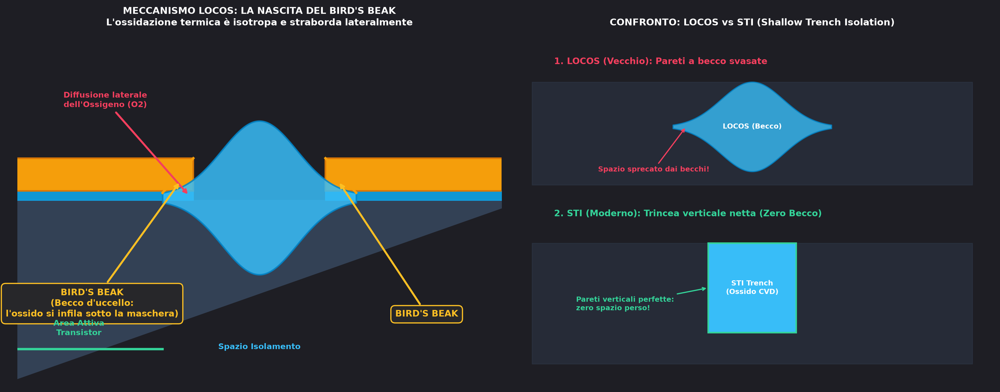
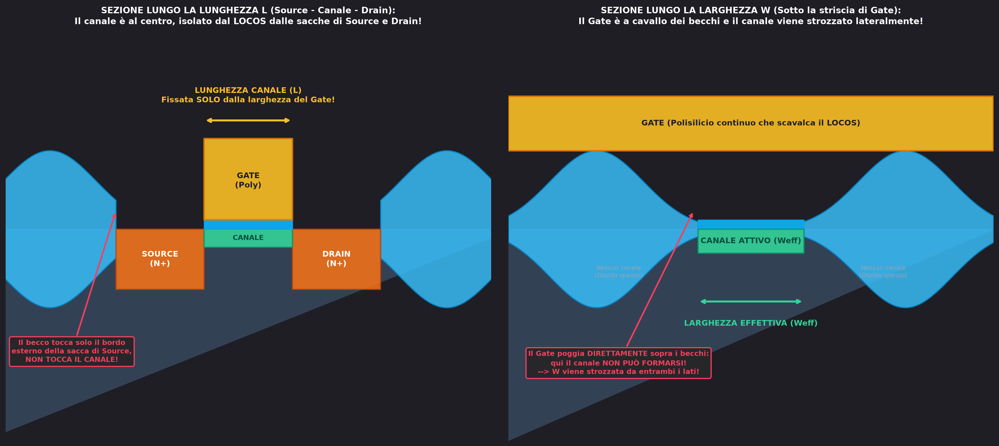
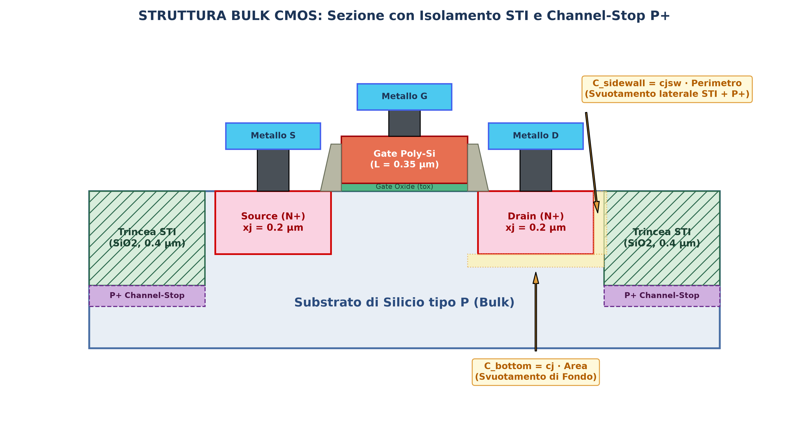
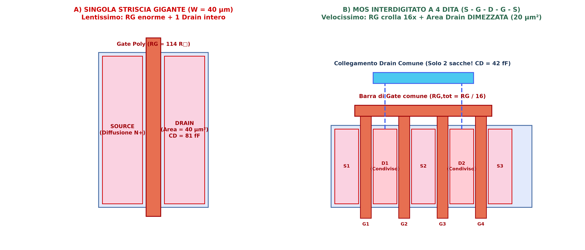
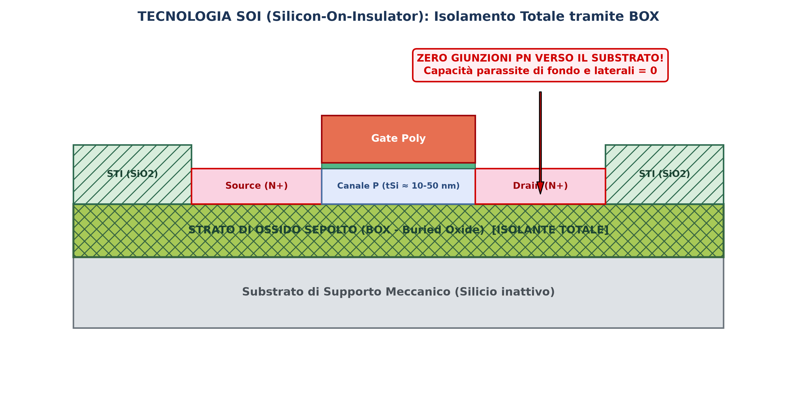

Nei circuiti integrati è fondamentale isolare elettricamente i transistor adiacenti realizzati sullo stesso substrato, per evitare che piste conduttive o di metallo sovrastanti agiscano da gate parassiti accendendo canali indesiderati tra sacche vicine.

---

### 1. Il Processo Storico LOCOS e la Nascita del Bird's Beak

Il processo storico di isolamento era il **LOCOS** (*LOCal Oxidation of Silicon*):
* **Principio:** si fanno crescere spesse zone di biossido di silicio (*Field Oxide* / $\text{FOX}$) tra i transistor per alzare drasticamente la tensione di soglia parassita ed evitare accoppiamenti.
* **La maschera di nitruro:** la regione attiva viene protetta da una maschera di nitruro di silicio ($\text{Si}_3\text{N}_4$), impermeabile all'ossigeno. Il wafer viene poi posto in forno ad alta temperatura ($1000^\circ\text{C}$).
* **Il Becco d'Uccello (*Bird's Beak*):** l'ossidazione termica è **isotropa**. L'ossigeno non scava solo verso il basso consumando silicio, ma si infila anche **lateralmente sotto i bordi del nitruro**. L'ossido cresce aumentando di volume e solleva la maschera, formando una svasatura laterale conica affusolata identica a un becco d'uccello.

---

### 2. Il Dilemma della Profondità e la Strozzatura della Larghezza $W$

Nel LOCOS più vogliamo isolare, più dobbiamo andare in profondità con l'ossido:
* **Profondità ed espansione laterale:** poiché l'ossidazione è isotropa, maggiore è il tempo nel forno per andare a fondo, maggiore sarà l'espansione laterale del becco d'uccello.
* **Perché mangia la $W$ e NON la $L$:**
  * L'ossido circonda l'area attiva come un recinto.
  * La striscia di **Gate (Polisilicio)** scavalca l'area attiva lungo la larghezza $W$, poggiando direttamente sopra i due becchi d'uccello laterali. Sotto i becchi l'ossido è troppo spesso per accendere il canale: il canale utile si forma solo al centro, **strozzando la larghezza effettiva** ($W_{eff} = W_{drawn} - 2\Delta W_{beak}$).
  * Lungo la lunghezza $L$ il canale è protetto al centro dal Gate di polisilicio ed è separato dal LOCOS dalle sacche di Source e Drain: il becco tocca solo il margine esterno estremo delle diffusioni, lasciando intatta $L$.

---

### 3. Gerarchia dei Processi: Perché Prima l'Ossidazione e Poi il Gate?

Nella fabbricazione si esegue **prima l'ossidazione LOCOS e solo dopo la deposizione del Gate**:
1. Il Gate di polisilicio viene depositato in modo conformale e **segue la forma del becco d'uccello**, arrampicandosi sulla gobba laterale dell'ossido spesso (profilo a sella ai bordi).
2. **Perché non depositare prima il Gate e poi ossidare?**
   * **Il Gate è di polisilicio:** se il Gate fosse già sul wafer durante l'ossidazione a $1000^\circ\text{C}$, l'ossigeno lo divorerebbe ossidandolo interamente in $\text{SiO}_2$ (un blocco di vetro isolante!).
   * **Espansione volumetrica:** l'ossido cresce aumentando di volume del $220\%$ e generando pressioni enormi (GigaPascal) che solleverebbero e spaccherebbero l'ossido sottile di gate.

---

### 4. Il Passaggio a STI (*Shallow Trench Isolation*)

Nel LOCOS, per compensare lo spazio rubato dai becchi bisognava distanziare maggiormente i transistor. Moltiplicando questo spreco di area per miliardi di transistor, il costo del chip diventa insostenibile.

Per questo si è passati alla **STI** (*Shallow Trench Isolation*):
* Si scava una trincea verticale netta nel silicio tramite attacco al plasma anisotropo (**Reactive Ion Etching**).
* Si riempie la trincea con ossido $\text{SiO}_2$ depositato chimicamente ([CVD](../Tecnologia%20e%20Fabbricazione/CVD.md)).
* Si spiana la superficie con lucidatura chimico-meccanica (**CMP**).
* **Risultato:** pareti verticali a $90^\circ$, **zero Bird's Beak**, superficie perfettamente piana e transistor impacchettabili a distanze nanometriche.

---

### 5. Sezione Trasversale Bulk CMOS: STI, Svuotamento e Channel-Stop $P^+$

Nella struttura reale a canale corto:
* Le diffusioni $N^+$ di Source e Drain sbattono **a filo contro la parete verticale dell'ossido STI** (profondo $0.4\,\mu\text{m} > x_j = 0.2\,\mu\text{m}$).
* Alla base della trincea viene impiantato un anello **$P^+$ Channel-Stop** per evitare canali parassiti di inversione e correnti di fuga tra dispositivi adiacenti.

Le capacità parassite di giunzione si scompongono in:
* **Capacità di fondo ($C_{\text{bottom}}$):** $C_{\text{bottom}} = c_j \cdot (W \cdot L_D)$
* **Capacità di perimetro/pareti ($C_{\text{sidewall}}$):** $C_{\text{sidewall}} = c_{jsw} \cdot (2W + 2L_D)$

---

### 6. Layout del MOS Largo: Fingering e Condivisione delle Diffusioni

Nei MOS con larghezza $W$ elevata ($W \gg L$):
* Una singola striscia continua presenta una **resistenza distribuita di Gate $R_G$ enorme** ($R_G = R_\square \frac{W}{L}$) e un'area di Drain estesa su tutta la larghezza.
* **La tecnica del Fingering:** spezzando il canale in $N$ dita parallele interdigitate ($\mathbf{S - G - D - G - S}$), **la resistenza di Gate crolla di $N^2$ volte** ($R_{G,\text{tot}} = R_G / N^2$) e le dita condividono le sacche di Drain interne, **dimezzando l'area totale di Drain e la capacità parassita $C_{DB}$**!

👉 Approfondimento completo sulle regole di layout, lo *sweet spot* contro i perimetri STI e il matching: [Layout e Tecniche di Progettazione dei MOS](./Layout%20e%20Tecniche%20di%20Progettazione%20dei%20MOS.md)

---

### 7. Layout del MOS Lungo: "Folded MOS" ed Effetto Body

Quando si richiedono canali molto lunghi ($W/L \ll 1$) per correnti bassissime o altissime resistenze equivalenti, il transistor viene ripiegato a serpentina (**Folded MOS**) sotto un unico piano di Gate.
* Nelle connessioni in serie dei canali, i nodi intermedi salgono a potenziale positivo ($V_{\text{nodo}} > 0\text{ V}$), imponendo **$V_{SB} > 0\text{ V}$** per tutti i transistor superiori.
* Per l'**Effetto Body**, la soglia $V_T$ **aumenta progressivamente salendo verso il Drain**, riducendo la corrente efficace erogata.

---

### 8. L'Isolamento Totale: Tecnologia SOI (*Silicon-On-Insulator*)

In tecnologia SOI il silicio attivo massivo è sostituito da un sottile film appoggiato sopra un ossido sepolto (**BOX - *Buried Oxide***):

* Le pareti laterali STI e il fondo toccano solo biossido di silicio.
* **Le capacità parassite di giunzione $pn$ verso il substrato sono pari a ZERO.**
* 👉 Approfondimento: [SOI (Silicon On Insulator)](./SOI.md)

---

### 9. L'Evoluzione Tridimensionale: Transistori FinFET (Tri-Gate)

Sotto i $22\,\text{nm}$, il MOSFET planare è stato sostituito dalla struttura **FinFET (Tri-Gate)**:
* Il canale non è più una piastra bidimensionale, ma una **pinna verticale 3D** avvolta dal Gate su tre lati.
* **Vantaggi principali:**
  1. A parità di impronta a terra (*footprint*), la larghezza efficace triplica ($W_{\text{eff}} = 2 H_{\text{fin}} + W_{\text{fin}}$), moltiplicando la corrente utile per unità di area.
  2. Il controllo elettrostatico perfetto sopprime il [DIBL](../Effetti%20di%20Canale%20Corto/DIBL.md) e consente l'uso di silicio **non drogato (intrinseco)**, azzerando le fluttuazioni casuali di soglia (RDF) e massimizzando la mobilità $\mu$.
* 👉 Approfondimento completo su fisica, quantizzazione di $W$ e fabbricazione: [FinFET](./FinFET.md)

---

### 10. Lo Scaling dei Materiali: High-$\kappa$ Metal Gate e Silicio Deformato

Quando lo spessore dell'ossido ha raggiunto il limite atomico di $1.5 - 2\,\text{nm}$ (5 strati atomici) innescando correnti di perdita mostruose per effetto tunnel quantistico, lo sviluppo ha introdotto nuovi materiali:
* **High-$\kappa$ Metal Gate (HKMG):** Sostituzione di $\text{SiO}_2$ con biossido di afnio ($\text{HfO}_2$, $\epsilon_r \approx 25$) e del polisilicio con elettrodi metallici, azzerando il tunneling e il *poly-depletion*. Realizzato prevalentemente con processo **Gate-Last / RMG**.
  👉 Approfondimento: [High-k e Metal Gate (HKMG)](./High-k%20e%20Metal%20Gate%20(HKMG).md)
* **Strained Silicon (Silicio Deformato):** Ingegnerizzazione meccanica del reticolo tramite tasche epitassiali di $\text{SiGe}$ per PMOS (compressione) e cappucci in $\text{Si}_3\text{N}_4$ per NMOS (trazione). Aumenta la mobilità delle lacune fino al $+500\%$, consentendo la fondamentale **equalizzazione P-N** nei circuiti CMOS.
  👉 Approfondimento: [Strained Silicon (Silicio Deformato)](./Strained%20Silicon%20(Silicio%20Deformato).md)

---

*Pagine correlate:*
- [FinFET](./FinFET.md)
- [High-k e Metal Gate (HKMG)](./High-k%20e%20Metal%20Gate%20(HKMG).md)
- [Strained Silicon (Silicio Deformato)](./Strained%20Silicon%20(Silicio%20Deformato).md)
- [Rapporto Ion/Ioff e Sottosoglia](../Effetti%20di%20Canale%20Corto/Rapporto%20Ion%20Ioff%20e%20sottosoglia.md)
- [Overdrive e Regioni di Inversione](./Overdrive%20e%20Regioni%20di%20Inversione.md)
- [Layout e Tecniche di Progettazione dei MOS](./Layout%20e%20Tecniche%20di%20Progettazione%20dei%20MOS.md)
- [Capacità parassite nel MOSFET](./Capacit%C3%A0%20parassite%20nel%20MOSFET.md)
- [Matching e Variabilita nei Componenti Integrati](./Matching%20e%20Variabilita%20nei%20Componenti%20Integrati.md)
- [La soglia da cosa dipende](./La%20soglia%20da%20cosa%20dipende.md)
- [SOI](./SOI.md)
- [Famiglia Logica e Costo per Bit](../Famiglie%20Logiche/Famiglia%20Logica%20e%20Costo%20per%20Bit.md)
- [Caratteristica di Trasferimento e Rigenerazione](../Famiglie%20Logiche/Caratteristica%20di%20Trasferimento%20e%20Rigenerazione.md)
- [Soglia Logica e Margine di Rumore](../Famiglie%20Logiche/Soglia%20Logica%20e%20Margine%20di%20Rumore.md)
- [Isolamento](../Tecnologia%20e%20Fabbricazione/Isolamento.md)
- [Transconduttanza Reale e Degrado di Mobilità](./Transconduttanza%20Reale%20e%20Degrado%20di%20Mobilita.md)
- [Rumore nel MOSFET](./Rumore%20nel%20MOSFET.md)
- [Crollo della Resistenza di Uscita (ro)](../Effetti%20di%20Canale%20Corto/Crollo%20di%20ro.md)
- [Portatori Caldi (Hot Carriers)](../Effetti%20di%20Canale%20Corto/Hot%20carriers.md)
- [Breakdown e Diodo Zener](./Breakdown%20e%20Diodo%20Zener.md)
- [BJT](./BJT.md)
- [Diodo](./Diodo.md)
- [Siliciuro](../Tecnologia%20e%20Fabbricazione/Siliciuro.md)
- [Vias](../Tecnologia%20e%20Fabbricazione/Vias.md)
- [Elettromigrazione e tossicità dei metalli](../Tecnologia%20e%20Fabbricazione/Elettromigrazione%20e%20tossicit%C3%A0%20dei%20metalli.md)
- [CVD](../Tecnologia%20e%20Fabbricazione/CVD.md)
- [PVD](../Tecnologia%20e%20Fabbricazione/PVD.md)
- [Wafer produzione](../Tecnologia%20e%20Fabbricazione/Wafer%20produzione.md)
- [Difficoltà nel fare un componente ideale](../Scaling%20e%20Limiti%20Fisici/Difficolt%C3%A0%20nel%20fare%20un%20componente%20ideale.md)
- [Resistore](./Resistore.md)
- [Condensatori](./Condensatori.md)