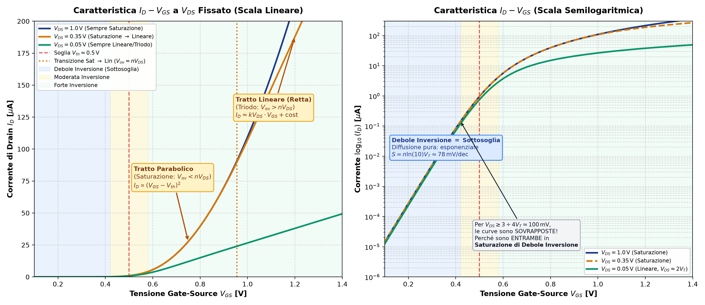
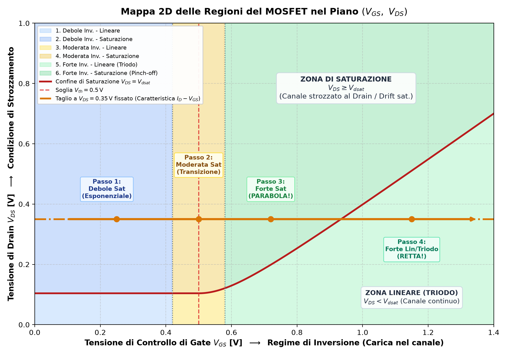

# Overdrive $V_{ov}$, Tensione di Saturazione $V_{dsat}$ e Regioni di Inversione

L'**overdrive** ($V_{ov} = V_{GS} - V_{th}$) quantifica quanto stiamo spingendo il gate sopra la soglia per accendere il canale. Tuttavia, la classica uguaglianza $V_{dsat} = V_{GS} - V_{th}$ e la formula $g_m = \frac{2I_D}{V_{ov}}$ sono approssimazioni che valgono solo in determinate condizioni fisiche.

---

### 1. $V_{dsat} = V_{GS} - V_{th}$ è un'approssimazione?

**Sì, è un'approssimazione** valida rigorosamente solo nel modello a canale lungo in **forte inversione**.

La tensione minima di drain necessaria a mandare il transistor in saturazione ($V_{dsat}$) dipende dal regime fisico di trasporto:

#### A) Forte Inversione (Drift / Deriva dominante)
* **Condizione:** $V_{GS} \gg V_{th}$.
* La densità di carica mobile nel canale è abbondante: $Q_I(x) \approx -C_{ox}(V_{GS} - V_{th} - V(x))$.
* Il trasporto è dominato dal campo elettrico (**drift**).
* La saturazione avviene per **pinch-off** (strozzamento geometrico della carica al drain, $Q_I(L) = 0$).
* **Risultato:** $V_{dsat} = V_{GS} - V_{th} = V_{ov}$.
*(Nei canali corti subentra prima la [saturazione di velocità](../Effetti%20di%20Canale%20Corto/Saturazione%20di%20velocita.md), per cui $V_{dsat} < V_{ov}$)*.

#### B) Debole Inversione / Sottosoglia (Diffusione dominante)
* **Condizione:** $V_{GS} < V_{th}$ (vedi [Conduzione di Sottosoglia e Rapporto Ion/Ioff](../Effetti%20di%20Canale%20Corto/Rapporto%20Ion%20Ioff%20e%20sottosoglia.md)).
* La densità di portatori è minima: il trasporto avviene per **diffusione** (come nei [BJT](./BJT.md)).
* La corrente vale:
  $$I_D \propto \exp\left(\frac{V_{GS}-V_{th}}{n V_T}\right) \left( 1 - \exp\left(-\frac{V_{DS}}{V_T}\right) \right)$$
  dove $V_T = \frac{k_B T}{q} \approx 26\,\text{mV}$ e $n \approx 1.2 \div 1.5$.
* Per saturare la corrente basta annullare il termine esponenziale di ritorno dal drain: è sufficiente che $V_{DS} \ge 3 \div 4 V_T \approx 75 \div 100\,\text{mV}$.
* **Risultato:** In debole inversione $V_{dsat} \approx 3\div 4 V_T \approx 100\,\text{mV}$, ed è **completamente indipendente dall'overdrive $V_{GS} - V_{th}$**.

#### C) Moderata Inversione (Regione di transizione)
* **Condizione:** $V_{GS} \approx V_{th}$.
* Il trasporto è un mix continuo di diffusione e deriva.
* Non valgono né il modello esponenziale puro né quello quadratico: $V_{dsat}$ transita gradualmente da $\approx 3 V_T$ a $V_{ov}$. Dire che $V_{dsat} = V_{ov}$ è una sovrastima grossolana.

---

### 2. A Corrente Fissata ($I_D$), cosa decide l'Overdrive $V_{ov}$?

Se imponiamo una corrente di polarizzazione $I_D$ (es. tramite uno specchio di corrente o un generatore di bias), il transistor non "sceglie" da solo il suo overdrive: **è il progettista a determinarlo attraverso le dimensioni geometriche $W/L$** e i parametri tecnologici del processo ($\mu C_{ox}$).

In forte inversione:
$$I_D = \frac{1}{2} \mu C_{ox} \left(\frac{W}{L}\right) V_{ov}^2 \implies V_{ov} = \sqrt{\frac{2 I_D}{\mu C_{ox} \left(\frac{W}{L}\right)}}$$

#### Intuizione fisica:
$V_{ov}$ misura **quanta densità di carica superficiale** dobbiamo accumulare nel canale per permettere il transito della corrente $I_D$:

1. **Se scegliamo $W/L$ molto grande (transistor largo):**
   * Il canale offre una sezione enorme al passaggio dei portatori.
   * Serve pochissima carica per unità di superficie per far scorrere $I_D$.
   * Il transistor si polarizza con un **$V_{ov}$ piccolissimo**, spostandosi verso la moderata o debole inversione.
2. **Se scegliamo $W/L$ piccolo (transistor stretto o lungo):**
   * Il canale è un collo di bottiglia.
   * Per far passare la stessa corrente $I_D$, serve un forte campo di gate e un'alta densità di portatori.
   * Il circuito impone un **$V_{ov}$ elevato** (forte inversione profonda).

---

### 3. La Transconduttanza $g_m$ e il Trade-off $g_m / I_D$

La transconduttanza $g_m = \frac{\partial I_D}{\partial V_{GS}}$ rappresenta il guadagno del transistor (conversione tensione-corrente):
* In forte inversione: $g_m = \frac{2 I_D}{V_{ov}} = \sqrt{2 \mu C_{ox} \frac{W}{L} I_D}$.
* In debole inversione: $g_m = \frac{I_D}{n V_T}$ (massima efficienza, indipendente da $W/L$).

L'indice di merito **$g_m / I_D$** (efficienza di transconduttanza) guida il dimensionamento in analogico:

| Parametro | $V_{ov}$ Piccolo (Grande $W/L$ - Moderata/Debole Inv.) | $V_{ov}$ Grande (Piccolo $W/L$ - Forte Inv.) |
| :--- | :--- | :--- |
| **Efficienza $\frac{g_m}{I_D}$** | **Massima** ($\approx \frac{1}{n V_T} \approx 25\,\text{V}^{-1}$) $\rightarrow$ Massimo guadagno a parità di corrente | **Bassa** ($= \frac{2}{V_{ov}} \approx 5 \div 10\,\text{V}^{-1}$) |
| **Velocità / Banda ($f_T$)** | Minore (capacità parassite [Cgg](./Capacit%C3%A0%20parassite%20nel%20MOSFET.md) elevate per via dell'ampio $W$) | **Molto elevata** ($f_T \propto \frac{V_{ov}}{L^2}$) |
| **Tensione $V_{dsat}$** | Piccola ($\approx 80 \div 150\,\text{mV}$) $\rightarrow$ Massimo **voltage headroom** (dinamica di segnale) | Grande ($\ge 200 \div 400\,\text{mV}$) $\rightarrow$ Minore dinamica di uscita |
| **Matching di Corrente** | Peggiore a parità di $\Delta V_{th}$ ($\frac{\Delta I_D}{I_D} = \frac{2\Delta V_{th}}{V_{ov}}$) | Migliore mismatch relativo di corrente (perché $V_{ov}$ è alto al denominatore) |

👉 Approfondimento sulla variabilità: [Matching e Variabilità nei Componenti Integrati](./Matching%20e%20Variabilita%20nei%20Componenti%20Integrati.md)

---

### 4. La Caratteristica $I_D - V_{GS}$ a $V_{DS}$ Fissato: Perché prima Parabola e poi Retta?

Quando tracciamo la caratteristica di trasferimento $I_D(V_{GS})$, la tensione $V_{DS}$ viene mantenuta **costante**. A seconda del valore scelto per $V_{DS}$, il comportamento cambia radicalmente:

#### A) Se fissiamo un $V_{DS}$ intermedio (es. $V_{DS} = 0.35\,\text{V}$):
All'aumentare di $V_{GS}$ da zero verso tensioni elevate, il transistor attraversa in sequenza:
1. **$V_{GS} < V_{th}$ (Debole Inversione / Sottosoglia):**  
   Corrente di diffusione esponenziale (invisibile in scala lineare, retta su scala logaritmica con pendenza $S \approx 78\,\text{mV/dec}$).
2. **Subito sopra la soglia ($V_{th} < V_{GS} < V_{th} + V_{DS}$):**  
   L'overdrive $V_{ov} = V_{GS} - V_{th}$ è piccolo ($V_{ov} < V_{DS}$).  
   Il canale al drain è strozzato (**Pinch-off $\implies$ SATURAZIONE**). La corrente vale:
   $$I_D = \frac{1}{2}\mu C_{ox}\frac{W}{L}(V_{GS}-V_{th})^2$$
   Rispetto a $V_{GS}$, la curva è un **tratto di PARABOLA**!
3. **Aumentando ancora $V_{GS}$ ($V_{GS} > V_{th} + V_{DS}$):**  
   L'overdrive supera il drain fissato ($V_{ov} > V_{DS}$).  
   Il canale non è più strozzato al drain: il transistor entra in **LINEARE (TRIODO)**!  
   Con $V_{DS}$ fissato costante, la formula di triodo diventa:
   $$I_D = \mu C_{ox}\frac{W}{L}\left[(V_{GS}-V_{th})V_{DS} - \frac{1}{2}V_{DS}^2\right] = \underbrace{\left(\mu C_{ox}\frac{W}{L}V_{DS}\right)}_{\text{Pendenza costante}}\cdot V_{GS} + \text{costante}$$
   Rispetto a $V_{GS}$, la curva si raddrizza e diventa una **RETTA**!

#### B) Se fissiamo un $V_{DS}$ molto piccolo (es. $V_{DS} = 50\,\text{mV}$):
* L'intervallo di saturazione ($V_{ov} < 50\,\text{mV}$) è una finestrella microscopica quasi coincidente con la moderata inversione.
* Per tutto il funzionamento utile sopra soglia, il transistor è **SEMPRE IN LINEARE** (la curva verde è una retta continua).
* 👉 **Applicazione pratica nei test di laboratorio:** si impone $V_{DS} = 50\,\text{mV}$ appositamente per estrarre la soglia $V_{th}$ (estrapolando la retta a $I_D=0$) e ricavare $\mu C_{ox}\frac{W}{L}$ dalla pendenza.

#### C) Se fissiamo un $V_{DS}$ alto (es. $V_{DS} = V_{DD} = 1.0 \div 1.5\,\text{V}$):
* Poiché nei circuiti $V_{GS} \le V_{DD}$, risulta sempre $V_{ov} < V_{DS}$.
* Il dispositivo è **SEMPRE IN SATURAZIONE** (la curva blu è una parabola pura su tutto l'intervallo).

---

### 5. I Due Assi Indipendenti: La Mappa 2D $(V_{GS}, V_{DS})$

Spesso si fa confusione tra le regioni di inversione e i regimi di drain. Si tratta di **due decisioni fisiche completamente indipendenti (ortogonali)**:

1. **Asse 1: Regime di Inversione (Deciso da $V_{GS}$, carica nel canale):**
   * **Debole Inversione (Sottosoglia, $V_{GS} < V_{th}$):** pochi portatori, trasporto per diffusione.
   * **Moderata Inversione ($V_{GS} \approx V_{th}$):** transizione continua diffusione/deriva.
   * **Forte Inversione ($V_{GS} \gg V_{th}$):** tanti portatori, trasporto dominato dalla deriva (drift).
2. **Asse 2: Regime di Drain (Deciso da $V_{DS}$ rispetto a $V_{dsat}$):**
   * **Lineare / Triodo ($V_{DS} < V_{dsat}$):** canale continuo da Source a Drain.
   * **Saturazione ($V_{DS} \ge V_{dsat}$):** canale strozzato (pinch-off o saturazione di velocità).

| Livello di Inversione (deciso da $V_{GS}$) | $V_{dsat}$ locale | Regime Lineare ($V_{DS} < V_{dsat}$) | Regime Saturato ($V_{DS} \ge V_{dsat}$) |
| :--- | :--- | :--- | :--- |
| **Debole Inversione (Sottosoglia)** | $\approx 3\div 4 V_T \approx 100\,\text{mV}$ (costante!) | Lineare di debole inv. ($V_{DS} < 100\,\text{mV}$) | Saturazione di debole inv. ($V_{DS} \ge 100\,\text{mV}$) |
| **Moderata Inversione** | Raccordo continuo $\sim 100\,\text{mV} \to V_{ov}$ | Moderata lineare | Moderata saturata |
| **Forte Inversione** | $V_{dsat} = V_{ov} = V_{GS} - V_{th}$ | **Triodo (Lineare)**: retta con $V_{DS}$ | **Saturazione**: parabola con $V_{GS}$ |

> Quando tracciamo la caratteristica $I_D - V_{GS}$ a $V_{DS} = 0.35\,\text{V}$, tracciamo un **taglio orizzontale** a quota $0.35\,\text{V}$ sulla mappa:  
> Poiché $0.35\,\text{V} > 100\,\text{mV}$, attraversiamo prima **Debole Saturata** $\to$ **Moderata Saturata** $\to$ **Forte Saturata (Parabola)** e solo dopo che la retta rossa $V_{dsat}$ sale oltre $0.35\,\text{V}$ entriamo in **Forte Lineare (Retta)**!

---

*Pagine correlate:*
- [La soglia da cosa dipende](./La%20soglia%20da%20cosa%20dipende.md)
- [MOS](./MOS.md)
- [Transconduttanza Reale e Degrado di Mobilità](./Transconduttanza%20Reale%20e%20Degrado%20di%20Mobilita.md)
- [Rumore nel MOSFET](./Rumore%20nel%20MOSFET.md)
- [Conduzione di Sottosoglia e Rapporto Ion/Ioff](../Effetti%20di%20Canale%20Corto/Rapporto%20Ion%20Ioff%20e%20sottosoglia.md)
- [Crollo della Resistenza di Uscita (ro)](../Effetti%20di%20Canale%20Corto/Crollo%20di%20ro.md)
- [Portatori Caldi (Hot Carriers)](../Effetti%20di%20Canale%20Corto/Hot%20carriers.md)
- [Saturazione di velocità](../Effetti%20di%20Canale%20Corto/Saturazione%20di%20velocita.md)
- [Matching e Variabilita nei Componenti Integrati](./Matching%20e%20Variabilita%20nei%20Componenti%20Integrati.md)
- [Capacità parassite nel MOSFET](./Capacit%C3%A0%20parassite%20nel%20MOSFET.md)
- [Layout e Tecniche di Progettazione dei MOS](./Layout%20e%20Tecniche%20di%20Progettazione%20dei%20MOS.md)
- [BJT](./BJT.md)

