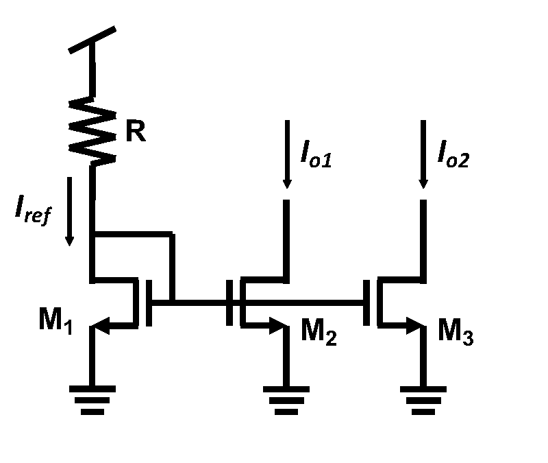
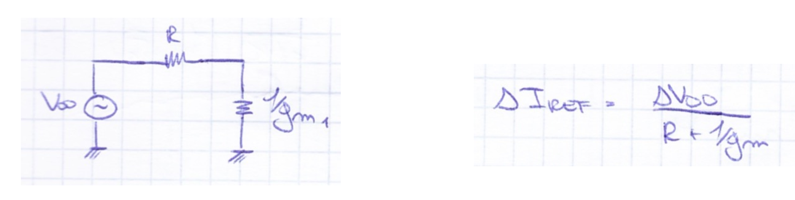
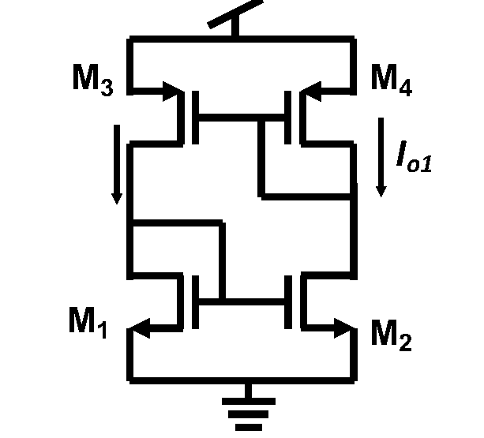
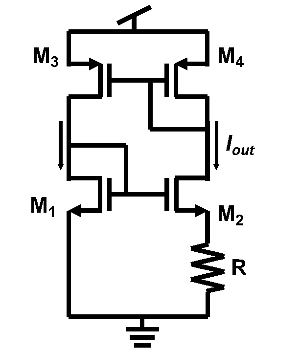
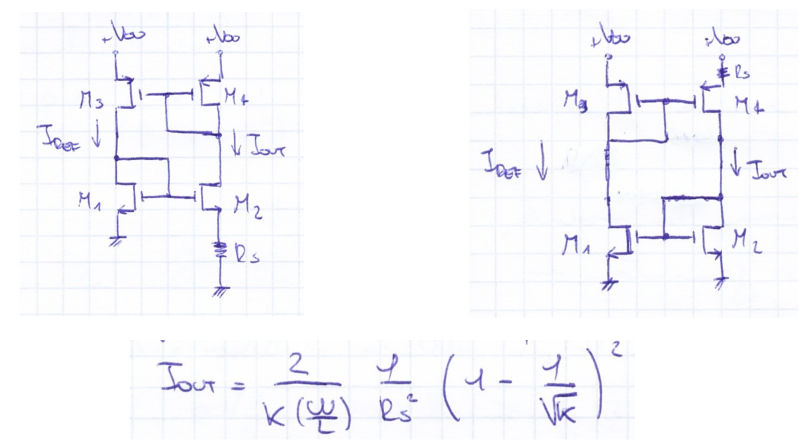
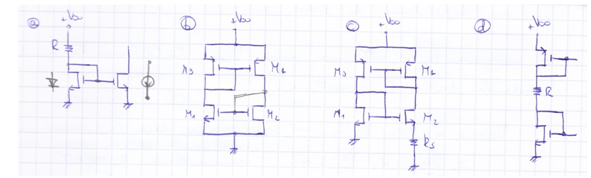
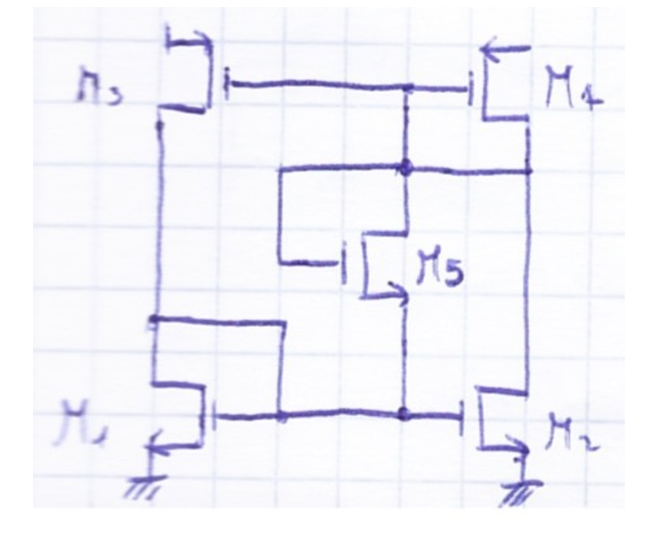

# Riferimenti di Corrente e Circuiti di Start-Up

Nei circuiti integrati analogici (amplificatori differenziali, cascode, folded cascode, stadi di uscita), tutti i blocchi funzionali richiedono delle correnti di polarizzazione ($I_{BIAS}$, $I_{ref}$) stabili e precise.  
Tuttavia, **su silicio non esistono generatori ideali di corrente**: l'unica risorsa fornita dall'esterno è la tensione di alimentazione ($V_{DD}$) e la massa ($\text{GND}$).

Un generatore di riferimento integrato deve soddisfare il requisito di **robustezza PVT**:
* **P (Process):** tolleranze di fabbricazione (spessore dell'ossido $t_{ox}$, mobilità $\mu$, tensione di soglia $V_{th}$).
* **V (Voltage):** insensibilità alle variazioni e al rumore di alimentazione $V_{DD}$ (elevato PSRR).
* **T (Temperature):** stabilità al variare della temperatura operativa.

---

### 1. I Soluzione: Il Riferimento Elementare con Resistenza a $V_{DD}$

L'approccio più immediato consiste nel polarizzare uno specchio di corrente classico mediante una resistenza $R$ collegata direttamente alla linea di alimentazione $V_{DD}$.

#### A) Analisi in Continua (DC)
Scrivendo la legge di Kirchhoff delle tensioni (KVL) sulla maglia d'ingresso formata da $V_{DD}$, $R$ e il transistore a diodo $M_1$:
$$V_{DD} - R \cdot I_{ref} - V_{GS1} = 0 \implies I_{ref} = \frac{V_{DD} - V_{GS1}}{R}$$

Ipotizzando $M_1$ in saturazione (con $\lambda = 0$):
$$I_{ref} = \frac{1}{2} \mu C_{ox} \left(\frac{W}{L}\right)_1 (V_{GS1} - V_{th1})^2$$

I rami d'uscita copiano la corrente in base al rispettivo rapporto geometrico:
$$I_{ox} = I_{ref} \cdot \frac{(W/L)_x}{(W/L)_1}$$

#### B) Analisi alle Variazioni (Piccolo Segnale per fluttuazioni su $V_{DD}$)
Se sull'alimentazione si sovrappone un disturbo $\Delta V_{DD}$ (ripple o caduta della batteria), possiamo studiare la variazione della corrente attraverso il circuito equivalente per piccoli segnali:

Il transistore a diodo $M_1$ presenta verso massa una resistenza equivalente pari a $r_{d1} \approx 1/g_{m1}$ (trascurando $r_{o1} \gg 1/g_{m1}$).  
La variazione di corrente che attraversa la serie di $R$ e $1/g_{m1}$ risulta:
$$\Delta I_{ref} = \frac{\Delta V_{DD}}{R + \frac{1}{g_{m1}}}$$

E sui rami specchiati in uscita:
$$\Delta I_{ox} = \frac{\Delta V_{DD}}{R + \frac{1}{g_{m1}}} \cdot \frac{(W/L)_x}{(W/L)_1}$$

#### Perché questa soluzione fallisce?
1. **Forte sensibilità a $V_{DD}$:** La corrente varia in modo quasi lineare con l'alimentazione ($\Delta I \propto \Delta V_{DD}$): il circuito non offre alcun rigetto dei disturbi di alimentazione (PSRR pessimo).
2. **Dipendenza da $V_{th}$ e parametri di processo:** La corrente dipende direttamente da $V_{GS1} = V_{th1} + V_{ov1}$. Se la tensione di soglia varia per tolleranze tecnologiche o deriva termica, $I_{ref}$ cambia sensibilmente. Inoltre anche la transconduttanza $g_{m1}$ dipende da $V_{th1}$.

> 💡 **Conclusione:** Per svincolare la corrente da $V_{DD}$ è necessario un circuito a **retroazione autonoma (autopolarizzazione o self-biasing)**.

---

### 2. II Soluzione: Autopolarizzazione ad Anello Chiuso (Due Specchi Incrociati)

Per eliminare la resistenza $R$ collegata a $V_{DD}$ (responsabile di trasmettere direttamente il rumore di alimentazione), si collegano due specchi di corrente incrociati testa-coda:
* In basso: specchio NMOS ($M_1, M_2$) con sorgenti a massa.
* In alto: specchio PMOS ($M_3, M_4$) con sorgenti a $V_{DD}$.

#### Analisi delle Equazioni
Ipotizzando tutti i transistori in saturazione e trascurando la modulazione di lunghezza di canale ($\lambda = 0$):
1. **Specchio NMOS inferiore ($M_1, M_2$):**  
   Avendo i gate in comune ($V_{GS1} = V_{GS2}$), se dimensioniamo $(W/L)_2 = K \cdot (W/L)_1$, lo specchio impone:
   $$I_{out} = K \cdot I_{ref}$$
2. **Specchio PMOS superiore ($M_3, M_4$):**  
   Avendo i gate in comune ($V_{SG3} = V_{SG4}$), la relazione di specchio impone:
   $$I_{ref} = I_{out} \cdot \frac{(W/L)_3}{(W/L)_4}$$

#### Il Problema di Indeterminazione
Sostituendo una relazione nell'altra:
$$I_{out} = K \cdot \left[ I_{out} \frac{(W/L)_3}{(W/L)_4} \right] \implies 1 = K \frac{(W/L)_3}{(W/L)_4} \iff \frac{(W/L)_4}{(W/L)_3} = \frac{(W/L)_2}{(W/L)_1}$$

* Le due equazioni $I_{out} = K \cdot I_{ref}$ e $I_{ref} = \frac{1}{K} \cdot I_{out}$ sono **linearmente dipendenti** (rappresentano due rette coincidenti passanti per l'origine).
* **Il sistema è indeterminato:** ammette infinite soluzioni. **Non è possibile scegliere né fissare il valore di $I_{ref}$!**
* Il punto di lavoro reale non sarà fissato dalla geometria dei MOS, ma dipenderà esclusivamente da effetti secondari incontrollati (resistenze parassite $r_o$, tensione di alimentazione $V_{DD}$).
* Se consideriamo le resistenze di uscita per piccoli segnali, la sensibilità a $V_{DD}$ si riduce ($\Delta I \approx \frac{\Delta V_{DD}}{r_{o1} + 1/g_{m3}}$), ma il problema fondamentale resta: **il valore nominale di corrente non è definito**.

> ⚠️ **Nota sull'isomorfismo topologico:** Non importa quale diagonale venga scelta per i transistori a diodo (es. $M_1-M_4$ a diodo come sopra, oppure $M_3-M_2$ a diodo come disegnato a volte alla lavagna): la topologia è speculare e impone sempre un guadagno d'anello unitario $I_{out} = K I_{ref}$, lasciando la corrente non determinata.

---

### 3. III Soluzione: Riferimento Widlar MOS (Constant-$g_m$)

Per rompere l'indeterminazione della II soluzione è necessario introdurre una seconda relazione **indipendente e non lineare**.  
Si inserisce una **resistenza $R_S$ di degenerazione sul source** di uno dei transistor.

#### Struttura del Circuito
* **Specchio PMOS superiore ($M_3, M_4$):**  
  Dimensionati identici $(W/L)_3 = (W/L)_4$.  
  Poiché condividono la stessa $V_{SG}$, forzano le correnti nei due rami a essere rigorosamente **uguali**:
  $$I_{ref} = I_{out}$$
* **Specchio NMOS inferiore ($M_1, M_2$):**  
  * $M_1$ è a diodo con source a massa ($V_{S1} = 0 \implies V_{G1} = V_{GS1}$).
  * Il gate di $M_2$ è collegato a quello di $M_1$ ($V_{G2} = V_{GS1}$).
  * Il source di $M_2$ non è a massa, ma è sollevato dalla resistenza $R_S$:
    $$V_{S2} = R_S \cdot I_{out}$$
  * Quindi la $V_{GS2}$ di $M_2$ vale:
    $$V_{GS2} = V_{G2} - V_{S2} = V_{GS1} - R_S \cdot I_{out}$$
    Riscrivendo la legge alla maglia (KVL):
    $$\mathbf{V_{GS1} = V_{GS2} + R_S \cdot I_{out} \iff R_S \cdot I_{out} = V_{GS1} - V_{GS2}}$$
* **Dimensionamento Geometrico:**  
  Affinché $V_{GS1} > V_{GS2}$ pur conducendo la stessa identica corrente ($I_{ref} = I_{out}$), il transistor $M_2$ deve avere una transconduttanza geometrica superiore, quindi deve essere dimensionato **più largo** di $M_1$:
  $$(W/L)_2 = K \cdot (W/L)_1 \quad \text{con } K > 1$$

---

### 4. Dimostrazione Analitica della Corrente Generata

Dall'equazione del MOS in saturazione (con $\lambda = 0$):
$$I_D = \frac{1}{2} \mu C_{ox} \frac{W}{L} (V_{GS} - V_{th})^2 \implies V_{GS} = V_{th} + \sqrt{\frac{2 I_D}{\mu C_{ox} (W/L)}}$$

Esprimiamo le tensioni gate-source di $M_1$ e $M_2$ (ipotizzando provvisoriamente $V_{th1} = V_{th2}$):
$$V_{GS1} = V_{th} + \sqrt{\frac{2 I_{out}}{\mu C_{ox} (W/L)_1}}$$
$$V_{GS2} = V_{th} + \sqrt{\frac{2 I_{out}}{\mu C_{ox} K (W/L)_1}}$$

Calcoliamo la differenza $V_{GS1} - V_{GS2}$:
$$V_{GS1} - V_{GS2} = \sqrt{\frac{2 I_{out}}{\mu C_{ox} (W/L)_1}} \left( 1 - \frac{1}{\sqrt{K}} \right)$$

Sostituendo nella KVL ($R_S \cdot I_{out} = V_{GS1} - V_{GS2}$):
$$R_S \cdot I_{out} = \sqrt{\frac{2 I_{out}}{\mu C_{ox} (W/L)_1}} \left( 1 - \frac{1}{\sqrt{K}} \right)$$

Dividiamo entrambi i membri per $\sqrt{I_{out}}$ (ipotizzando $I_{out} \neq 0$):
$$R_S \cdot \sqrt{I_{out}} = \sqrt{\frac{2}{\mu C_{ox} (W/L)_1}} \left( 1 - \frac{1}{\sqrt{K}} \right)$$

Elevando al quadrato ambo i membri e isolando $I_{out}$:
$$\mathbf{I_{out} = \frac{2}{\mu C_{ox} (W/L)_1} \cdot \frac{1}{R_S^2} \left( 1 - \frac{1}{\sqrt{K}} \right)^2}$$

> 🔍 **Nota su un comune refuso di stampa:** Nelle dispense a stampa può capitare di trovare scritto erroneamente un fattore $4$ anziché $2$ o il quadrato omesso sulla parentesi; la formula corretta al 100% è quella derivata sopra (riportata anche negli appunti manoscritti con $k = \mu C_{ox}$).

---

### 5. Le Due Proprietà Fondamentali della III Soluzione

1. **Indipendenza al 1° ordine da $V_{DD}$:**  
   Nell'espressione di $I_{out}$ **la tensione $V_{DD}$ non compare**!  
   Al primo ordine la corrente di polarizzazione è totalmente immune alle fluttuazioni o al ripple della tensione di alimentazione.
2. **Proprietà "Constant-$g_m$" (Transconduttanza stabilizzata):**  
   Calcoliamo la transconduttanza di $M_1$:
   $$g_{m1} = \sqrt{2 \mu C_{ox} (W/L)_1 I_{out}}$$
   Sostituendo l'espressione di $I_{out}$:
   $$g_{m1} = \sqrt{2 \mu C_{ox} (W/L)_1 \cdot \frac{2}{\mu C_{ox} (W/L)_1 R_S^2} \left( 1 - \frac{1}{\sqrt{K}} \right)^2} = \mathbf{\frac{2}{R_S} \left( 1 - \frac{1}{\sqrt{K}} \right)}$$
   * La transconduttanza $g_{m1}$ dipende **esclusivamente dal valore della resistenza $R_S$ e dal fattore geometrico $K$**!
   * Tutti i parametri di processo ($\mu, C_{ox}, V_{th}$) sono scomparsi. Poiché il guadagno degli stadi analogici ($A_v \approx g_m R_{out}$) e la banda passante dipendono da $g_m$, questo circuito garantisce parametri dinamici eccezionalmente stabili.

---

### 6. Confronto tra Topologie Duali e Non-Idealità Reali

La resistenza $R_S$ può essere posizionata sul source dell'NMOS $M_2$ (verso massa) o sul source del PMOS $M_4$ (verso $V_{DD}$):

#### A) Perché NON sono equivalenti in una tecnologia standard? (L'Effetto Body)
In una tecnologia standard a substrato p (p-substrate) comune:
* Tutti gli **NMOS** condividono lo stesso bulk monolitico, permanentemente collegato al potenziale più basso (massa, $V_B = 0$).
  * Nel circuito con resistenza su NMOS ($M_2$), il suo source si trova a $V_{S2} = R_S I_{out} > 0$.
  * Di conseguenza, $V_{SB2} > 0$: per [Effetto Body](./La%20soglia%20da%20cosa%20dipende.md), la soglia $V_{th2}$ aumenta:
    $$V_{th2} = V_{th0} + \gamma \left(\sqrt{2\phi_F + V_{SB2}} - \sqrt{2\phi_F}\right) > V_{th1}$$
  * Le due soglie non si elidono più ($V_{th1} \neq V_{th2}$), alterando il valore di corrente e reintroducendo dipendenze tecnologiche.
* I **PMOS**, invece, vengono realizzati all'interno di pozzetti isolati (**n-well**). Possiamo connettere il bulk di ciascun PMOS direttamente al rispettivo source ($V_{BS} = 0$), **annullando completamente l'effetto body**.
* 👉 **Regola pratica:** Nei processi con substrato p, la versione con resistenza di degenerazione sui PMOS è nettamente preferibile.

#### B) Altre Non-Idealità
* **Modulazione di lunghezza di canale ($\lambda \neq 0$):** I due rami lavorano con tensioni drain-source differenti ($V_{DS1} = V_{GS1}$, mentre $V_{DS2} = V_{DD} - |V_{SD4}| - R_S I_{out} \neq V_{DS1}$). A causa di $\lambda$, si reintroduce una lieve dipendenza residua da $V_{DD}$.
* **Deriva termica di $R_S$:** Poiché $I_{out} \propto 1/R_S^2$, il coefficiente di temperatura del [Resistore](./Resistore.md) integrato modula la corrente al variare della temperatura.

---

### 7. Il Problema dello Start-Up

Tutti i circuiti dotati di autopolarizzazione ad anello chiuso presentano **due punti di equilibrio stabili**:
1. **Punto desiderato:** $I_{out} > 0$ dato dalla formula analitica.
2. **Punto spuro a corrente nulla (circuito "morto"):** $I_{ref} = 0$ e $I_{out} = 0$.

Se all'accensione tutte le correnti sono nulle:
* Sugli NMOS ($M_1, M_2$): nessuna corrente $\implies$ caduta su $R_S$ nulla $\implies V_{G1} = V_{G2} = 0\text{ V}$. Quindi $V_{GS1} = V_{GS2} = 0\text{ V} < V_{thn}$ (**NMOS tutti spenti**).
* Sui PMOS ($M_3, M_4$): nessuna corrente $\implies$ gate tirati a $V_{DD}$ ($V_G = V_{DD}$). Quindi $V_{SG3} = V_{SG4} = 0\text{ V} < |V_{thp}|$ (**PMOS tutti spenti**).
* Tutte le KCL ai nodi sono banalmente soddisfatte ($0 = 0$). Il circuito rimane permanentemente disattivato.

> ⚠️ **Perché le formule lo nascondono?** Nella dimostrazione abbiamo diviso per $\sqrt{I_{out}}$, assumendo implicitamente $I_{out} \neq 0$ e scartando matematicamente la radice $I=0$. Nei simulatori SPICE, condizioni iniziali numeriche possono mascherare il difetto, ma sul silicio reale il chip rischia di non partire mai!

#### Esempi di circuiti con e senza problema di Start-Up

* **Circuito (a) — NO start-up:** All'accensione con $I=0$, non c'è caduta su $R$. Il gate dell'NMOS a diodo è a $V_{DD} > V_{thn}$: il transistore si accende autonomamente da solo.
* **Circuito (b) — SÌ start-up:** Specchio su specchio (II soluzione): se $I=0$, tutti i $V_{GS} = 0$, resta spento.
* **Circuito (c) — SÌ start-up:** III soluzione con $R_S$: se $I=0$, caduta su $R_S$ nulla, tutti i $V_{GS} = 0$, resta spento.
* **Circuito (d) — NO start-up:** Ramo unico serie passivo tra $V_{DD}$ e GND: non appena $V_{DD} > V_{thn} + |V_{thp}|$, i due diodi conducono necessariamente corrente.

---

### 8. Il Circuito di Start-Up (La Soluzione)

Per forzare l'innesco del circuito principale si aggiunge un transistore ausiliario **$M_5$** (NMOS a diodo).

#### Connessione di $M_5$
* Drain e Gate di $M_5$ sono cortocircuitati insieme e collegati al **nodo dei gate dei PMOS ($M_4$)**.
* Il Source di $M_5$ è collegato al **nodo dei gate degli NMOS ($M_1$)**.
* Si crea così una catena conduttiva temporanea da $V_{DD}$ a GND:
  $$V_{DD} \longrightarrow M_4 \text{ (a diodo)} \longrightarrow M_5 \text{ (a diodo)} \longrightarrow M_1 \text{ (a diodo)} \longrightarrow \text{GND}$$

#### Dinamica in 2 Fasi

1. **Fase di Accensione (Iniezione di Corrente):**
   * Se all'accensione il circuito principale tenta di rimanere spento, i gate PMOS sono a $V_{DD}$ e i gate NMOS sono a $0\text{ V}$.
   * Non appena la tensione di alimentazione supera la somma delle tre soglie:
     $$V_{DD} > |V_{thp4}| + V_{thn5} + V_{thn1}$$
     la catena centrale conduce corrente da $V_{DD}$ a massa.
   * Questa corrente **abbassa il potenziale dei gate PMOS** e **alza il potenziale dei gate NMOS**, accendendo contemporaneamente entrambi i lati del circuito. L'anello di retroazione si innesca e converge rapidamente al punto di lavoro nominale ($I_{out} > 0$).
2. **Fase di Regime (Disattivazione Automatica):**
   * Quando il circuito raggiunge il punto di lavoro desiderato:
     * Il potenziale dei gate PMOS scende a $V_{G5} = V_{DD} - V_{SG4}$.
     * Il potenziale dei gate NMOS sale a $V_{S5} = V_{GS1}$.
   * La tensione che pilota $M_5$ diventa:
     $$V_{GS5} = V_{G5} - V_{S5} = V_{DD} - (V_{SG4} + V_{GS1})$$
   * Essendo a regime $V_{SG4}$ e $V_{GS1}$ elevate, la differenza scende al di sotto della soglia:
     $$V_{GS5} < V_{thn5} \iff V_{DD} < V_{SG4} + V_{GS1} + V_{thn5}$$
   * **$M_5$ si spegne completamente ($I_{D5} = 0$)!**
   * A regime $M_5$ agisce come un circuito aperto: non consuma potenza e non perturba in alcun modo il punto di polarizzazione e le proprietà a $g_m$ costante.

---

### Riepilogo di Sintesi

| Soluzione | Topologia | Vantaggio Chiave | Criticità / Difetto |
| :--- | :--- | :--- | :--- |
| **I Soluzione** | Specchio semplice + $R$ a $V_{DD}$ | Semplicità circuitale | $\Delta I \propto \Delta V_{DD}$ (zero PSRR), forte sensibilità a $V_{th}$. |
| **II Soluzione** | Due specchi incrociati senza $R$ | Meno sensibile a $V_{DD}$ | Sistema indeterminato ($I_{out} = K I_{ref}$): corrente non fissabile. |
| **III Soluzione** | Specchi incrociati + degenerazione $R_S$ | Corrente indipendente da $V_{DD}$, transconduttanza $g_m$ stabilizzata | Richiede circuito di **Start-Up**; sensibile a effetto body se su NMOS. |
| **Con Start-Up** | III Soluzione + NMOS ausiliario $M_5$ | Avvio garantito + spegnimento automatico a regime | Nessuna interferenza a regime sul bias point. |

---

*Pagine correlate:*
- [La soglia da cosa dipende](./La%20soglia%20da%20cosa%20dipende.md)
- [Coppia Differenziale e Cascode Telescopico](./Coppia%20Differenziale%20e%20Cascode%20Telescopico.md)
- [Folded Cascode e Recycling](./Folded%20Cascode%20e%20Recycling.md)
- [Amplificatori Rail-to-Rail](./Amplificatori%20Rail-to-Rail.md)
- [Resistore](./Resistore.md)
- [MOS](./MOS.md)
- [Matching e Variabilita nei Componenti Integrati](./Matching%20e%20Variabilita%20nei%20Componenti%20Integrati.md)
- [Overdrive e Regioni di Inversione](./Overdrive%20e%20Regioni%20di%20Inversione.md)
