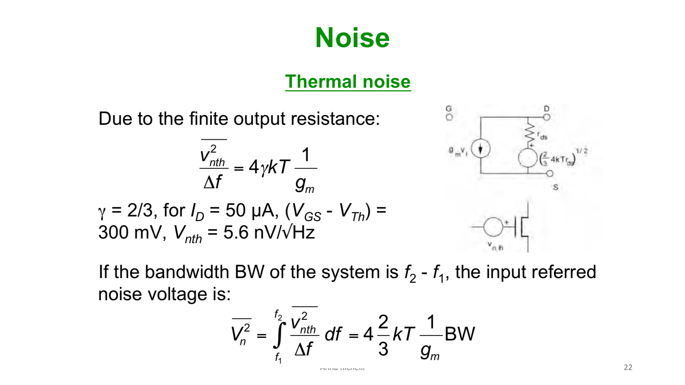
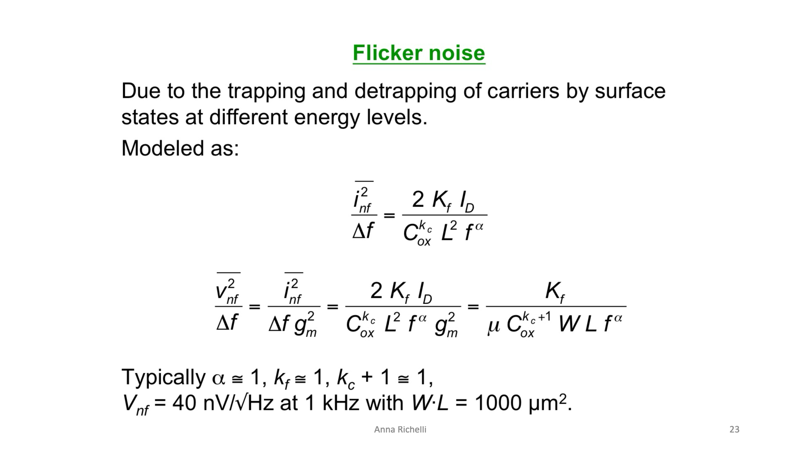
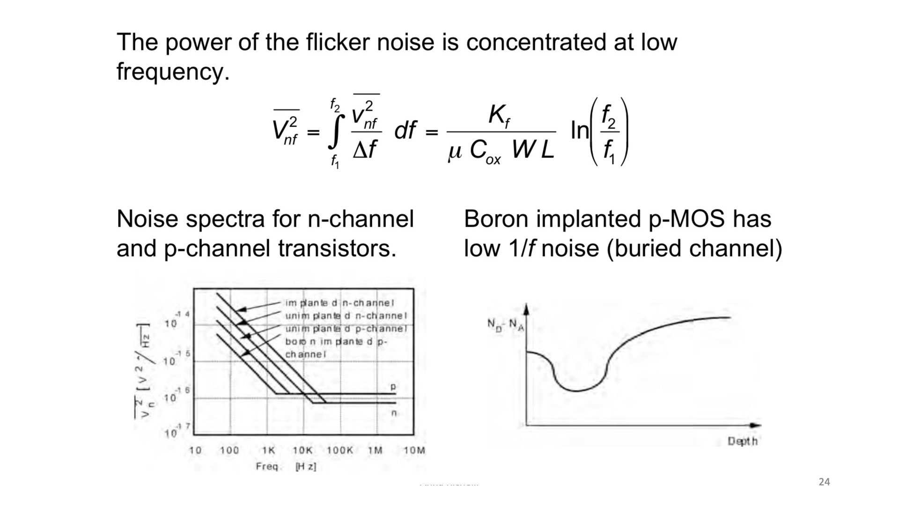
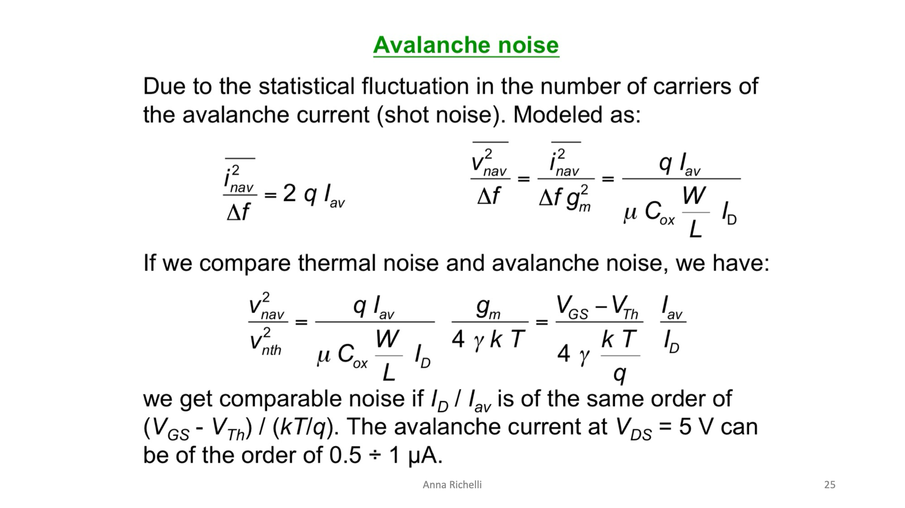
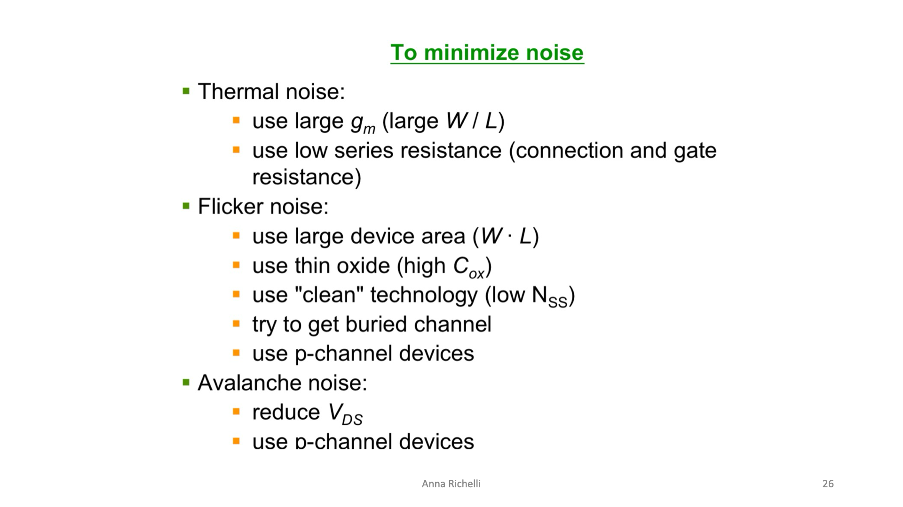

# Rumore nel MOSFET: Termico, Flicker (1/f) e Valanga

Nei circuiti analogici a basso rumore (*Low-Noise Amplifiers - LNA*, front-end di lettura per sensori, amplificatori biomedicali), il limite ultimo alla risoluzione di un segnale non è imposto dal guadagno, ma dal **rumore intrinseco** generato dai dispositivi attivi.

Nel transistor MOSFET agiscono tre meccanismi fisici indipendenti di rumore:
1. **Rumore Termico (Thermal Noise)**
2. **Rumore Flicker ($1/f$)**
3. **Rumore a Valanga (Avalanche Noise)**

Per valutare l'impatto sul circuito, ogni generatore di rumore fisico (che nasce come fluttuazione di corrente al Drain) viene convenzionalmente **riportato all'ingresso (Gate)** dividendolo per il quadrato della transconduttanza ($g_m^2$):
$$\overline{v_{n,\text{in}}^2} = \frac{\overline{i_{n,\text{drain}}^2}}{g_m^2}$$
Questo consente di confrontare immediatamente la densità spettrale di rumore con l'ampiezza del segnale utile applicato all'ingresso.

---

### 1. Rumore Termico (Thermal Noise)

Il canale invertito del MOSFET è un resistore continuo di silicio conduttivo. Il moto caotico e disordinato dei portatori dovuto all'agitazione termica a temperatura $T$ genera fluttuazioni casuali di corrente (rumore Johnson-Nyquist / rumore bianco, cioè con densità spettrale costante su tutte le frequenze).

#### Densità Spettrale Riportata all'Ingresso:
$$\frac{\overline{v_{nth}^2}}{\Delta f} = 4 \gamma k T \frac{1}{g_m} \quad \left[\frac{\text{V}^2}{\text{Hz}}\right]$$

Dove:
* $k = 1.38 \times 10^{-23}\,\text{J/K}$ è la costante di Boltzmann.
* $T$ è la temperatura assoluta ($300\,\text{K}$).
* $\gamma$ (gamma) è il fattore di rumore del canale:
  * In forte inversione a canale lungo (regime di saturazione): **$\gamma = \frac{2}{3} \approx 0.67$**.
  * Nei canali corti nanometrici subentrano gli elettroni caldi e $\gamma$ può salire a **$1 \div 2$** o superiore.
* $g_m$ è la transconduttanza del MOSFET.

#### Esempio numerico di dimensionamento:
Polarizzando il transistor con:
* $I_D = 50\,\mu\text{A}$
* Overdrive $(V_{GS} - V_{Th}) = 300\,\text{mV}$
* $g_m = \frac{2 I_D}{V_{GS}-V_{Th}} = \frac{2 \times 50\,\mu\text{A}}{0.3\,\text{V}} = 333\,\mu\text{S}$

La densità spettrale in tensione vale:
$$V_{nth} = \sqrt{\frac{\overline{v_{nth}^2}}{\Delta f}} = \sqrt{\frac{4 \times \frac{2}{3} \times (1.38 \times 10^{-23} \times 300)}{3.33 \times 10^{-4}}} \approx \mathbf{5.6\,\text{nV}/\sqrt{\text{Hz}}}$$

#### Integrazione sulla Banda Passante ($\text{BW} = f_2 - f_1$):
Essendo uno spettro bianco costante, il rumore efficace totale integrato vale:
$$\overline{V_n^2} = \int_{f_1}^{f_2} \frac{\overline{v_{nth}^2}}{\Delta f} df = \mathbf{4 \left(\frac{2}{3}\right) k T \frac{1}{g_m} \cdot \text{BW}}$$

> 💡 **Regola pratica:** Per abbattere il rumore termico bisogna **massimizzare $g_m$** (cioè scegliere un elevato rapporto d'aspetto $W/L$ e/o incrementare la corrente di polarizzazione $I_D$).

---

### 2. Rumore Flicker ($1/f$)

A differenza del transistore bipolare (BJT) dove la corrente fluisce nel volume neutro del silicio, nel MOSFET il canale scorre **a contatto diretto con l'interfaccia $\text{Si-SiO}_2$**.

#### Origine fisica: Trapping e Detrapping
All'interfaccia il reticolo cristallino del silicio è interrotto, generando legami chimici pendenti (*dangling bonds*) e stati energetici interfacciali (trappole).  
I portatori di carica che transitano nel canale cadono casualmente in queste trappole e vengono rilasciati dopo un certo tempo (*trapping and detrapping*).  
La sovrapposizione casuale di innumerevoli processi microscopici con un continuum di costanti di tempo genera uno spettro la cui potenza scala inversamente con la frequenza: **$1/f^\alpha$** (con $\alpha \approx 1$).

#### La Formula e il Ruolo Fondamentale dell'Area ($W \cdot L$):
La densità spettrale di rumore di corrente al Drain è:
$$\frac{\overline{i_{nf}^2}}{\Delta f} = \frac{2 K_f I_D}{C_{ox}^{k_c} L^2 f^\alpha}$$

Riportandola all'ingresso sul Gate ($\frac{\overline{i_{nf}^2}}{g_m^2}$), e ricordando che $g_m^2 = 2 \mu C_{ox}\frac{W}{L}I_D$:

$$\mathbf{\frac{\overline{v_{nf}^2}}{\Delta f} = \frac{K_f}{\mu C_{ox}^{k_c+1} \cdot (W \cdot L) \cdot f^\alpha} \propto \frac{1}{(W \cdot L) \cdot f}}$$

* $K_f$: coefficiente di flicker noise del processo tecnologico.
* **$W \cdot L$ (Area di Gate):** il rumore $1/f$ è **inversamente proporzionale all'area del canale**.  
  *Intuizione fisica:* in un transistor molto largo e lungo, il numero totale di portatori nel canale è enorme. L'evento di cattura/rilascio di un singolo elettrone da parte di una trappola viene "diluito" e mediato sulla carica complessiva (legge dei grandi numeri). In transistor nanometrici piccolissimi, invece, la cattura di un singolo elettrone produce sbalzi percentuali macroscopici di soglia e corrente! (Vedi [1_f non va a braccetto con lo scaling](../Scaling%20e%20Limiti%20Fisici/1_f%20non%20va%20a%20braccetto%20con%20lo%20scaling.md)).
* Valore tipico: con area $W \cdot L = 1000\,\mu\text{m}^2$ a $f = 1\,\text{kHz}$, $V_{nf} \approx \mathbf{40\,\text{nV}/\sqrt{\text{Hz}}}$.

#### Integrazione alle Basse Frequenze e Frequenza di Corner ($f_c$):

Integrando lo spettro $1/f$ tra le frequenze $f_1$ e $f_2$:
$$\overline{V_{nf}^2} = \int_{f_1}^{f_2} \frac{K_f}{\mu C_{ox} W L} \frac{1}{f} df = \frac{K_f}{\mu C_{ox} W L} \cdot \mathbf{\ln\left(\frac{f_2}{f_1}\right)}$$
Poiché diverge per $f \to 0$, il rumore flicker è interamente concentrato alle **bassissime frequenze** (banda audio, sensori lenti, segnali biologici).

* **Frequenza di Corner ($f_c$):** nello spettro reale (grafico a sinistra) il rumore scende con pendenza $-10\,\text{dB/dec}$ fino alla frequenza di corner $f_c$, oltre la quale il rumore flicker cade al di sotto del pavimento del rumore termico bianco.

#### Perché i PMOS hanno molto meno Rumore $1/f$ degli NMOS? (Canale Sepolto)
Nel grafico comparativo dello spettro si nota che i PMOS (*"p-channel"* e *"boron implanted p-channel"*) hanno una densità di rumore molto inferiore agli NMOS:
* Nei processi CMOS standard con gate in polisilicio $N^+$, per regolare la soglia del PMOS si effettua un impianto superficiale di Boro.
* Questo drogaggio sposta il picco di conduzione delle lacune **a qualche decina di nanometri di profondità nel silicio** (*Buried Channel / Canale Sepolto*, vedi grafico del profilo $N_D - N_A$ vs Depth).
* Poiché le lacune scorrono **distanti dall'interfaccia imperfetta $\text{Si-SiO}_2$**, non interagiscono con le trappole dell'ossido!
* **Risultato:** i PMOS hanno rumore $1/f$ da **2 a 5 volte inferiore** rispetto agli NMOS. Negli stadi di ingresso a basso rumore si scelgono quasi sempre coppie differenziali con PMOS.

---

### 3. Rumore a Valanga (Avalanche Noise)

Quando il transistor opera in saturazione con tensioni di drain elevate ($V_{DS} \ge 3 \div 5\,\text{V}$), il fortissimo campo elettrico nella zona svuotata al drain innesca la **ionizzazione per impatto** (portatori caldi che rompono legami covalenti, vedi [Portatori Caldi (Hot Carriers)](../Effetti%20di%20Canale%20Corto/Hot%20carriers.md)).

Trattandosi di una corrente generata da eventi di ionizzazione discreti e casuali, la corrente secondaria a valanga $I_{av}$ manifesta un **rumore di tipo Shot (Shot Noise)**:
$$\frac{\overline{i_{nav}^2}}{\Delta f} = 2 q I_{av}$$

Riportandolo all'ingresso sul Gate (dividendo per $g_m^2 = 2 \mu C_{ox}\frac{W}{L}I_D$):
$$\mathbf{\frac{\overline{v_{nav}^2}}{\Delta f} = \frac{q I_{av}}{\mu C_{ox} \frac{W}{L} I_D}}$$

#### Confronto diretto con il Rumore Termico:
Dividendo il rumore a valanga per il rumore termico:
$$\frac{\overline{v_{nav}^2}}{\overline{v_{nth}^2}} = \frac{\frac{q I_{av}}{\mu C_{ox} \frac{W}{L} I_D}}{\frac{4 \gamma k T}{g_m}} = \mathbf{\frac{V_{GS} - V_{Th}}{4 \gamma \left(\frac{k T}{q}\right)} \cdot \frac{I_{av}}{I_D}}$$

* Con un overdrive tipico $(V_{GS}-V_{Th}) = 300\,\text{mV}$ e $V_T = \frac{kT}{q} \approx 26\,\text{mV}$, il prefattore vale $\approx 4.3$.
* **Conclusione:** basta che la corrente di valanga $I_{av}$ sia appena **lo $0.1\% \div 1\%$ della corrente di drain $I_D$** (il che accade facilmente a $V_{DS} \approx 5\,\text{V}$ con $I_{av} \approx 0.5 \div 1\,\mu\text{A}$) affinché **il rumore a valanga diventi comparabile o superiore al rumore termico**, degradando pesantemente il ricevitore.

---

### 4. Strategie di Progetto per Minimizzare il Rumore

Sintesi delle scelte circuitali e di layout per la progettazione analogica a basso rumore:

| Sorgente di Rumore | Azione di Dimensionamento | Spiegazione Fisica |
| :--- | :--- | :--- |
| **Thermal Noise** | **1. Massimizzare $g_m$:** scegliere un rapporto d'aspetto $W/L$ grande e polarizzare con corrente adeguata.   **2. Minimizzare le resistenze in serie:** ridurre la resistenza di polisilicio del Gate ($R_G$) e dei contatti. | Il rumore termico riportato all'ingresso scala come $1/g_m$.   La resistenza parassita di Gate $R_G$ aggiunge rumore termico $4kTR_G$ direttamente all'ingresso: si abbatte spezzando il canale in dita parallele interdigitate (**layout a fingering**, vedi [Layout e Tecniche di Progettazione dei MOS](./Layout%20e%20Tecniche%20di%20Progettazione%20dei%20MOS.md)). |
| **Flicker Noise ($1/f$)** | **1. Aumentare l'Area del canale ($W \cdot L$):** usare transistor grandi.   **2. Usare ossidi sottili (alto $C_{ox}$):** dielettrici avanzati.   **3. Usare tecnologie a bassa densità di difetti ($N_{SS}$).**   **4. Preferire dispositivi PMOS** a canale sepolto. | Più l'area è ampia, più le fluttuazioni delle singole trappole superficiali vengono mediate statisticamente a zero.   Nei PMOS a canale sepolto le lacune scorrono in profondità nel silicio, lontane dalle trappole dell'interfaccia $\text{Si-SiO}_2$. |
| **Avalanche Noise** | **1. Ridurre la tensione $V_{DS}$:** tenere il drain a potenziale moderato.   **2. Preferire dispositivi PMOS.** | Mantenere $V_{DS}$ basso riduce il picco di campo elettrico al pinch-off, spegnendo la ionizzazione per urto ($I_{av} \to 0$).   Nei PMOS il coefficiente di ionizzazione delle lacune è drasticamente inferiore a quello degli elettroni ($\alpha_p \ll \alpha_n$). |

---

*Pagine correlate:*
- [1_f non va a braccetto con lo scaling](../Scaling%20e%20Limiti%20Fisici/1_f%20non%20va%20a%20braccetto%20con%20lo%20scaling.md)
- [Overdrive e Regioni di Inversione](./Overdrive%20e%20Regioni%20di%20Inversione.md)
- [Portatori Caldi (Hot Carriers)](../Effetti%20di%20Canale%20Corto/Hot%20carriers.md)
- [Crollo della Resistenza di Uscita (ro)](../Effetti%20di%20Canale%20Corto/Crollo%20di%20ro.md)
- [Breakdown e Diodo Zener](./Breakdown%20e%20Diodo%20Zener.md)
- [Layout e Tecniche di Progettazione dei MOS](./Layout%20e%20Tecniche%20di%20Progettazione%20dei%20MOS.md)
- [Coppia Differenziale e Cascode Telescopico](./Coppia%20Differenziale%20e%20Cascode%20Telescopico.md)
- [Analogico non si scende di dimensioni](../Scaling%20e%20Limiti%20Fisici/Analogico%20non%20si%20scende%20di%20dimensioni.md)
