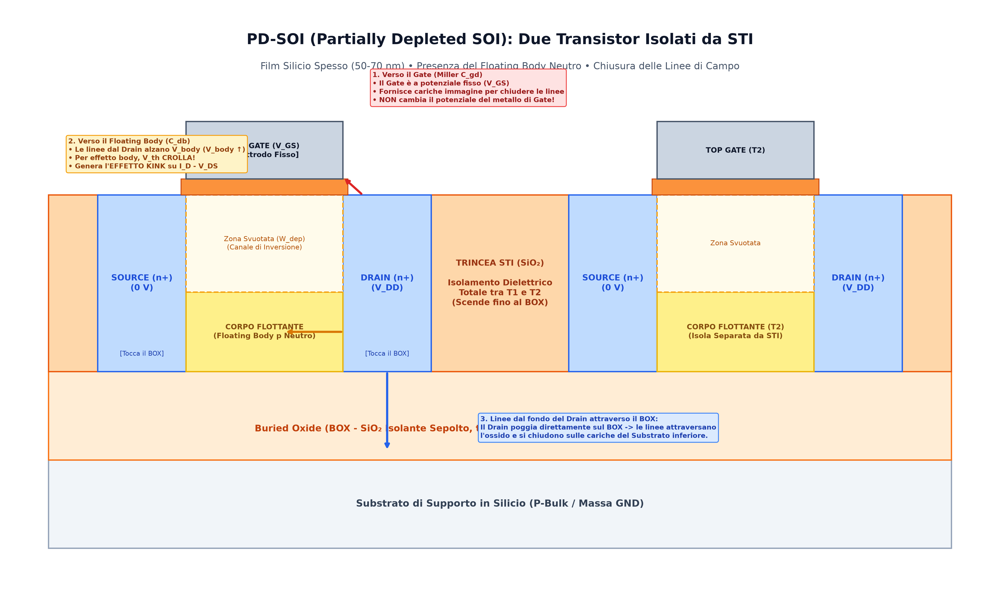
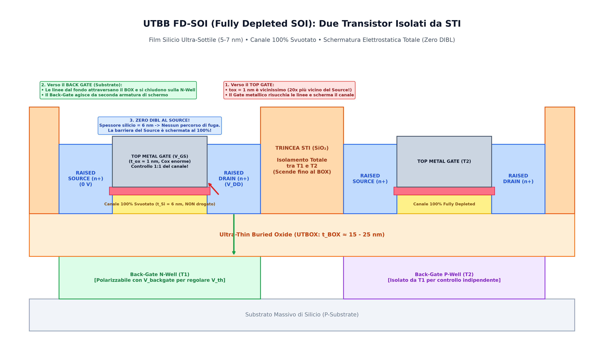

La tecnologia **SOI** (*Silicon On Insulator*) rappresenta l'evoluzione fondamentale del classico MOSFET su silicio massivo (*bulk*). 

Il principio chiave consiste nell'introdurre uno strato continuo di ossido isolante sepolto (**BOX** - *Buried Oxide*, $\text{SiO}_2$) tra il sottile film superiore di silicio attivo (in cui si realizzano canale, Source e Drain) e il substrato massivo inferiore di supporto.

---

### 1. Perché la tecnologia SOI? (I Vantaggi Fisici Rispetto al Bulk)

1. **Azzeramento delle Perdite in Continua verso il Substrato ($I_{DC} = 0$):**
   * Nel bulk tradizionale, sotto il canale c'è silicio continuo con giunzioni p-n estese sul fondo e sui lati dei pozzetti di Drain/Source, soggette a correnti di perdita inversa e passaggio di cariche in profondità (*punchthrough*).
   * Nel SOI, l'ossido sepolto è un isolante perfetto ($R > 10^{16}\,\Omega$): **nessuna corrente parassita in DC può penetrare nel substrato**.
2. **Crollo delle Correnti di Generazione Termica:**
   * La corrente di generazione termica (SRH) è proporzionale al volume di silicio svuotato ($I_{\text{gen}} = q \cdot G_{\text{th}} \cdot \text{Volume}$).
   * Nel bulk il volume include tutti i pozzetti profondi micrometri nel substrato; in SOI il volume è confinato al solo sottilissimo film attivo ($W \cdot L \cdot t_{\text{Si}}$), abbattendo $I_{\text{gen}}$ di ordini di grandezza.
   * *Dove scorre la generazione in FD-SOI?* A transistor spento ($V_D = V_{DD}$, $V_S = 0\,\text{V}$), gli elettroni generati vanno al Drain e le lacune al Source: la corrente scorre **esclusivamente tra Drain e Source** come frazione trascurabile di $I_{\text{OFF}}$, mentre verso il substrato è rigorosamente **$0\,\text{A}$**.
3. **Crollo delle Capacità Parassite di Giunzione ($C_{db}, C_{sb}$):**
   * **La costante dielettrica:** Il BOX è biossido di silicio ($\varepsilon_{SiO_2} \approx 3.9 \cdot \varepsilon_0$), che ha una permittività **3 volte inferiore rispetto al silicio** ($\varepsilon_{Si} \approx 11.7 \cdot \varepsilon_0$). A parità di geometria, la capacità $C = \frac{\varepsilon A}{d}$ è già divisa per 3.
   * **L'area reale non è "tutto il chip":** Anche se l'ossido sepolto si estende su tutto il wafer, l'armatura superiore del condensatore è **esclusivamente la minuscola area del singolo pozzetto di Drain o Source** (frazioni di micrometro quadro, es. $W \cdot L_D \approx 0.05\,\mu\text{m}^2$). Ciascun transistor è fisicamente ritagliato e isolato lateralmente da trincee STI.
   * **Azzeramento delle pareti laterali ($C_{\text{sidewall}}$):** Nel silicio bulk la sacca di Drain è una vaschetta 3D le cui pareti laterali toccano il substrato (spesso con drogaggio maggiorato *halo*), contribuendo per oltre il $50\%$ della capacità parassita totale. Nel SOI le pareti laterali toccano l'ossido STI spesso: **la capacità perimetrale è praticamente azzerata**.
   * Di conseguenza, la capacità parassita complessiva vista dal nodo di Drain crolla del $70\% \div 80\%$, aumentando drasticamente la velocità di commutazione ($f_{\text{max}}$) e abbattendo la potenza dinamica di carica/scarica ($P_{\text{dyn}} = C V_{DD}^2 f$).

> ❓ **"Se c'è una capacità parassita verso il fondo, se balla il substrato non balla anche il Drain?"**  
> L'obiezione è ottima: ogni capacità trasferisce una corrente di spostamento $i = C \frac{dV}{dt}$. Tuttavia, il SOI garantisce un'immunità al rumore nettamente superiore al Bulk per 3 motivi:
> 1. Essendo $C$ ridotta di $3-5$ volte, la corrente impulsiva accoppiata è proporzionalmente ridotta.
> 2. Nel Bulk il substrato è un semiconduttore conduttivo resistivo ($\rho \approx 1 \div 10\,\Omega\cdot\text{cm}$): le commutazioni digitali iniettano portatori che scorrono nel silicio generando cadute ohmiche ($V = R_{\text{sub}} \cdot I$), facendo "ballare" direttamente il Bulk dei transistor analogici e **modulando la loro $V_{th}$ per effetto body**.
> 3. Nel SOI l'ossido ha una resistività dielettrica infinita ($>10^{14}\,\Omega\cdot\text{cm}$): **nessuna corrente DC o portatore di carica può attraversare il BOX**, e il canale è schermato, azzerando l'effetto body dal substrato comune.
> 👉 Approfondimento: [Confronto Tecnologie CMOS e BiCMOS](../Tecnologia%20e%20Fabbricazione/Confronto%20Tecnologie%20CMOS%20e%20BiCMOS.md).

4. **Immunità Totale al [Latch-Up](../Famiglie%20Logiche/Latchup%20nei%20circuiti%20CMOS.md):**
   * Non esistendo un substrato continuo condiviso tra NMOS e PMOS, la catena di transistori parassiti a tiristore ($p^+-n-p-n^+$) è fisicamente interrotta. Il rischio di Latch-Up è **azzerato al $100\%$**.
5. **Isolamento Dielettrico Completo tra Transistor Adiacenti:**
   * Le trincee di isolamento superficiale [STI](../Tecnologia%20e%20Fabbricazione/Isolamento.md) vengono scavate nel film di silicio fino a **toccare direttamente il BOX**. Ogni transistor è un'isola dielettrica sigillata su tutti i lati.

---

### 2. PD-SOI (*Partially Depleted SOI*)

Nel **PD-SOI**, il film di silicio attivo è relativamente spesso ($t_{Si} \approx 50 - 100\,\text{nm}$).



#### A. La Nascita del Floating Body
Poiché lo spessore del silicio $t_{Si}$ è maggiore della massima profondità di svuotamento naturale del Gate ($t_{Si} > W_{d,max}$):
* La tensione di Gate svuota solo i primi $30-40\,\text{nm}$ superiori del film.
* Sotto la zona svuotata rimane una sacca di **silicio neutro $p$ non svuotato** a contatto con il BOX.
* Questa sacca è priva di qualsiasi contatto ohmico verso massa ed è completamente isolata da ossido: prende il nome di **Corpo Flottante (*Floating Body*)**.

#### B. L'Effetto Kink e l'History Effect
1. Quando il transistor conduce ad alta $V_{DS}$, gli elettroni ad alta energia generano per **ionizzazione da impatto** coppie elettrone-lacuna ($e^- - h^+$) in prossimità del Drain (a cui si aggiunge la generazione termica).
2. Gli elettroni vengono assorbiti dal Drain positivo, mentre **le lacune ($h^+$) non potendo scendere nel substrato (bloccate dal BOX) si accumulano nel corpo flottante**.
3. L'accumulo di carica positiva alza il potenziale del corpo ($V_{\text{body}} \uparrow$).
4. Per effetto body, **la tensione di soglia crolla improvvisamente ($V_{th} \downarrow$)**, provocando un'impennata anomala della corrente di Drain: questo scalino nella curva $I_D - V_{DS}$ prende il nome di **Effetto Kink** (*Kink Effect*).
5. Nei circuiti digitali, il ritardo di commutazione di una porta logica dipende dallo stato di carica lasciato dalla transizione precedente (**History Effect**), rendendo il timing non deterministico.

#### C. Chiusura delle Linee di Campo del Drain nel PD-SOI
Il Drain ($n^+$) attraversa l'intero spessore del silicio e tocca il BOX sul fondo:
* **Verso l'alto (Gate):** le linee formano la capacità parassita $C_{gd}$, amplificata per [Effetto Miller](./Effetto%20Miller.md). Il metallo del Gate, mantenuto a potenziale imposto dal generatore/driver esterno, fornisce cariche immagine senza variare la propria tensione.
* **Di lato (Floating Body):** le linee accoppiano capacitivamente il Drain al corpo flottante ($C_{db}$), modulando $V_{\text{body}}$.
* **Dal fondo (BOX $\to$ Substrato):** le linee attraversano l'ossido sepolto chiudendosi sul piano conduttivo del substrato inferiore.

---

### 3. UTBB FD-SOI (*Ultra-Thin Body and Buried Oxide Fully Depleted SOI*)

Nel **Fully Depleted SOI**, il film di silicio viene assottigliato a soli **$t_{Si} \approx 5 - 7\,\text{nm}$** (circa $15-20$ strati atomici di silicio), poggiato su un ossido sepolto ultrasottile (**UTBOX**, $t_{BOX} \approx 15 - 25\,\text{nm}$).



#### A. Canale 100% Svuotato e Senza Drogaggio
Poiché $t_{Si} \ll W_{d,max}$, il campo elettrico del Gate attraversa l'intero spessore del silicio fino al BOX:
* **Zero Floating Body:** non esiste silicio neutro, eliminando al $100\%$ l'effetto Kink e l'History Effect (le lacune fluiscono liberamente verso il Source).
* **Canale Intrinseco (Non Drogato, $N_A \approx 0$):** non dovendo inserire atomi di drogante per controllare la soglia, si azzera lo scattering ionico (**mobilità dei portatori $\mu$ elevatissima**) e si elimina la dispersione statistica di soglia dovuta alle fluttuazioni casuali dei droganti (mismatch di Pelgrom / RDF).

#### B. Efficienza Elettrostatica Ideale ($S \to 60\,\text{mV/dec}$)
Nel partitore capacitivo tra Gate e superficie del canale:
$$\frac{\partial \psi_s}{\partial V_{GS}} = \frac{1}{1 + \frac{C_{\text{sotto}}}{C_{ox}}} \approx \frac{1}{1 + \frac{C_{BOX}}{C_{ox}}} \approx 1.0$$
* Poiché il BOX è un isolante a bassa capacità ($C_{BOX} \ll C_{ox}$), quasi il **$100\%$ della variazione di tensione di Gate si trasferisce direttamente sul potenziale di canale**.
* Il fattore di sottosoglia $n \to 1.05 \approx 1.0$, permettendo al **Subthreshold Swing di raggiungere il limite termodinamico ideale**:
  $$S \approx 62 - 65\,\text{mV/dec}$$
* Il transistor commuta tra ON e OFF con massima pendenza, garantendo correnti di perdita da spento ($I_{OFF}$) microscopiche.

#### C. Soppressione Totale del DIBL ([DIBL](../Effetti%20di%20Canale%20Corto/DIBL.md)) e Modello Elettrostatico 2D
Nei nodi nanometrici su bulk, le linee di campo del Drain penetrano in profondità nel silicio e abbassano la barriera di potenziale del Source da sotto (DIBL).
Nell'FD-SOI il DIBL è soppresso geometricamente per **Doppia Schermatura Elettrostatica**:

1. **Chiusura delle Linee di Campo (Legge di Gauss):**
   * Le cariche positive nel Drain ($+Q_D$) richiamano cariche negative. 
   * Il Gate sopra ($V_G = 0\,\text{V}$) e il Back-Gate sotto ($V_{BG} = 0\,\text{V}$) sono piastre conduttrici collegate a potenziale fisso: su di esse **si accumulano cariche negative reali indotte** ($-Q_{\text{gate}}$ e $-Q_{\text{backgate}}$) fornite dai generatori esterni.
   * Le linee di campo del Drain vengono intercettate e "mangiate" immediatamente sopra e sotto.

2. **Il Partitore Capacitivo e la Capacità Laterale ($C_{\text{lat}}$):**
   Il potenziale in un punto $X$ del canale è determinato dal partitore capacitivo a 4 vie:
   $$\phi_X = \frac{C_{ox} \cdot V_G + C_{BOX} \cdot V_{BG} + C_{\text{lat,S}} \cdot V_S + C_{\text{lat,D}} \cdot V_D}{C_{ox} + C_{BOX} + C_{\text{lat,S}} + C_{\text{lat,D}}}$$
   dove la **Capacità Laterale** è l'accoppiamento orizzontale attraverso la sezione del canale:
   $$C_{\text{lat}} = \epsilon_{Si} \frac{W \cdot t_{Si}}{L}$$
   * Poiché $t_{Si} \approx 6\,\text{nm}$, l'area laterale $W \times t_{Si}$ è minuscola $\implies C_{\text{lat,D}}$ è trascurabile rispetto a $C_{ox} = \frac{\epsilon_{ox}}{t_{ox}}$ (con $t_{ox} \approx 1\,\text{nm}$).
   * Risultato: $(C_{ox} + C_{BOX}) \gg C_{\text{lat,D}}$, quindi Gate e Back-Gate inchiodano il potenziale del canale, impedendo al Drain di alzare la tensione verso il Source.

3. **Decadimento Esponenziale del Campo ($\lambda$):**
   L'influenza del Drain decade lungo il canale secondo:
   $$\Delta V(x) \propto \exp\left(-\frac{x}{\lambda}\right) \quad \text{con} \quad \lambda \approx \sqrt{\frac{\epsilon_{Si}}{\epsilon_{ox}} t_{ox} t_{Si}} \approx 3 - 5\,\text{nm}$$
   * Con $\lambda$ così piccolo, il disturbo di potenziale del Drain si estingue completamente dopo pochissimi nanometri: il Source non risente minimamente della tensione $V_{DS}$ ($\mathbf{\Delta V_{th} = 0}$, **Zero DIBL**).

#### D. Controllo Dinamico di Soglia via Back-Gate (*Back Biasing Tuning*)

Nell'UTBB FD-SOI, il substrato drogato al di sotto dell'ossido sepolto (*Ground Plane*, GP) agisce come un vero e proprio **secondo Gate inferiore (*Back-Gate*)**. Il dispositivo si comporta come un transistor a doppio gate indipendente, dove il canale ultrasottile ($6\,\text{nm}$) è controllato elettrostaticamente da sopra dal Front-Gate e da sotto dal Back-Gate.

```
                  FRONT GATE (VG)
               ┌───────────────────┐
               │    Ossido (Cox)   │
 Source (n+)   ╞═══════════════════╡   Drain (n+)
 ┌─────────┐   │ Canale Si (6 nm)  │   ┌─────────┐
 └─────────┘   ╞═══════════════════╡   └─────────┘
               │     BOX (CBOX)    │  <- Ossido Sepolto (Isolante dielettrico!)
               └───────────────────┘
                 BACK-GATE / GP (VBG)
               ┌───────────────────┐
               │ Ground Plane p/n  │
               └───────────────────┘
```

##### 1. Chiarimento semantico: cosa significa la sigla $V_{BG}$ (o $V_{BB}$)?
* **$V_{BG}$ NON significa differenza di tensione tra Body e Gate ($V_{\text{Body-Gate}}$)!**
* **$V_{BG}$ sta per $V_{\text{Back-Gate}}$** (ovvero la tensione applicata all'elettrodo di Gate Posteriore riferita al Source o a massa), spesso chiamata anche **$V_{BB}$** (*Body Bias* o *Back Bias*).

##### 2. Perché non c'è Floating Body?
A differenza del PD-SOI (dove il silicio spesso lasciava una sacca neutra isolata che fluttuava generando l'effetto Kink), in FD-SOI il silicio è spesso appena $6\,\text{nm}$. Il canale è **completamente svuotato** in tutto il suo volume: non c'è silicio neutro. Il potenziale del canale non fluttua affatto, ma è inchiodato rigidamente dal partitore capacitivo formato da $C_{ox}$ superiormente e $C_{BOX}$ inferiormente, e vincolato alle estremità da Source e Drain.

##### 3. Il confronto cruciale con il Bulk: zero paura della polarizzazione diretta!
Nel MOS Bulk convenzionale, la modulazione della soglia avveniva tramite la tensione Source-Substrato ($V_{SB}$):
* **Nel Bulk:** Tra Source ($n^+$) e Substrato ($p$) c'è una **vera giunzione $p\text{-}n$ fisica a contatto diretto**. Se si prova ad applicare una polarizzazione diretta (*Forward Body Bias*, $V_{BS} > 0$), non appena si superano $0.3 - 0.4\,\text{V}$ la giunzione inizia a condurre corrente esponenziale come un diodo ordinario. Questo provoca correnti di perdita mostruose e rischia di innescare il **latch-up** distruttivo del chip. Nel bulk si era quindi confinati quasi solo al *Reverse Body Bias* ($V_{SB} > 0$), con margini molto limitati.
* **In UTBB FD-SOI:** Tra il canale/Source e il Back-Gate sottostante c'è il **BOX**, uno strato dielettrico continuo di $\text{SiO}_2$. **Non esiste alcuna giunzione $p\text{-}n$ tra canale e Back-Gate!** L'accoppiamento è puramente capacitivo ($C_{BOX}$). Di conseguenza, **non c'è alcun diodo che possa accendersi in diretta**, e la corrente continua attraverso il BOX è rigorosamente **zero ($I_{DC} = 0$)**.

##### 4. I due regimi operativi di Back Biasing (Dati nodo STM 28nm)
Grazie all'isolamento galvanico del BOX, la tensione $V_{BG}$ può essere variata in un intervallo ampio (tipicamente da $-2\,\text{V}$ a $+2\,\text{V}$), limitata unicamente dalla tensione di rottura dielettrica (*breakdown*) del BOX:

1. **Forward Back Biasing (FBB) $\implies V_{BG} > 0\,\text{V}$ (per nMOS) / $V_{BG} < 0\,\text{V}$ (per pMOS):**
   * Applicando una tensione positiva al Back-Gate dell'nMOS, il campo elettrico inferiore attira elettroni verso il canale per induzione elettrostatica, aiutando il Front-Gate.
   * **Effetto sulla soglia:** La tensione di soglia **$V_{th}$ diminuisce** di $100 - 300\,\text{mV}$.
   * **Applicazione (Modalità "Turbo Boost"):** Quando il processore deve gestire un carico computazionale intenso, si attiva l'FBB: la corrente $I_{ON}$ quasi raddoppia (dai dati STM a $28\,\text{nm}$: con $V_{BG} = +2\,\text{V}$, $I_{ON}$ sale da $525\,\mu\text{A}/\mu\text{m}$ a $955\,\mu\text{A}/\mu\text{m}$) permettendo frequenze di clock molto più elevate senza aumentare $V_{DD}$.
2. **Reverse Back Biasing (RBB) $\implies V_{BG} < 0\,\text{V}$ (per nMOS) / $V_{BG} > 0\,\text{V}$ (per pMOS):**
   * Applicando una tensione negativa al Back-Gate dell'nMOS, il campo elettrico respinge gli elettroni, contrastando l'azione del Front-Gate.
   * **Effetto sulla soglia:** La tensione di soglia **$V_{th}$ aumenta**.
   * **Applicazione (Modalità "Deep Sleep"):** Quando il circuito è inattivo o a riposo, l'aumento di $V_{th}$ sposta la curva di sottosoglia a destra, facendo crollare la corrente di fuga $I_{OFF}$ di vari ordini di grandezza (fino a frazioni di $\text{pA}/\mu\text{m}$), preservando la batteria.

In sintesi, il Back-Gate offre una **manopola dinamica (DVFS - Dynamic Voltage and Frequency Scaling)** per scambiare velocità e potenza a piacimento, senza rischi di conduzione parassita o latch-up.

---

### 4. Tabella Comparativa Finale

| Parametro Fisico | Bulk MOSFET | PD-SOI | UTBB FD-SOI |
| :--- | :--- | :--- | :--- |
| **Spessore Silicio ($t_{Si}$)** | $\infty$ (Wafer Massivo) | $50 - 100\,\text{nm}$ | **$5 - 7\,\text{nm}$ (Ultra-sottile)** |
| **Drogaggio nel Canale** | Molto forte ($N_A > 10^{18}\,\text{cm}^{-3}$) | Forte | **Nullo (Silicio Intrinseco)** |
| **Floating Body ed Effetto Kink** | Assente | **Presente (Instabilità)** | **Assente al $100\%$** |
| **Correnti di Perdita verso Substrato** | Presenti (Giunzioni $pn$) | **Zero (Isolato da BOX)** | **Zero (Isolato da BOX)** |
| **Subthreshold Swing ($S$)** | $80 - 95\,\text{mV/dec}$ | $80 - 90\,\text{mV/dec}$ | **$\approx 62 - 65\,\text{mV/dec}$ (Quasi ideale)** |
| **Controllo del [DIBL](../Effetti%20di%20Canale%20Corto/DIBL.md)** | Scarso (Linee passano sotto) | Moderato | **Eccellente (Schermato a $6\text{ nm}$)** |
| **Rischio di [Latch-Up](../Famiglie%20Logiche/Latchup%20nei%20circuiti%20CMOS.md)** | Alto (Richiede tap frequenti) | **Zero ($100\%$ Immune)** | **Zero ($100\%$ Immune)** |
| **Regolazione Dinamica $V_{th}$** | Limitata (Rischio Latch-Up) | Impossibile | **Ampia e Sicura (Back-Gate)** |

---

*Pagine correlate:*
- [FinFET](./FinFET.md)
- [High-k e Metal Gate (HKMG)](./High-k%20e%20Metal%20Gate%20(HKMG).md)
- [Strained Silicon (Silicio Deformato)](./Strained%20Silicon%20(Silicio%20Deformato).md)
- [Latchup nei circuiti CMOS](../Famiglie%20Logiche/Latchup%20nei%20circuiti%20CMOS.md)
- [Effetto Miller](./Effetto%20Miller.md)
- [Isolamento](../Tecnologia%20e%20Fabbricazione/Isolamento.md)
- [MOS](./MOS.md)
- [DIBL](../Effetti%20di%20Canale%20Corto/DIBL.md)
- [Rapporto Ion/Ioff e Sottosoglia](../Effetti%20di%20Canale%20Corto/Rapporto%20Ion%20Ioff%20e%20sottosoglia.md)
- [La soglia da cosa dipende](./La%20soglia%20da%20cosa%20dipende.md)
- [Confronto Tecnologie CMOS e BiCMOS](../Tecnologia%20e%20Fabbricazione/Confronto%20Tecnologie%20CMOS%20e%20BiCMOS.md)
