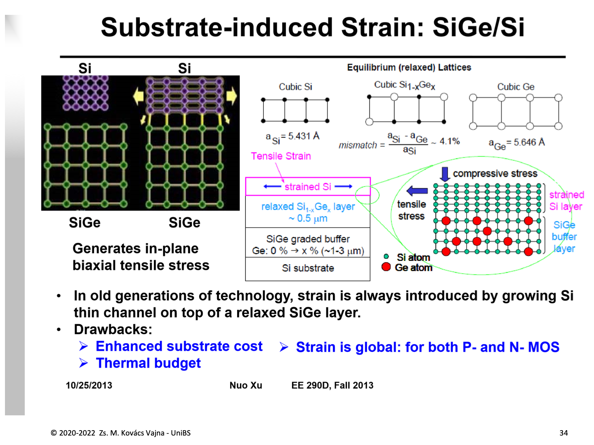
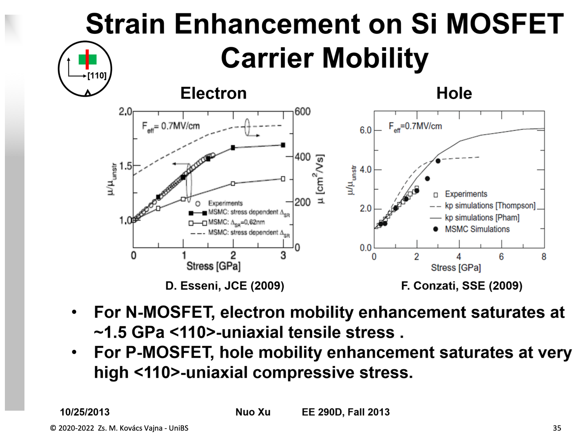
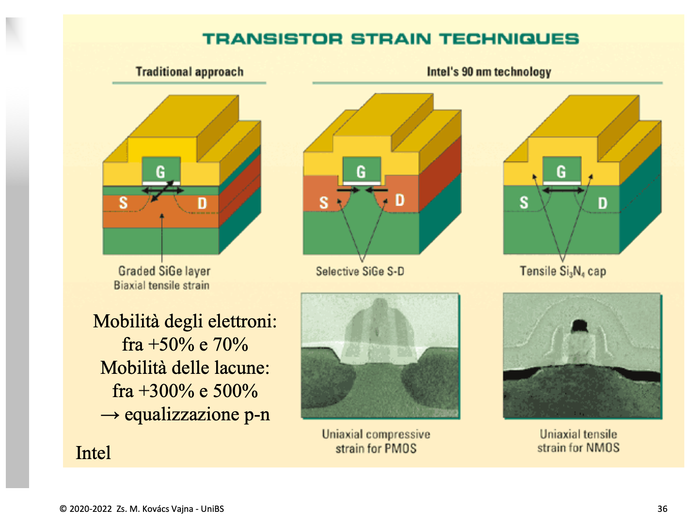

La tecnologia dello **Strained Silicon** (*Silicio Deformato*, introdotta da Intel al nodo a $90\,\text{nm}$ nel 2003) rappresenta la risposta ingegneristica al rallentamento dello scaling geometrico: **aumentare la velocità dei portatori di carica modificando la struttura cristallina del silicio**.

Nel fattore di conduzione del MOSFET:
$$k'_n = \mu_n \frac{\epsilon_{ox}}{t_{ox}}$$
dopo aver spinto al limite la capacità $C_{ox}$ tramite dielettrici [High-$\kappa$](./High-k%20e%20Metal%20Gate%20(HKMG).md), l'ultima leva fisica a disposizione è **l'incremento diretto della mobilità $\mu$** degli elettroni e delle lacune.

---

### 1. La Fisica dello Strain: Come la Deformazione Alza la Mobilità

Nel silicio non deformato, la banda di conduzione possiede **6 valli ellissoidali equivalenti** a minima energia lungo gli assi cristallografici $\langle 100 \rangle$. In queste valli, gli elettroni presentano una massa efficace anisotropa:
* Massa longitudinale pesante: $m_l^* \approx 0.98\,m_0$
* Massa trasversale leggera: $m_t^* \approx 0.19\,m_0$

Nel silicio naturale a riposo, gli elettroni si distribuiscono equamente tra le 6 valli e subiscono frequenti urti termici (*scattering fononico*) che li fanno rimbalzare da una valle all'altra (**inter-valley scattering**), riducendone la velocità di deriva e la mobilità.

Quando si applica uno **stress meccanico controllato** al cristallo:
1. **Rottura della simmetria cubica e Valley Splitting:** La deformazione reticolare solleva l'energia di 4 valli e abbassa l'energia delle restanti 2 valli.
2. **Ripopolamento energetico:** Gli elettroni scendono nelle valli a minore energia, le quali sono orientate in modo tale che lungo la direzione di trasporto nel canale la **massa efficace sia quella più leggera ($m_t^*$)**.
3. **Soppressione dello scattering tra valli:** Essendo le altre 4 valli a un'energia più alta, la probabilità che gli elettroni vi rimbalzino (*inter-valley scattering*) crolla drasticamente.

Il risultato combinato è che **i portatori viaggiano con minore inerzia e subiscono meno urti: la mobilità $\mu$ aumenta in modo impressionante.**

---

### 2. Il Primo Approccio: Strain Globale Indotto da Substrato (*SiGe/Si*)

Nei primi anni di ricerca, lo sforzo veniva indotto fabbricando wafer speciali con un substrato di lega Silicio-Germanio:

#### Il disallineamento reticolare (*Lattice Mismatch*)
* Silicio cubico: costante reticolare $a_{\text{Si}} = 5.431\,\text{\AA}$
* Germanio cubico: costante reticolare $a_{\text{Ge}} = 5.646\,\text{\AA}$
* Il reticolo del Germanio è più largo di circa il **$4.1\%$** rispetto al silicio.

Facendo crescere sul silicio uno strato cuscinetto di $\text{Si}_{1-x}\text{Ge}_x$ graduato fino a uno strato rilassato, e depositando poi sopra un sottile velo di silicio puro:
* Gli atomi di silicio sono costretti ad allargarsi per fare presa sulla griglia atomica più larga del $\text{SiGe}$ sottostante.
* Il silicio subisce uno **sforzo di trazione biassiale nel piano (*in-plane biaxial tensile stress*)**.

#### I Limiti dello Strain Globale
Questo metodo è stato presto abbandonato nella produzione industriale di massa a causa di tre gravi difetti:
1. **Costo elevato del wafer:** far crescere strati epitassiali spessi $1 - 3\,\mu\text{m}$ di $\text{SiGe}$ graduato aumenta enormemente il costo del substrato.
2. **Dislocazioni e difetti:** le tensioni termiche durante i cicli di fabbricazione generano difetti reticolari che risalgono nel canale.
3. **Lo sforzo è globale (indifferenziato):** deforma tutto il silicio allo stesso modo su tutto il chip. Ma la fisica dei semiconduttori rivela che **gli elettroni e le lacune rispondono in modo radicalmente opposto allo stress!**

---

### 3. La Risposta Asimmetrica della Mobilità: Trazione vs Compressione

Analizzando sperimentalmente la mobilità lungo la direzione cristallina standard di conduzione $\langle 110 \rangle$:

* **Per l'NMOS (Elettroni, grafico a sinistra):**
  * La mobilità cresce con uno sforzo di **trazione uniassiale (*uniaxial tensile stress*)**.
  * Raggiunge la saturazione attorno a circa $1.5\,\text{GPa}$, con un miglioramento del **$+50\% \div +70\%$**.
* **Per il PMOS (Lacune, grafico a destra):**
  * La mobilità delle lacune **non gradisce la trazione**, ma richiede uno **sforzo di compressione uniassiale (*uniaxial compressive stress*)**!
  * Sotto forte compressione, la struttura della banda di valenza si modifica separando le bande delle lacune pesanti (*heavy holes*) e leggere (*light holes*): la mobilità delle lacune si impenna letteralmente, aumentando del **$+300\% \div +500\%$ (fino a $4 - 6$ volte il valore naturale)**!

> [!IMPORTANT]
> **La conclusione ingegneristica:** Non è possibile usare una deformazione uniforme su tutto il wafer. Occorre una tecnologia di **deformazione locale differenziata**: tirare il canale degli NMOS e schiacciare il canale dei PMOS.

---

### 4. La Svolta di Intel a 90 nm: Tecniche di Deformazione Locale (*Uniaxial Strain*)

A partire dal 2003, Intel ha introdotto l'ingegneria dello strain locale implementata selettivamente a livello di singolo transistor:

#### A. Nel PMOS: Compressione Uniassiale con $\text{SiGe}$ Selettivo in Source/Drain
1. Dopo aver definito il Gate, si scavano due tasche nelle zone di Source e Drain ai lati del canale.
2. Nelle tasche si fa crescere per epitassia selettiva una lega di **Silicio-Germanio ($\text{SiGe}$)**.
3. Poiché il reticolo del $\text{SiGe}$ è più voluminoso del silicio circostante, quando si espande nelle cavità **preme lateralmente contro il canale di silicio posto in mezzo**, inducendo un fortissimo **stress di compressione uniassiale lungo la direzione del canale**.

#### B. Nell'NMOS: Trazione Uniassiale con Capping Layer in Nitruro ($\text{Si}_3\text{N}_4$)
1. Sopra l'intero transistor NMOS viene depositato uno strato dielettrico di copertura (*capping layer*) in nitruro di silicio ([$\text{Si}_3\text{N}_4$](../Tecnologia%20e%20Fabbricazione/CVD.md)) fabbricato con una forte tensione meccanica intrinseca di trazione.
2. Questo strato "tira" verso l'esterno le diffusioni di Source e Drain, inducendo uno **stress di trazione uniassiale nel canale dell'NMOS**.

---

### 5. L'Effetto Rivoluzionario: L'Equalizzazione P-N nei Circuiti CMOS

Questo avanzamento tecnologico ha rivoluzionato il layout dei circuiti digitali:

* **Il problema storico nei CMOS:** Nel silicio naturale, le lacune sono intrinsecamente molto più lente degli elettroni ($\mu_n \approx 3 \mu_p$). Per ottenere la stessa corrente in salita e in discesa (ad esempio per avere una caratteristica di commutazione simmetrica in un inverter CMOS), i progettisti erano obbligati a disegnare il PMOS con una larghezza tripla rispetto all'NMOS:
  $$W_p \approx 2.5 - 3 \cdot W_n$$
  Questo comportava un enorme spreco di area di silicio e raddoppiava le capacità parassite sulle linee di clock e dati.
* **Con la deformazione locale:**
  * Mobilità elettroni (NMOS): $+50\% \div +70\%$
  * Mobilità lacune (PMOS): **$+300\% \div +500\%$**
  * **Equalizzazione p-n:** Il divario di velocità tra elettroni e lacune si è quasi annullato! I progettisti hanno potuto ridurre drasticamente la larghezza $W_p$ dei transistori PMOS ($W_p \approx W_n$), rendendo le porte logiche **più compatte, simmetriche e veloci**.

---

### 6. Lo Strain nei Transistor Moderni: FinFET e Oltre

Nei transistori [FinFET](./FinFET.md) tridimensionali a geometria nanometrica (slide 37), questa tecnica è stata ulteriormente perfezionata:
* Si scava la pinna di silicio nelle regioni di Source e Drain (**Fin Etch/Recess**) fino a $48\,\text{nm}$ di profondità.
* Si riempie lo scavo con lega epitassiale $\text{Si}_{0.5}\text{Ge}_{0.5}$ (con il $50\%$ di Germanio).
* La compressione longitudinale nel canale della pinna supera i **$-1400\,\text{MPa}$**, preservando correnti $I_{ON}$ record anche nei nodi più spinti.

---

*Pagine correlate:*
- [FinFET](./FinFET.md)
- [High-k e Metal Gate (HKMG)](./High-k%20e%20Metal%20Gate%20(HKMG).md)
- [Rapporto Ion/Ioff e Sottosoglia](../Effetti%20di%20Canale%20Corto/Rapporto%20Ion%20Ioff%20e%20sottosoglia.md)
- [Layout e Tecniche di Progettazione dei MOS](./Layout%20e%20Tecniche%20di%20Progettazione%20dei%20MOS.md)
- [Inverter CMOS e Regioni di Funzionamento](../Famiglie%20Logiche/Inverter%20CMOS%20e%20Regioni%20di%20Funzionamento.md)
- [Ritardo di Propagazione e Dimensionamento dell'Inverter CMOS](../Famiglie%20Logiche/Ritardo%20di%20Propagazione%20e%20Dimensionamento%20dell'Inverter%20CMOS.md)
