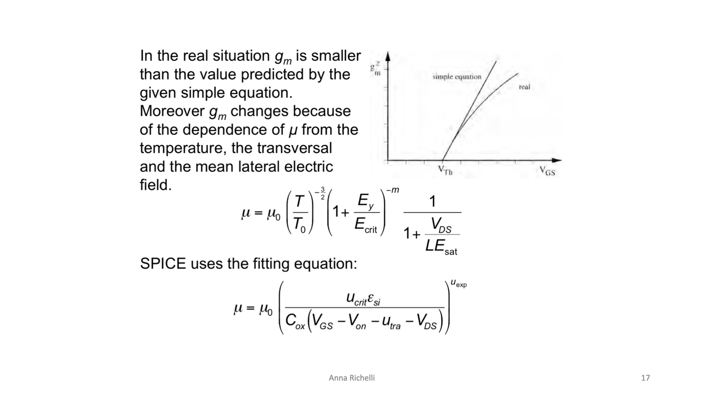

# Transconduttanza Reale $g_m$ e Degrado della Mobilità $\mu$

Nel modello quadratico ideale di forte inversione, la transconduttanza del MOSFET in saturazione è data da:
$$g_m = \frac{\partial I_D}{\partial V_{GS}} = \mu C_{ox} \frac{W}{L} (V_{GS} - V_{Th})$$

Secondo questa equazione semplificata, aumentando la tensione di pilotaggio del Gate $V_{GS}$, la transconduttanza dovrebbe crescere **in modo indefinitamente lineare** (la retta *"simple equation"*).

Nella realtà fisica, tuttavia, la curva reale $g_m(V_{GS})$ **piega vistosamente verso il basso** (comportamento sub-lineare e asintotico), raggiungendo un valore massimo significativamente inferiore al previsto.

---

### 1. La Causa Fisica: La Mobilità $\mu$ non è Costante!

La transconduttanza reale si discosta dalla teoria perché la mobilità effettiva dei portatori nel canale ($\mu$) non è un parametro fisso, ma **si degrada drasticamente** sotto l'azione di tre fattori fisici indipendenti:

$$\mu = \mu_0 \cdot \underbrace{\left( \frac{T}{T_0} \right)^{-3/2}}_{\text{1. Temperatura}} \cdot \underbrace{\left( 1 + \frac{E_y}{E_{crit}} \right)^{-m}}_{\text{2. Campo Elettrico Trasversale (Gate)}} \cdot \underbrace{\frac{1}{1 + \frac{V_{DS}}{L E_{sat}}}}_{\text{3. Campo Elettrico Laterale (Drain)}}$$

#### 1. Dipendenza dalla Temperatura $\left(\frac{T}{T_0}\right)^{-3/2}$
All'aumentare della temperatura del silicio $T$, gli atomi del reticolo cristallino vibrano con ampiezza maggiore. Aumenta la probabilità di collisione tra i portatori e i fononi acustici del reticolo (*lattice scattering*), riducendo il tempo libero medio tra due urti e abbattendo la mobilità.

#### 2. Campo Elettrico Trasversale Verticale $E_y$ (*Surface Roughness Scattering*)
Quando aumentiamo $V_{GS}$ per aumentare la densità di carica del canale e spingere la transconduttanza, creiamo un campo elettrico **verticale perpendicolare al canale** estremamente intenso ($E_y \propto (V_{GS} - V_{Th})/t_{ox}$).  
* Questo campo spinge e "schiaccia" con violenza gli elettroni contro l'interfaccia ruvida e imperfetta tra il silicio monocristallino e l'ossido di silicio amorfo ($\text{Si-SiO}_2$).
* I portatori subiscono continui urti anelastici con le asperità atomiche della superficie (*surface roughness scattering*).
* **Risultato:** più aumenti $V_{GS}$, più la mobilità locale crolla con legge esponenziale $\left(1 + \frac{E_y}{E_{crit}}\right)^{-m}$.

#### 3. Campo Elettrico Laterale Orizzontale $\frac{V_{DS}}{L}$ (*Saturazione di Velocità*)
Lungo la direzione Source-Drain, la caduta di potenziale $V_{DS}$ impone un campo elettrico orizzontale medio $E_x \approx V_{DS}/L$.  
* Nei canali corti sub-micrometrici, questo campo supera facilmente il valore critico $E_{sat} \approx 10^4\,\text{V/cm}$.
* I portatori raggiungono la velocità limite termica di saturazione ($v_{sat} \approx 10^7\,\text{cm/s}$ per gli elettroni).
* Superato tale campo, la velocità dei portatori cessa di crescere proporzionalmente al campo elettrico ($v = \mu E$ crolla), introducendo il fattore di degradazione:
  $$\frac{1}{1 + \frac{V_{DS}}{L E_{sat}}}$$

---

### 2. Modello di Fitting nei Simulatori SPICE

Nei software CAD di simulazione circuitale (SPICE, Spectre), la mobilità effettiva viene modellata tramite un'equazione empirica che tiene conto della concentrazione di carica superficiale indotta dal Gate e dal Drain:

$$\mu = \mu_0 \left( \frac{u_{crit} \varepsilon_{si}}{C_{ox} (V_{GS} - V_{on} - u_{tra} - V_{DS})} \right)^{u_{exp}}$$

dove $u_{crit}, u_{tra}, u_{exp}$ sono parametri tecnologici estratti sperimentalmente per ogni nodo di fonderia.

---

### 3. Conseguenze nella Progettazione Analogica

1. **Perdita di Efficienza ad Alti Overdrive:**  
   Spingere un transistor a overdrive $V_{ov}$ elevatissimi sperando di ottenere un $g_m$ enorme è inutile ed energeticamente inefficiente: superata una certa tensione di Gate, $g_m$ si appiattisce, sprecando solo corrente di polarizzazione.
2. **Lo "Sweet Spot" in Moderata Inversione:**  
   Proprio a causa del degrado di mobilità e della saturazione di velocità in forte inversione, i circuiti analogici a basso consumo moderni vengono polarizzati in **moderata inversione** ($V_{ov} \approx 50 \div 150\,\text{mV}$), dove l'efficienza $g_m/I_D$ è elevatissima ($\approx 15 \div 20\,\text{V}^{-1}$) e la mobilità non ha ancora subito il degrado del campo trasversale.
3. **Crollo del Guadagno Intrinseco ($A_0 = g_m r_o$):**  
   Il degrado di $g_m$ sommato al contemporaneo crollo di $r_o$ (dovuto a DIBL e CLM, vedi [Crollo della Resistenza di Uscita (ro)](../Effetti%20di%20Canale%20Corto/Crollo%20di%20ro.md)) fa precipitare il guadagno di uno stadio elementare a canale corto da $40\text{ dB}$ ad appena $10 \div 15\text{ dB}$.

---

*Pagine correlate:*
- [Overdrive e Regioni di Inversione](./Overdrive%20e%20Regioni%20di%20Inversione.md)
- [Saturazione di velocità](../Effetti%20di%20Canale%20Corto/Saturazione%20di%20velocita.md)
- [Crollo della Resistenza di Uscita (ro)](../Effetti%20di%20Canale%20Corto/Crollo%20di%20ro.md)
- [Rumore nel MOSFET](./Rumore%20nel%20MOSFET.md)
- [Portatori Caldi (Hot Carriers)](../Effetti%20di%20Canale%20Corto/Hot%20carriers.md)
- [High-k e Metal Gate (HKMG)](./High-k%20e%20Metal%20Gate%20(HKMG).md)
- [Strained Silicon (Silicio Deformato)](./Strained%20Silicon%20(Silicio%20Deformato).md)
- [Analogico non si scende di dimensioni](../Scaling%20e%20Limiti%20Fisici/Analogico%20non%20si%20scende%20di%20dimensioni.md)
