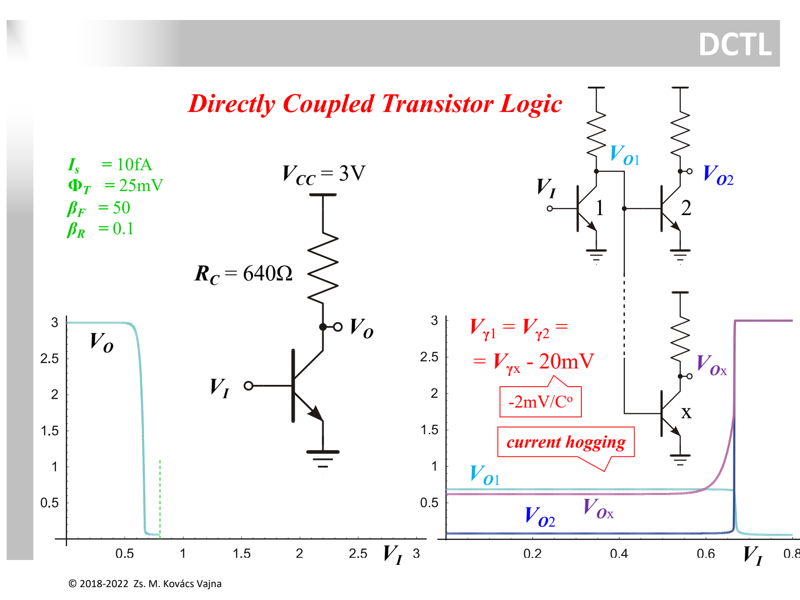
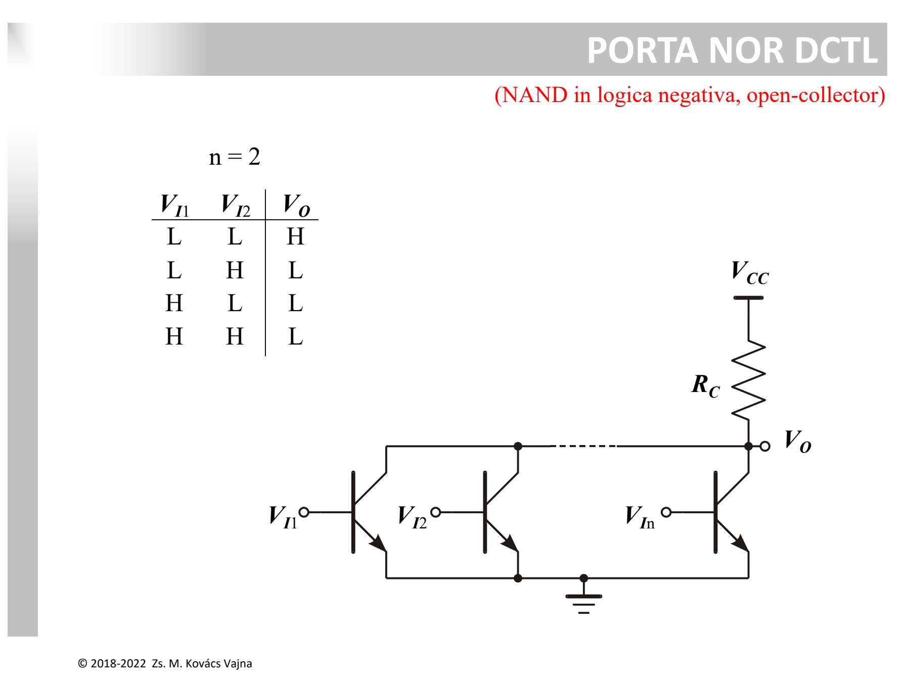

La famiglia **DCTL (*Direct-Coupled Transistor Logic*)** è la più semplice logica bipolare concepibile: un invertitore a singolo [BJT](../Dispositivi%20e%20Componenti/BJT.md) con resistore di collettore $R_C$, in cui l'uscita è collegata **direttamente** alla base dei transistor degli stadi successivi, senza alcuna resistenza di base $R_B$.



---

### 1. Il Vantaggio Teorico

In un circuito integrato, i [resistori](../Dispositivi%20e%20Componenti/Resistore.md) occupano un'enorme area di silicio rispetto ai transistor.  
L'idea alla base del DCTL era quella di **eliminare tutte le resistenze di base $R_B$**:
* L'uscita a collettore aperto con pull-up $R_C$ pilota direttamente le basi dei carichi.
* La corrente che entra nelle basi a valle è già limitata a monte dal resistore $R_C$ dello stadio pilota.

---

### 2. Il Problema Fatale: Il *Current Hogging*

Quando una porta DCTL deve pilotare più porte in parallelo ($\text{Fan-Out} > 1$), tutte le giunzioni Base-Emettitore dei BJT di carico si trovano **in parallelo sullo stesso nodo di uscita**:

```
                  Vcc
                   │
                  [Rc]
                   │
          Vo ──────┼──────────────┬──────────────┐
                   │              │              │
                 ┌─┴─┐          ┌─┴─┐          ┌─┴─┐
                 │Q1 │          │Q2 │          │Qn │
                 └─┬─┘          └─┬─┘          └─┬─┘
                   │              │              │
                  GND            GND            GND
```

La corrente di base di un BJT segue la caratteristica esponenziale della giunzione PN:
$$I_B \approx I_S \cdot e^{\frac{V_{BE}}{V_T}}$$

A causa di:
1. **Tolleranze di processo:** microscopiche differenze di drogaggio o area di emettitore fanno variare la tensione di soglia $V_\gamma$ tra i transistor (es. $\Delta V_\gamma \approx 10 \div 20\text{ mV}$).
2. **Gradienti termici sul silicio:** la tensione di soglia di una giunzione scende con la temperatura di circa $-2\text{ mV}/^\circ\text{C}$ (vedi [Diodo](../Dispositivi%20e%20Componenti/Diodo.md)). Il transistor posizionato nel punto più caldo del chip conduce a tensioni più basse.

#### Cosa succede fisicamente:
* Il transistor con la $V_{BE(on)}$ leggermente più bassa (es. $0.68\text{ V}$) si accende per primo.
* Essendo la corrente limitata solo da $R_C$, questo transistor **assorbe ("ciuccia", *hogs*) la totalità della corrente erogata da $R_C$**.
* La tensione sul nodo $V_O$ rimane "inchiodata" a $0.68\text{ V}$, impedendo al nodo di salire a $0.70\text{ V}$.
* Tutti gli altri transistor in parallelo rimangono a secco di corrente di base: **restano interdetti o non saturano**, provocando errori logici irreversibili.

---

### 3. Porta NOR DCTL



Mettendo più transistor in parallelo sullo stesso resistore di pull-up $R_C$:
* Se **almeno un ingresso è ALTO**, il rispettivo BJT satura e porta $V_O \approx V_{CE,sat} \approx 0.1 \div 0.2\text{ V}$ (**LOW**).
* Solo se **tutti gli ingressi sono BASSI**, tutti i BJT sono spenti e $V_O = V_{CC}$ (**HIGH**).
* La funzione logica è una **NOR** (equivalente a una NAND in logica negativa).

---

### 4. La Soluzione e l'Evoluzione

Per eliminare il *current hogging*:
1. Si è passati alla famiglia [RTL](./RTL%20e%20Prodotto%20Ritardo-Consumo%20%28PDP%29.md), inserendo una resistenza $R_B$ in serie a ciascuna base come "zavorra" per linearizzare l'impedenza di ingresso e distribuire la corrente.
2. Più avanti, per eliminare sia il current hogging che l'ingombro delle resistenze integrate, è nata la logica [I2L (Integrated Injection Logic)](./I2L%20%28Integrated%20Injection%20Logic%29.md).

---

*Pagine correlate:*
- [RTL e Prodotto Ritardo-Consumo (PDP)](./RTL%20e%20Prodotto%20Ritardo-Consumo%20%28PDP%29.md)
- [I2L (Integrated Injection Logic)](./I2L%20%28Integrated%20Injection%20Logic%29.md)
- [Soglia Logica e Margine di Rumore](./Soglia%20Logica%20e%20Margine%20di%20Rumore.md)
- [Caratteristica di Trasferimento e Rigenerazione](./Caratteristica%20di%20Trasferimento%20e%20Rigenerazione.md)
- [BJT](../Dispositivi%20e%20Componenti/BJT.md)
- [Diodo](../Dispositivi%20e%20Componenti/Diodo.md)
- [Resistore](../Dispositivi%20e%20Componenti/Resistore.md)
