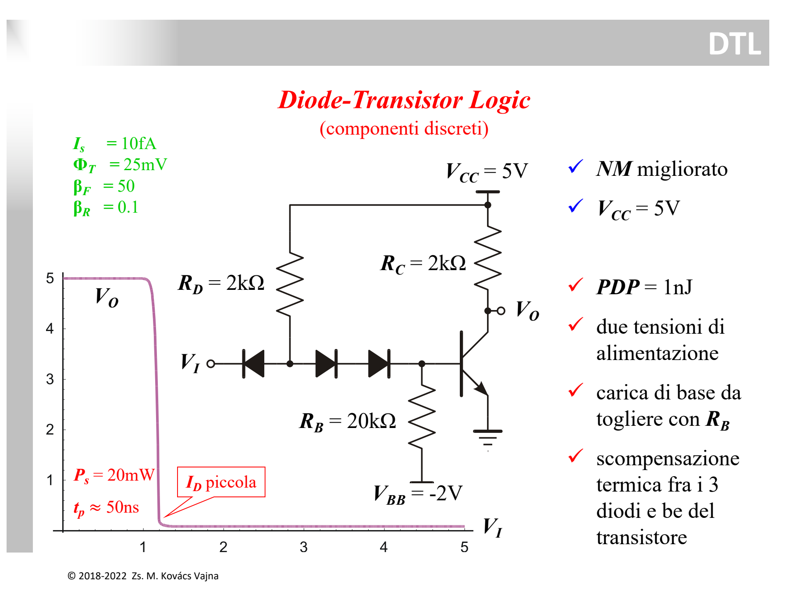
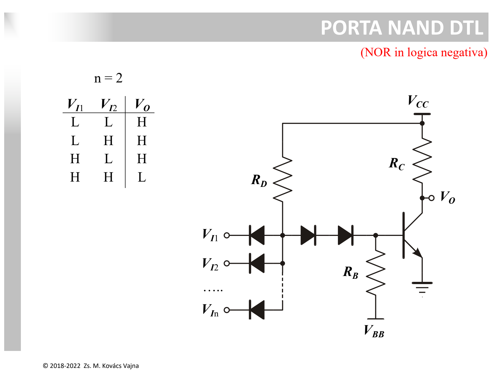

La famiglia **DTL (*Diode-Transistor Logic*)** nasce per superare la scarsa immunità al rumore e la lentezza dell'[RTL](./RTL%20e%20Prodotto%20Ritardo-Consumo%20%28PDP%29.md), impiegando una rete a [diodi](../Dispositivi%20e%20Componenti/Diodo.md) per l'elaborazione logica in ingresso e per la traslazione di livello.



---

### 1. Schema Circuitale dell'Invertitore DTL

```
                      +Vcc = 5V
                       │        │
                      [RD]     [RC] (2kΩ)
                     (2kΩ)      │
                       │        ├────── Vo (Uscita)
                  Nodo X        │
     Ingresso          │      ┌─┴─┐
     Vi o────┤◀────────┼──▶|──┤   │ Q (NPN)
            Din        │  D1  │   └┬┘
                       │      └─▶|─┤
                       │        D2 │
                       │           │
                      [RB]        GND
                     (20kΩ)
                       │
                      -VBB = -2V
```

* **$D_{in}$ (Diodo d'ingresso):** riceve la tensione d'ingresso $V_I$ sul catodo.
* **$R_D = 2\text{ k}\Omega$:** resistore di pull-up che alimenta il nodo centrale $X$ tirandolo verso $+V_{CC} = 5\text{ V}$.
* **$D_1, D_2$ (Diodi di traslazione di livello):** due diodi in serie che collegano il nodo $X$ alla base del transistor $Q$.
* **$Q$ (NPN) & $R_C = 2\text{ k}\Omega$:** stadio invertitore di uscita.
* **$R_B = 20\text{ k}\Omega$ & $V_{BB} = -2\text{ V}$:** ramo di polarizzazione negativa e scarica rapida della base.

---

### 2. Funzionamento nei Due Stati Logici

#### A. Ingresso BASSO ($V_I = \text{LOW} \approx 0.2\text{ V}$)
1. Il diodo $D_{in}$ è polarizzato direttamente e conduce.
2. Il nodo interno $X$ si fissa a:
   $$V_X = V_I + V_{Din} \approx 0.2\text{ V} + 0.7\text{ V} = \mathbf{0.9\text{ V}}$$
3. Per far condurre la catena di destra ($D_1 + D_2 + V_{BE(Q)}$) servirebbero:
   $$V_{X,necessaria} = V_{D1} + V_{D2} + V_{BE} \approx 0.7\text{ V} + 0.7\text{ V} + 0.7\text{ V} = \mathbf{2.1\text{ V}}$$
4. Essendo $V_X = 0.9\text{ V} \ll 2.1\text{ V}$, i diodi $D_1, D_2$ e il transistor $Q$ sono **completamente interdetti (spenti)**.
5. Il resistore $R_B$ collegato a $-2\text{ V}$ drena eventuali correnti di perdita e assicura che $Q$ rimanga spento.
6. L'uscita sale a $\mathbf{V_O = V_{CC} = 5\text{ V}\ (HIGH)}$.

#### B. Ingresso ALTO ($V_I = \text{HIGH} \approx 5\text{ V}$)
1. Avendo il catodo a $5\text{ V}$, il diodo $D_{in}$ è polarizzato inversamente (**spento**).
2. La corrente che scende da $V_{CC}$ attraverso $R_D$ fluisce interamente attraverso $D_1$ e $D_2$ verso la base di $Q$.
3. Il nodo $X$ sale a $V_X \approx 2.1\text{ V}$. La corrente erogata è:
   $$I_D = \frac{V_{CC} - V_X}{R_D} = \frac{5\text{ V} - 2.1\text{ V}}{2\text{ k}\Omega} = 1.45\text{ mA}$$
4. Una piccola frazione viene drenata da $R_B$ verso $-2\text{ V}$:
   $$I_{RB} = \frac{V_{BE} - V_{BB}}{R_B} = \frac{0.7\text{ V} - (-2\text{ V})}{20\text{ k}\Omega} = 0.135\text{ mA}$$
5. La parte restante ($I_B = 1.45 - 0.135 \approx 1.31\text{ mA}$) satura pesantemente il BJT $Q$, portando l'uscita a $\mathbf{V_O = V_{CE,sat} \approx 0.1 \div 0.2\text{ V}\ (LOW)}$.

---

### 3. I Diodi $D_1, D_2$ e il Margine di Rumore ($NM$)

Senza i due diodi di traslazione $D_1, D_2$, la soglia di commutazione in ingresso sarebbe $V_{th} \approx V_{BE} - V_{Din} \approx 0\text{ V}$, rendendo la porta ultra-sensibile al rumore.  
Con i due diodi, la soglia di commutazione dell'ingresso sale a:
$$V_{th} = (V_{D1} + V_{D2} + V_{BE}) - V_{Din} \approx 3(0.7\text{ V}) - 0.7\text{ V} = \mathbf{1.4\text{ V}}$$
Questa soglia a $1.4\text{ V}$ è ben posizionata rispetto all'alimentazione a $5\text{ V}$, garantendo un ottimo [margine di rumore](./Soglia%20Logica%20e%20Margine%20di%20Rumore.md) ($NM$).

---

### 4. Il Fenomeno della Scompensazione Termica

La tensione di conduzione di ogni giunzione varia con la temperatura di circa $-2\text{ mV}/^\circ\text{C}$ (vedi [Diodo](../Dispositivi%20e%20Componenti/Diodo.md)):
$$\frac{dV_D}{dT} \approx \frac{dV_{BE}}{dT} \approx -2\text{ mV}/^\circ\text{C}$$

Derivando la soglia di commutazione $V_{th} = V_{D1} + V_{D2} + V_{BE} - V_{Din}$:
$$\frac{dV_{th}}{dT} = \underbrace{\frac{dV_{D1}}{dT} + \frac{dV_{D2}}{dT} + \frac{dV_{BE}}{dT}}_{\text{3 giunzioni a destra } (-6\text{ mV}/^\circ\text{C})} - \underbrace{\frac{dV_{Din}}{dT}}_{\text{1 giunzione a sinistra } (-2\text{ mV}/^\circ\text{C})} = \mathbf{-4\text{ mV}/^\circ\text{C}}$$

* Il singolo diodo d'ingresso $D_{in}$ **compensa solo una** delle tre giunzioni a valle: restano **due giunzioni scompensate**.
* All'aumentare della temperatura ($\Delta T = +50^\circ\text{C}$), la soglia $V_{th}$ scende di circa $-200\text{ mV}$, riducendo il margine di rumore $NM_L$.

---

### 5. Porta NAND DTL



Collegando più diodi d'ingresso in parallelo ($D_{in1}, D_{in2}, \dots, D_{inN}$):
* Se **anche un solo ingresso è LOW**, il suo diodo conduce, porta il nodo $X$ a $0.9\text{ V}$ e spegne il BJT $\implies \mathbf{V_O = HIGH}$.
* Solo quando **tutti gli ingressi sono HIGH**, tutti i diodi d'ingresso sono interdetti e il BJT satura $\implies \mathbf{V_O = LOW}$.
* Si ottiene così una porta **NAND**.

---

### 6. Pregi e Difetti

* **Vantaggi:** $NM$ notevolmente migliorato rispetto all'RTL, alimentazione standard $V_{CC} = 5\text{ V}$, tempo di commutazione migliorato ($t_p \approx 50\text{ ns}$) grazie a $R_B$ che drena la carica di base verso $-2\text{ V}$.
* **Svantaggi:** richiede **due tensioni di alimentazione** ($+5\text{ V}$ e $-2\text{ V}$), scompensazione termica della soglia, prodotto ritardo-consumo $PDP \approx 1\text{ nJ}$.
* Questa struttura è stata la base per lo sviluppo della successiva [TTL (Transistor-Transistor Logic)](./TTL%20%28Transistor-Transistor%20Logic%29.md) e della variante industriale [HTL (High-Threshold Logic)](./HTL%20%28High-Threshold%20Logic%29.md).

---

*Pagine correlate:*
- [HTL (High-Threshold Logic)](./HTL%20%28High-Threshold%20Logic%29.md)
- [TTL (Transistor-Transistor Logic)](./TTL%20%28Transistor-Transistor%20Logic%29.md)
- [RTL e Prodotto Ritardo-Consumo (PDP)](./RTL%20e%20Prodotto%20Ritardo-Consumo%20%28PDP%29.md)
- [Soglia Logica e Margine di Rumore](./Soglia%20Logica%20e%20Margine%20di%20Rumore.md)
- [Diodo](../Dispositivi%20e%20Componenti/Diodo.md)
- [BJT](../Dispositivi%20e%20Componenti/BJT.md)
- [Resistore](../Dispositivi%20e%20Componenti/Resistore.md)
