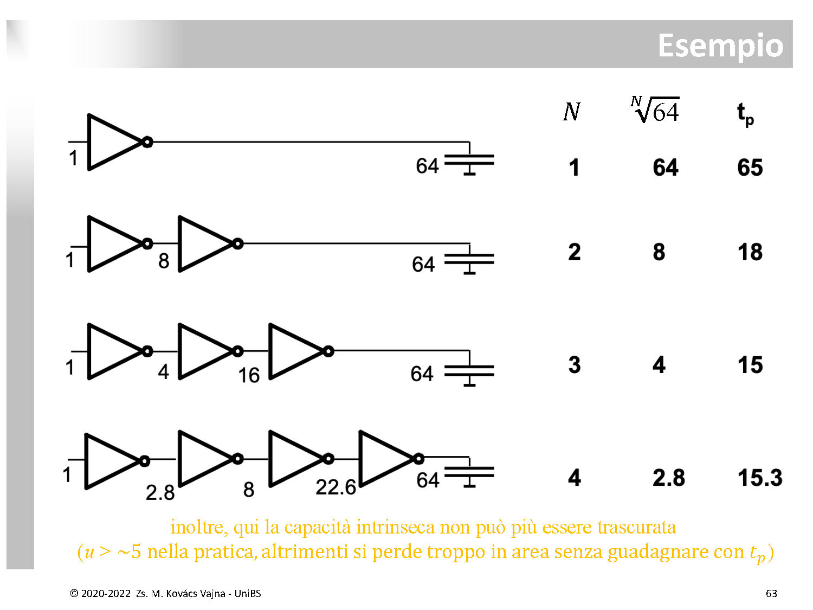

# Dimensionamento Progressivo e Tapered Buffer (Inverter Chain)

Quando una porta logica [CMOS](./Inverter%20CMOS%20e%20Regioni%20di%20Funzionamento.md) deve pilotare un carico capacitivo di grandi dimensioni (ad esempio un piedino di uscita verso l'esterno del chip, un bus condiviso o una lunga pista metallica di interconnessione), l'impiego di un singolo inverter standard porta a ritardi di propagazione inaccettabili.

La tecnica del **dimensionamento progressivo** (*tapered buffer* o catena di inverter a fattore di scala costante) risolve questo problema minimizzando il ritardo complessivo senza sovraccaricare la logica interna a monte.

---

### 1. Il Problema del Carico Capacitivo Rilevante (Slide 59 – 60 di cmos.pdf)

Consideriamo un **inverter minimo**:
* $W_n = W_{min}, \quad W_p = \alpha W_{min} \quad (\alpha \approx 2 \div 3, \text{ per bilanciare } \mu_n / \mu_p)$
* $L_n = L_p = L_{min}$
* Capacità d'ingresso minima dell'inverter:
  $$C_{in} = C_{in,Min} \approx (1 + \alpha) C_{gate,Min}$$

Se questo inverter minimo pilota un carico pari alla propria capacità d'ingresso ($C_L = C_{in}$), il suo ritardo di commutazione vale un tempo base di riferimento:
$$t_p = t_{p0}$$

#### Cosa succede quando il carico è enorme?
Se l'inverter deve guidare una pista esterna o un pin (vedi [Potenza Dinamica e Dissipazione di Carica](./Potenza%20Dinamica%20e%20Dissipazione%20di%20Carica.md)):
$$C_L = C_{\text{intrinseca NOT}} + x \cdot C_{in}$$
Per carichi rilevanti ($x \gg 1$, ad esempio $x = 1000$), la capacità parassita intrinseca dell'inverter diventa trascurabile:
$$C_L \approx x \cdot C_{in}$$

Poiché il ritardo di propagazione scala proporzionalmente al rapporto tra capacità di carico e larghezza di canale ($t_p \propto \frac{C_L}{W}$):
$$t_p \approx x \cdot t_{p0}$$
* **Esempio:** se $x = 1000 \implies \mathbf{t_p = 1000 \cdot t_{p0}}$! Il circuito rallenta di tre ordini di grandezza, rendendo impossibile operare ad alte frequenze.

---

### 2. La "Soluzione SBAGLIATA" (Slide 61)

L'approccio intuitivo e ingenuo consisterebbe nell'allargare direttamente i transistor dell'inverter di un fattore $x$:
* $W_n = x \cdot W_{min}, \quad W_p = \alpha x \cdot W_{min}$

In questo modo la resistenza di canale cala di $x$ volte ($R_{on} = R_0 / x$), e il ritardo di questo inverter per scaricare $C_L = x C_{in}$ torna a valere:
$$t_p \propto \frac{R_0}{x} \cdot (x C_{in}) = t_{p0}$$

Sembrerebbe la soluzione ideale, **MA c'è un tranello fatale**:

```text
  Logica a Monte                                Mega-Inverter
   (Taglia 1)                                    (Taglia x)                  Carico Esterno
  ┌───────────┐                                 ┌───────────┐
  │           │      Ingresso VI                │           │
  │           ├────────────────────────────────►│           ├───────────────►  CL = x · Cin
  │           │   Cin,mega ≈ x · Cin            │           │  (tp ≈ tp0)
  └───────────┘  (Carico MOSTRUOSO!)            └───────────┘
   (tp ≈ x·tp0!)
```

* Allargando i canali di $x$ volte, **anche la capacità di gate d'ingresso dell'inverter si moltiplica per $x$**:
  $$C_{in} \approx x \cdot (1 + \alpha) C_{gate,Min} = \mathbf{x \cdot C_{in,Min}}$$
* **Il problema si è solo spostato a monte:** la porta logica interna del chip che pilota questo mega-inverter (che ha una taglia tipica minima, pari a 1) si ritrova a dover caricare una capacità gigante pari a $x \cdot C_{in}$. Sarà quindi la porta precedente a subire un ritardo disastroso di $x \cdot t_{p0}$.

---

### 3. La Soluzione: Catena di Inverter a Dimensionamento Progressivo (Slide 62)

Per risolvere il problema senza caricare il circuito a monte, si inserisce una **catena a staffetta di $N$ inverter** che crescono progressivamente di taglia a ogni stadio di un fattore costante $u$ (*tapering factor*):

```text
  VI ──► [ Inverter 1 ] ──► [ Inverter 2 ] ──► ... ──► [ Inverter N ] ──► VO
             Taglia 1             Taglia u                 Taglia u^(N-1)     CL = x · Cin
           (Cin = 1)           (Cin = u)               (Cin = u^(N-1))
```

1. **Il primo inverter ha SEMPRE taglia 1:** in questo modo la capacità vista dall'ingresso $V_I$ è rigorosamente $C_{in} = C_{in,Min}$. La logica a monte vede un carico unitario standard e opera alla sua normale velocità di progetto.
2. Ogni stadio $j$ ha una taglia $u$ volte superiore allo stadio precedente:
   $$\text{Taglie: } \left[ 1, \, u, \, u^2, \, \dots, \, u^{N-1} \right]$$
3. L'ultimo inverter (stadio $N$, taglia $u^{N-1}$) deve pilotare il carico finale $C_L = x \cdot C_{in}$.

#### A) Dimostrazione Analitica per $N = 2$ stadi:
* Il $1^\circ$ inverter (taglia 1) deve caricare l'ingresso del $2^\circ$ inverter (capacità $u C_{in}$):
  $$t_{p1} = u \cdot t_{p0}$$
* Il $2^\circ$ inverter (taglia $u$) deve caricare il carico finale ($x C_{in}$):
  $$t_{p2} = \frac{x}{u} \cdot t_{p0}$$
* Il ritardo totale da $V_I$ a $V_O$ vale:
  $$t_p = t_{p1} + t_{p2} = \left( u + \frac{x}{u} \right) t_{p0}$$

Per trovare il fattore di scala $u$ che **minimizza il ritardo**, calcoliamo la derivata prima rispetto a $u$ e azzeriamola:
$$\frac{d t_p}{du} = t_{p0} \left( 1 - \frac{x}{u^2} \right) = 0 \implies 1 = \frac{x}{u^2} \implies u^2 = x \implies \mathbf{u_{ott} = \sqrt{x}}$$

Sostituendo $u_{ott} = \sqrt{x}$ nell'espressione del ritardo:
$$t_{p,ott} = \left( \sqrt{x} + \frac{x}{\sqrt{x}} \right) t_{p0} = \mathbf{2\sqrt{x} \cdot t_{p0}}$$

> **Confronto numerico:** se $x = 100$:
> * Con 1 solo stadio non scalato: $t_p = 100 \cdot t_{p0}$.
> * Con 2 stadi a dimensionamento progressivo ($u = \sqrt{100} = 10$):
>   $$t_p = 2 \sqrt{100} \cdot t_{p0} = \mathbf{20 \cdot t_{p0}} \quad (\mathbf{5 \text{ volte più veloce!}})$$

#### B) Generalizzazione a una Catena di $N$ stadi:
Estendendo la derivazione a $N$ stadi in cascata, la condizione di ottimo impone che **ciascun inverter compia esattamente lo stesso sforzo di crescita $u$**:
$$u^N = x \implies \mathbf{u_{ott} = \sqrt[N]{x}}$$
Poiché ogni stadio introduce un ritardo identico pari a $u_{ott} \cdot t_{p0} = \sqrt[N]{x} \cdot t_{p0}$, il ritardo complessivo minimo vale:
$$\mathbf{t_{p,ott} = N \sqrt[N]{x} \cdot t_{p0}}$$

#### C) Il Limite Teorico di Nepero ($u = e \approx 2.718$):
Derivando ulteriormente la funzione $t_p(N) = N \cdot x^{1/N}$ rispetto a $N$ per determinare il numero ideale di stadi, si ottiene matematicamente che il valore ottimo universale del fattore di scala è la base dei logaritmi naturali:
$$\frac{\partial t_p}{\partial N} = 0 \implies \mathbf{u = e \approx 2.718}$$

> [!WARNING]
> **Perché $u = e$ NON si usa MAI nella pratica industriale:**
> Scegliere $u = 2.7$ richiederebbe un numero $N$ di stadi molto elevato ($N = \ln x$). Questo comporta:
> 1. Un'enorme occupazione di area di silicio sul chip.
> 2. Una forte dissipazione di potenza dinamica ($P_d = C V^2 f$), poiché ogni inverter commuta a ogni ciclo.
> 3. Il degrado causato dalle capacità parassite intrinseche delle giunzioni, che a valori bassi di $u$ annullano qualsiasi guadagno.

---

### 4. Esempio Pratico Completo ($x = 64$) e la Capacità Intrinseca (Slide 63)

Nella realtà circuitale, ciascun inverter non spinge soltanto la porta successiva, ma deve anzitutto caricare le proprie capacità parassite intrinseche di drain (vedi [Capacità parassite nel MOSFET](../Dispositivi%20e%20Componenti/Capacit%C3%A0%20parassite%20nel%20MOSFET.md)).



Normalizzando il ritardo intrinseco proprio di ogni stadio a $1$, la formula ingegneristica reale per ciascun inverter $j$ vale:
$$t_{pj} = \left( 1 + \frac{C_{\text{carico, } j}}{\text{Taglia}_j} \right) t_{p0} = (1 + u) \, t_{p0}$$
E per l'intera catena di $N$ stadi:
$$t_p = N \cdot (1 + u) = N \cdot \left( 1 + \sqrt[N]{x} \right)$$

Analizziamo l'esempio con carico **$x = 64$** ($C_L = 64 \cdot C_{in}$):

| Stadi ($N$) | Fattore $u = \sqrt[N]{64}$ | Sequenza delle Taglie degli Inverter | Calcolo del Ritardo $t_p$ | Ritardo Risultante |
| :---: | :---: | :--- | :--- | :---: |
| **1** | $\sqrt[1]{64} = \mathbf{64}$ | $[1] \longrightarrow 64$ | $1 \cdot (1 + 64)$ | **65** |
| **2** | $\sqrt[2]{64} = \mathbf{8}$ | $[1] \longrightarrow [8] \longrightarrow 64$ | $2 \cdot (1 + 8)$ | **18** |
| **3** | $\sqrt[3]{64} = \mathbf{4}$ | $[1] \longrightarrow [4] \longrightarrow [16] \longrightarrow 64$ | $3 \cdot (1 + 4)$ | **15** 🚀 *(Ottimo reale)* |
| **4** | $\sqrt[4]{64} \approx \mathbf{2.8}$ | $[1] \longrightarrow [2.8] \longrightarrow [8] \longrightarrow [22.6] \longrightarrow 64$ | $4 \cdot (1 + 2.828)$ | **15.3** ❌ *(Peggiora!)* |

#### Dettaglio passo-passo della catena a 4 stadi ($N = 4$):
* Fattore di scala: $u = \sqrt[4]{64} = 64^{0.25} \approx \mathbf{2.828}$ (scritto come $2.8$ a slide 63).
* **Taglia 1:** $1$
* **Taglia 2:** $1 \times 2.828 \approx \mathbf{2.8}$
* **Taglia 3:** $2.828 \times 2.828 \approx \mathbf{8.0}$
* **Taglia 4:** $8.0 \times 2.828 \approx \mathbf{22.6}$
* Verifica sul carico finale: $\frac{C_L}{\text{Taglia}_4} = \frac{64}{22.6} \approx 2.828$. Tutto perfettamente bilanciato.
* Ritardo di ciascun singolo inverter: $1 + 2.828 = 3.828$.
* Ritardo totale: $4 \times 3.828 \approx \mathbf{15.3}$.

#### Perché con $N = 4$ il ritardo sale a 15.3 (peggiora rispetto a $N = 3$)?
Sebbene ciascun inverter compia uno sforzo di pilotaggio esterno inferiore ($2.8$ rispetto a $4$):
* Aggiungere un $4^\circ$ inverter significa introdurre **un ulteriore ritardo parassita fisso $+1$** dovuto alla capacità intrinseca di diffusione del transistor aggiunto.
* Con 3 stadi il dazio intrinseco fisso valeva $3 \times 1 = 3$.
* Con 4 stadi il dazio intrinseco sale a $4 \times 1 = 4$.
* Il piccolo risparmio sulla commutazione non compensa più il costo fisso del nuovo componente: **il ritardo complessivo risale**. In più abbiamo occupato il $40\%$ di area in più e incrementato i consumi di commutazione.

---

### 5. Regola d'Oro di Progetto (Slide 63)

> [!IMPORTANT]
> **$\mathbf{u > \sim 5}$ nella pratica progettuale:**
> Nella progettazione reale di ASIC e microprocessori non si scende mai verso l'ottimo matematico puro ($u \approx 2.7$). Si adotta quasi sempre un fattore di crescita compreso tra **$3$ e $5$** (tipicamente $u \approx 4 \div 5$), limitandosi a **$N = 2$ o $N = 3$ stadi**, poiché garantisce il massimo compromesso tra velocità elevata, occupazione d'area minima e bassi consumi dinamici.

---

*Pagine correlate:*
- [Tecniche di Ottimizzazione per Porte Complesse Veloci](../Circuiti%20Combinatori%20CMOS/Tecniche%20di%20Ottimizzazione%20per%20Porte%20Complesse%20Veloci.md)
- [Effetto di Fan-In e Fan-Out sul Ritardo (Elmore)](../Circuiti%20Combinatori%20CMOS/Effetto%20di%20Fan-In%20e%20Fan-Out%20sul%20Ritardo%20(Elmore).md)
- [Dimensionamento Transistor e Ritardo di Pattern (Sizing)](../Circuiti%20Combinatori%20CMOS/Dimensionamento%20Transistor%20e%20Ritardo%20di%20Pattern%20(Sizing).md)
- [Ritardo di Propagazione e Dimensionamento dell'Inverter CMOS](./Ritardo%20di%20Propagazione%20e%20Dimensionamento%20dell%27Inverter%20CMOS.md)
- [Inverter CMOS e Regioni di Funzionamento](./Inverter%20CMOS%20e%20Regioni%20di%20Funzionamento.md)
- [Potenza Dinamica e Dissipazione di Carica](./Potenza%20Dinamica%20e%20Dissipazione%20di%20Carica.md)
- [Capacità parassite nel MOSFET](../Dispositivi%20e%20Componenti/Capacit%C3%A0%20parassite%20nel%20MOSFET.md)
- [Layout e Tecniche di Progettazione dei MOS](../Dispositivi%20e%20Componenti/Layout%20e%20Tecniche%20di%20Progettazione%20dei%20MOS.md)
- [Latchup nei circuiti CMOS](./Latchup%20nei%20circuiti%20CMOS.md)
- [RTL e Prodotto Ritardo-Consumo (PDP)](./RTL%20e%20Prodotto%20Ritardo-Consumo%20%28PDP%29.md)
