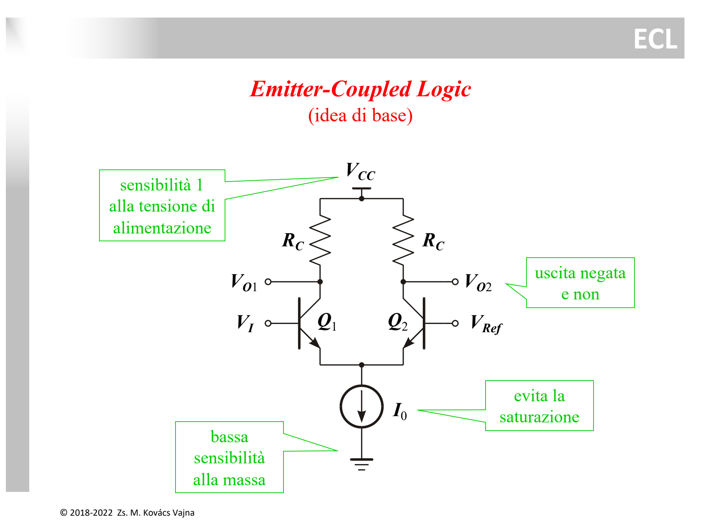
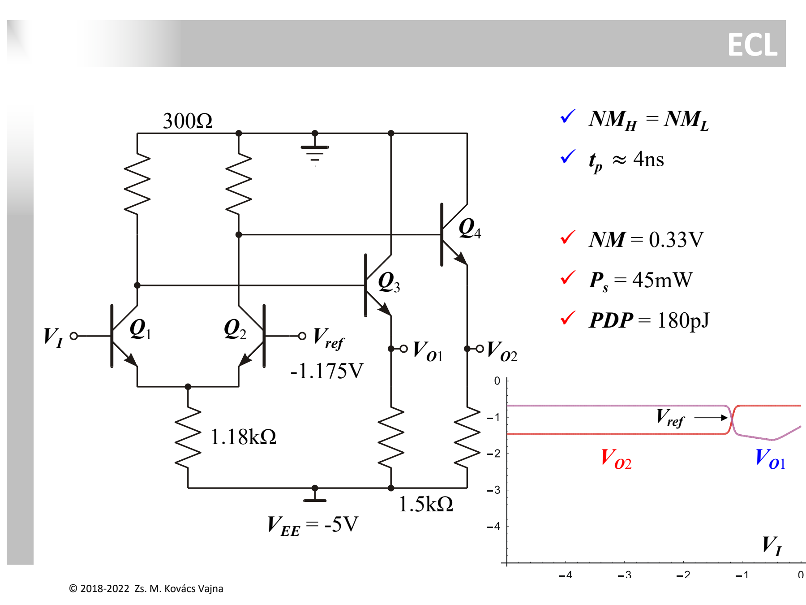
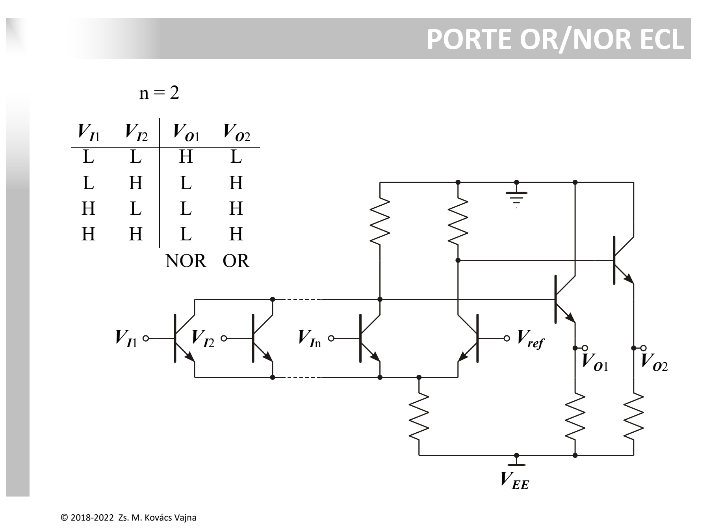

La famiglia **ECL (*Emitter-Coupled Logic*)** è la logica bipolare **più veloce in assoluto** ($t_p \approx 1 \div 4\text{ ns}$), progettata per azzerare i tempi di commutazione eliminando del tutto la saturazione dei [BJT](../Dispositivi%20e%20Componenti/BJT.md) e riducendo l'escursione di tensione (*logic swing*).

---

### 1. Il Principio Differenziale: Zero Saturazione

Nelle altre famiglie a BJT, i transistor commutano tra interdizione e saturazione. In saturazione l'accumulo di carica minoritaria nella base introduce ritardi considerevoli.  
L'ECL adotta un approccio radicalmente diverso:
1. Una **coppia differenziale a BJT** ad emettitori accoppiati (*Emitter-Coupled*).
2. I transistor **non saturano mai**: commutano una corrente costante $I_0$ tra i due rami, lavorando solo in zona attiva diretta o interdizione.
3. Lo **swing logico è ridottissimo** ($\Delta V \approx 0.8\text{ V}$), velocizzando la carica/scarica delle [capacità parassite](../Dispositivi%20e%20Componenti/Capacit%C3%A0%20parassite%20nel%20MOSFET.md).



```
                       Vcc (0V - Massa pulita)
                        │          │
                       [Rc]       [Rc]
                        │          │
                 Vo1 o──┤          ├──o Vo2
                 (NOR) ┌┴┐        ┌┴┐ (OR)
                 Vi o──┤ │ Q1  Q2 │ ├──o Vref (-1.175V)
                       └┬┘        └┬┘
                        └───┬──────┘
                            │
                           (↓) I0 (Generatore di corrente)
                            │
                           Vee (-5.2V)
```

* Se $V_I > V_{ref}$ (Ingresso **HIGH**): $Q_1$ conduce, devia tutta la corrente $I_0$ sul ramo sinistro e $Q_2$ si spegne $\implies \mathbf{V_{O1} = LOW\ (NOR)}$ e $\mathbf{V_{O2} = HIGH\ (OR)}$.
* Se $V_I < V_{ref}$ (Ingresso **LOW**): $Q_1$ si spegne, tutta la corrente passa su $Q_2 \implies \mathbf{V_{O1} = HIGH\ (NOR)}$ e $\mathbf{V_{O2} = LOW\ (OR)}$.
* **Uscita complementare gratuita:** ogni porta ECL fornisce simultaneamente sia la funzione diretta (OR) che negata (NOR).

---

### 2. Topologia Reale ECL



```
                       Vcc = 0V (Massa pulita)
                   ┌─────┬────┬─────┬─────┐
                  [300Ω][300Ω]│     │     │
                   │     │   ┌┴┐   ┌┴┐    │
                   │     ├───┤ │Q3 │ │Q4  │
                   ├──┐  │   └┬┘   └┬┘    │
                  ┌┴┐ │ ┌┴┐   ├──Vo1├──Vo2│
             Vi o─┤ │Q1 │Q2   │     │     │
                  └┬┘ └┬┘-1.175V    │     │
                   └──┬┘ Vref [1.5k][1.5k]│
                      │       │     │     │
                   [1.18kΩ]   │     │     │
                      │       │     │     │
                   ───┴───────┴─────┴─────┴── Vee = -5V
```

#### Perché la Massa è a $0\text{ V}$ ($V_{CC}$) e l'Alimentazione è Negativa ($V_{EE} = -5\text{ V}$)?
* Le uscite logiche sono riferite direttamente a $V_{CC}$ attraverso i resistori da $300\ \Omega$.
* Connettendo $V_{CC}$ alla massa di sistema (priva di rumore), le ondulazioni o i disturbi della linea di alimentazione $V_{EE}$ vengono assorbiti dal ramo di emettitore da $1.18\text{ k}\Omega$ e non influenzano i livelli logici di uscita (*bassa sensibilità alla massa*).

#### Il Ruolo degli Emitter-Follower ($Q_3, Q_4$):
* **Bassa impedenza di uscita:** permettono di pilotare carichi capacitivi pesanti e linee di trasmissione terminate a $50\ \Omega$ senza riflessioni né rallentamenti.
* **Level-Shifting:** traslano il livello di una caduta $V_{BE} \approx 0.75\text{ V}$ verso il basso, rendendo l'uscita direttamente compatibile con gli ingressi degli stadi successivi.

---

### 3. Livelli Logici e Margini di Rumore

* **Livello ALTO ($V_{OH}$):** $V_{OH} = 0\text{ V} - V_{BE} \approx \mathbf{-0.85 \div -0.9\text{ V}}$
* **Livello BASSO ($V_{OL}$):** $V_{OL} = 0\text{ V} - (R_C \cdot I_0) - V_{BE} \approx -0.8\text{ V} - 0.9\text{ V} \approx \mathbf{-1.7\text{ V}}$
* **Soglia di riferimento ($V_{ref}$):** $V_{ref} = \frac{V_{OH} + V_{OL}}{2} \approx \mathbf{-1.175 \div -1.3\text{ V}}$
* **Margini di rumore simmetrici:**
  $$NM_H = NM_L \approx \mathbf{0.33\text{ V}}$$

---

### 4. Porte OR / NOR ECL



Collegando più transistor in parallelo sul ramo sinistro della coppia differenziale ($V_{I1}, V_{I2}, \dots, V_{In}$):
* Se **almeno un ingresso è HIGH** ($> V_{ref}$), la corrente $I_0$ passa a sinistra $\implies \mathbf{V_{O1} = LOW\ (NOR)}$ e $\mathbf{V_{O2} = HIGH\ (OR)}$.
* Solo se **tutti gli ingressi sono LOW** ($< V_{ref}$), la corrente passa interamente a destra su $Q_2 \implies \mathbf{V_{O1} = HIGH\ (NOR)}$ e $\mathbf{V_{O2} = LOW\ (OR)}$.

---

### 5. Sintesi Prestazioni

* **Velocità imbattuta:** $t_p \approx 1 \div 4\text{ ns}$ (transistor sempre in zona attiva, niente saturazione).
* **Consumo statico elevato:** $P_s = 45\text{ mW}$ (la corrente $I_0$ scorre continuamente in uno dei due rami).
* **Prodotto Ritardo-Consumo:** $PDP = 180\text{ pJ}$.

---

*Pagine correlate:*
- [TTL (Transistor-Transistor Logic)](./TTL%20%28Transistor-Transistor%20Logic%29.md)
- [RTL e Prodotto Ritardo-Consumo (PDP)](./RTL%20e%20Prodotto%20Ritardo-Consumo%20%28PDP%29.md)
- [Soglia Logica e Margine di Rumore](./Soglia%20Logica%20e%20Margine%20di%20Rumore.md)
- [BJT](../Dispositivi%20e%20Componenti/BJT.md)
- [Capacità parassite nel MOSFET](../Dispositivi%20e%20Componenti/Capacit%C3%A0%20parassite%20nel%20MOSFET.md)
- [Resistore](../Dispositivi%20e%20Componenti/Resistore.md)
