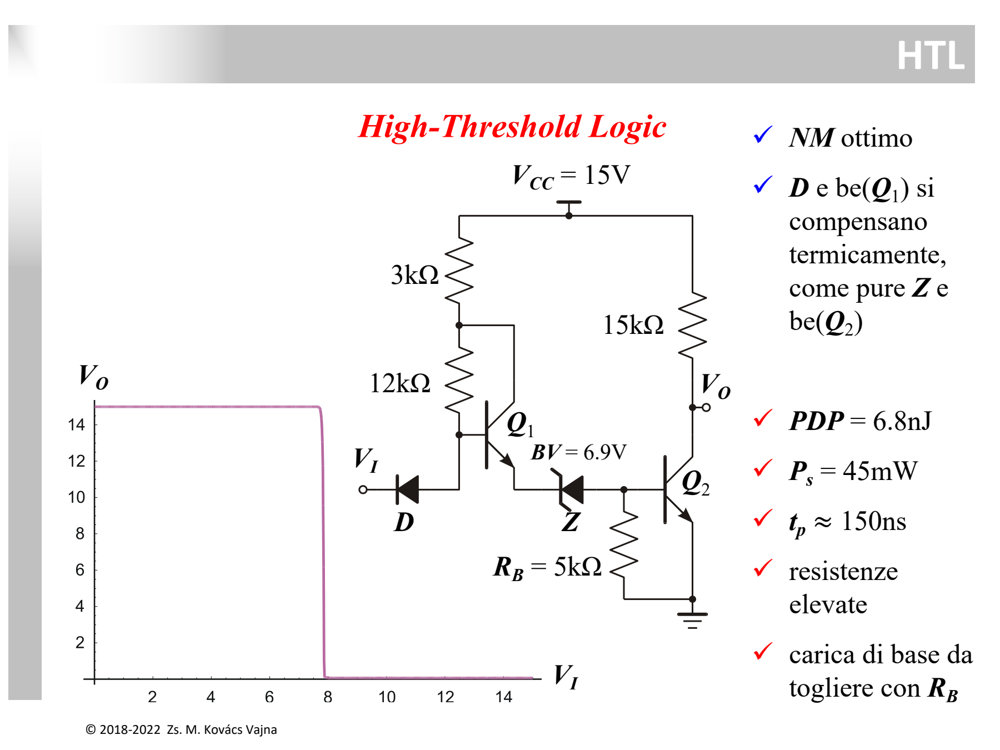
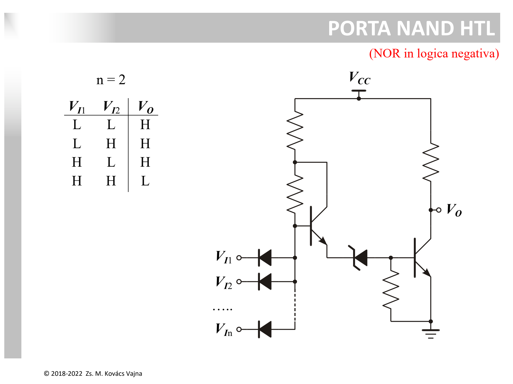

La famiglia **HTL (*High-Threshold Logic*)** è una variante della [DTL](./DTL%20%28Diode-Transistor%20Logic%29.md) ideata specificamente per operare in **ambienti industriali pesanti**, dove la presenza di motori, relè e disturbi elettromagnetici ad alta tensione richiede un'altissima immunità al rumore.



---

### 1. Obiettivo Progettuale e Schema Circuitale

Nelle normali logiche a $5\text{ V}$, i margini di rumore sono inferiori a $1\text{ V}$. In ambiente industriale, picchi di rumore di diversi volt causerebbero commutazioni spurie.  
L'HTL risolve il problema:
1. Elevando l'alimentazione a **$V_{CC} = 15\text{ V}$**.
2. Spostando la soglia di commutazione esattamente a metà della dinamica: **$V_{th} \approx 7.6\text{ V}$**.
3. Ottenendo margini di rumore elevatissimi: **$NM_L \approx 7.3\text{ V}$** e **$NM_H \approx 7.5\text{ V}$**.

```
                            +Vcc = 15V
                             │        │
                            [3kΩ]    [15kΩ] (Rc)
                             │        │
                             ├──┐     ├────── Vo (Uscita)
                             │ ┌┴┐    │
                           [12kΩ]│   ┌┴┐
                             │ └┬┘ Q1│ │ Q2
              Nodo B1        │  │    └┬┘ (Driver finale)
    Vi o──────┤◀─────────────┴──┼─▶|──┤
             D (Diodo)          │  Z  │
                           (Zener 6.9V)
                                │    [RB = 5kΩ]
                                │     │
                               GND   GND
```

* **Diodo d'ingresso $D$:** riceve il segnale d'ingresso $V_I$.
* **Partitore $3\text{ k}\Omega + 12\text{ k}\Omega$:** polarizza la base di $Q_1$.
* **Transistor $Q_1$ (*Emitter-Follower*):** funge da buffer di corrente ad alta impedenza d'ingresso.
* **Diodo Zener $Z$ ($BV = 6.9\text{ V}$):** componente fondamentale (vedi [Breakdown e Diodo Zener](../Dispositivi%20e%20Componenti/Breakdown%20e%20Diodo%20Zener.md)), crea la forte caduta controllata che innalza la soglia.
* **Resistenza $R_B = 5\text{ k}\Omega$ a Massa:** mantiene spento $Q_2$ ed elimina la necessità della seconda alimentazione negativa $-V_{BB}$.
* **Transistor $Q_2$ & $R_C = 15\text{ k}\Omega$:** stadio invertitore finale.

---

### 2. Funzionamento e Calcolo della Soglia di Commutazione ($V_{th}$)

Per accendere il transistor finale $Q_2$ e portare l'uscita a livello BASSO, la base di $Q_1$ ($V_{B1}$) deve raggiungere:
$$V_{B1} = V_{BE1} + V_Z + V_{BE2} = 0.7\text{ V} + 6.9\text{ V} + 0.7\text{ V} = \mathbf{8.3\text{ V}}$$

All'ingresso, la tensione è legata al diodo $D$ da $V_{B1} = V_I + V_D$.  
La soglia d'ingresso $V_{th}$ è quindi:
$$V_{th} = (V_{BE1} + V_Z + V_{BE2}) - V_D = 0.7\text{ V} + 6.9\text{ V} + 0.7\text{ V} - 0.7\text{ V} = \mathbf{7.6\text{ V}}$$

* **$V_I < 7.6\text{ V}$ (Livello LOW):** il diodo $D$ conduce, $V_{B1}$ è bloccata sotto $8.3\text{ V}$, $Q_1$ e $Q_2$ sono **spenti** $\implies \mathbf{V_O = 15\text{ V}\ (HIGH)}$.
* **$V_I > 7.6\text{ V}$ (Livello HIGH):** il diodo $D$ si spegne, $Q_1$ conduce ed eccita lo Zener $Z$, mandando $Q_2$ in saturazione $\implies \mathbf{V_O \approx 0.1 \div 0.2\text{ V}\ (LOW)}$.

---

### 3. La Doppia Compensazione Termica Perfetta

Mentre la [DTL](./DTL%20%28Diode-Transistor%20Logic%29.md) soffre di scompensazione termica ($-4\text{ mV}/^\circ\text{C}$), l'HTL raggiunge una deriva quasi nulla grazie a una doppia cancellazione:

$$\frac{dV_{th}}{dT} = \underbrace{\left( \frac{dV_{BE1}}{dT} - \frac{dV_D}{dT} \right)}_{\text{Coppia 1}} + \underbrace{\left( \frac{dV_Z}{dT} + \frac{dV_{BE2}}{dT} \right)}_{\text{Coppia 2}}$$

1. **Coppia 1: Giunzione $BE(Q_1)$ e Diodo $D$:**
   Entrambi sono giunzioni PN dirette al silicio con coefficiente $-2\text{ mV}/^\circ\text{C}$:
   $$\frac{dV_{BE1}}{dT} - \frac{dV_D}{dT} = (-2\text{ mV}) - (-2\text{ mV}) = \mathbf{0}$$
2. **Coppia 2: Diodo Zener $Z$ e Giunzione $BE(Q_2)$:**
   * Poiché $BV = 6.9\text{ V} > 5.6\text{ V}$, il breakdown è dominato dall'**effetto a valanga (*Avalanche Breakdown*)**, che ha coefficiente termico **POSITIVO** ($\approx \mathbf{+2\text{ mV}/^\circ\text{C}}$).
   * La giunzione $BE(Q_2)$ ha coefficiente **NEGATIVO** ($\approx \mathbf{-2\text{ mV}/^\circ\text{C}}$).
   * La somma si annulla:
   $$\frac{dV_Z}{dT} + \frac{dV_{BE2}}{dT} = (+2\text{ mV}) + (-2\text{ mV}) \approx \mathbf{0}$$

**Risultato:** $\frac{dV_{th}}{dT} \approx \mathbf{0\text{ mV}/^\circ\text{C}}$, rendendo la soglia logicamente granitica al variare della temperatura.

---

### 4. Porta NAND HTL



Aggiungendo diodi d'ingresso in parallelo si ottiene la funzione **NAND**:
* Se almeno un ingresso è a livello LOW ($< 7.6\text{ V}$), il rispettivo diodo conduce e l'uscita rimane HIGH ($15\text{ V}$).
* Solo quando tutti gli ingressi sono HIGH ($> 7.6\text{ V}$), tutti i diodi sono spenti e l'uscita va a LOW ($0.2\text{ V}$).

---

### 5. Prestazioni e Limiti

* **Vantaggi:** Margini di rumore eccezionali ($NM \approx 7.5\text{ V}$), alimentazione singola a $15\text{ V}$ (nessun $-V_{BB}$), soglia termicamente stabile.
* **Svantaggi:** 
  * **Lenta:** $t_p \approx 150\text{ ns}$ a causa dei valori resistivi elevati ($12\text{ k}\Omega, 15\text{ k}\Omega$).
  * **Consumi elevati:** $P_s = 45\text{ mW}$ per via dell'alimentazione a $15\text{ V}$.
  * **Pessimo PDP:** $PDP = 6.8\text{ nJ}$.

---

*Pagine correlate:*
- [DTL (Diode-Transistor Logic)](./DTL%20%28Diode-Transistor%20Logic%29.md)
- [TTL (Transistor-Transistor Logic)](./TTL%20%28Transistor-Transistor%20Logic%29.md)
- [Soglia Logica e Margine di Rumore](./Soglia%20Logica%20e%20Margine%20di%20Rumore.md)
- [Breakdown e Diodo Zener](../Dispositivi%20e%20Componenti/Breakdown%20e%20Diodo%20Zener.md)
- [Diodo](../Dispositivi%20e%20Componenti/Diodo.md)
- [BJT](../Dispositivi%20e%20Componenti/BJT.md)
- [Resistore](../Dispositivi%20e%20Componenti/Resistore.md)
