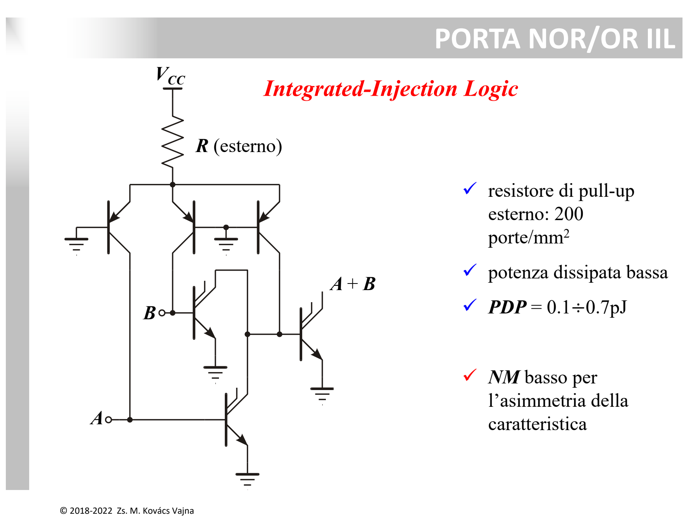

La famiglia **$I^2L$ (*Integrated-Injection Logic*)**, nota anche come *Merged Transistor Logic* (MTL), è stata sviluppata per superare il principale collo di bottiglia delle logiche [RTL](./RTL%20e%20Prodotto%20Ritardo-Consumo%20%28PDP%29.md) e [DCTL](./DCTL%20e%20Current%20Hogging.md): l'enorme occupazione di area delle [resistenze integrate](../Dispositivi%20e%20Componenti/Resistore.md) e il fenomeno del *current hogging*.



---

### 1. L'Idea Fondamentale: Eliminare le Resistenze Integrate

In $I^2L$ tutte le resistenze di pull-up e di base vengono **completamente eliminate** dal silicio integrato.  
Al loro posto si utilizzano due transistor BJT fusi fisicamente nella stessa struttura monolitica (*merged*):
1. Un **transistor PNP laterale** che funge da **iniettore di corrente** costante (sostituisce il carico di pull-up).
2. Un **transistor NPN verticale invertito** con **collettori multipli** (multi-collector), che funge da elemento logico invertitore.

```
                      +Vcc (Alimentazione esterna)
                         │
                        [R_ext] (UNICA resistenza esterna per tutto il chip)
                         │
                    ┌────┴────┐ (Emettitore PNP)
                    │  Q_pnp  │ (Iniettore di corrente)
                    └────┬────┘ (Collettore PNP = Base NPN)
                         │
      Ingresso (Vi) ─────┼────────┐
                         │       ┌┴┐
                         │       │ │ Q_npn (Invertitore)
                         │       └┬┘
                         │     ┌──┼──┐ (Collettori multipli aperti)
                         │     │  │  │
                        GND   Vo1 Vo2 Vo3
```

---

### 2. Funzionamento Logico

* **Ingresso BASSO ($V_I = \text{LOW} \approx 0.1 \div 0.2\text{ V}$):**
  L'uscita (collettore) dello stadio precedente è a massa. La corrente fornita dall'iniettore PNP viene **drenata via verso l'ingresso**.  
  Sulla base dell'NPN non arriva corrente $\implies$ l'NPN è **interdetto (spento)**.  
  Tutti i suoi collettori sono aperti (livello **HIGH** per gli stadi successivi).

* **Ingresso ALTO ($V_I = \text{HIGH}$ / collettore dello stadio a monte aperto):**
  La corrente dell'iniettore non trova una via verso massa all'ingresso, quindi si riversa interamente nella base dell'NPN.  
  L'NPN va in **saturazione** $\implies$ tutti i suoi collettori scendono a $V_{CE,sat} \approx 0.1\text{ V}$ (**LOW**).

---

### 3. I Grandi Vantaggi di $I^2L$

1. **Densità di Integrazione Record ($\approx 200\text{ porte/mm}^2$):**
   * Non ci sono resistori sul chip.
   * I transistor PNP e NPN sono "fusi": la base dell'NPN coincide con il collettore del PNP (regione P), mentre l'emettitore dell'NPN coincide con la base del PNP (substrato comune N). Non servono [sacche di isolamento](../Tecnologia%20e%20Fabbricazione/Isolamento.md) tra le porte!
2. **Prodotto Ritardo-Consumo Minimo ($PDP \approx 0.1 \div 0.7\text{ pJ}$):**
   * Rispetto ai $600\text{ pJ}$ di [RTL](./RTL%20e%20Prodotto%20Ritardo-Consumo%20%28PDP%29.md), $I^2L$ consuma ordini di grandezza in meno.
   * La corrente di iniezione $I_{inj}$ (e quindi il compromesso tra potenza e velocità) è regolabile esternamente tramite un'unica $R_{ext}$.
3. **Bassa Tensione di Alimentazione:**
   * Poiché basta polarizzare direttamente una sola giunzione $V_{BE}$, il circuito opera con $V_{CC} \approx 0.8 \div 1\text{ V}$.
4. **Logica Cablata (*Wired Logic*):**
   * Connettendo insieme i collettori multipli di porte diverse si realizzano direttamente funzioni **NOR** e **AND** senza componenti aggiuntivi.

---

### 4. Limiti

* **Margini di rumore ($NM$) ridotti:** dovuti alla caratteristica asimmetrica e all'escursione ridotta di tensione ($\Delta V \approx 0.6 \div 0.7\text{ V}$).
* È stata successivamente soppiantata dalla tecnologia CMOS per i sistemi digitali VLSI ad alta densità.

---

*Pagine correlate:*
- [DCTL e Current Hogging](./DCTL%20e%20Current%20Hogging.md)
- [RTL e Prodotto Ritardo-Consumo (PDP)](./RTL%20e%20Prodotto%20Ritardo-Consumo%20%28PDP%29.md)
- [Famiglia Logica e Costo per Bit](./Famiglia%20Logica%20e%20Costo%20per%20Bit.md)
- [Soglia Logica e Margine di Rumore](./Soglia%20Logica%20e%20Margine%20di%20Rumore.md)
- [BJT](../Dispositivi%20e%20Componenti/BJT.md)
- [Isolamento](../Tecnologia%20e%20Fabbricazione/Isolamento.md)
- [Resistore](../Dispositivi%20e%20Componenti/Resistore.md)
