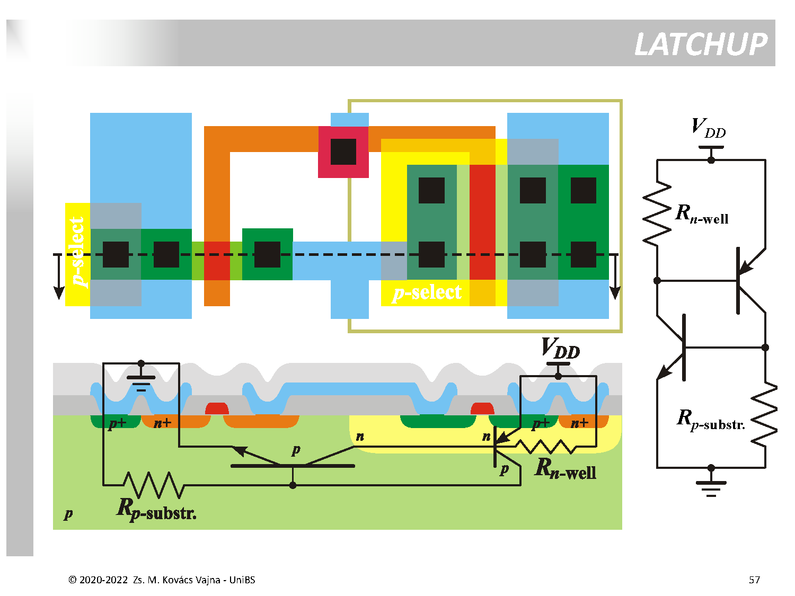
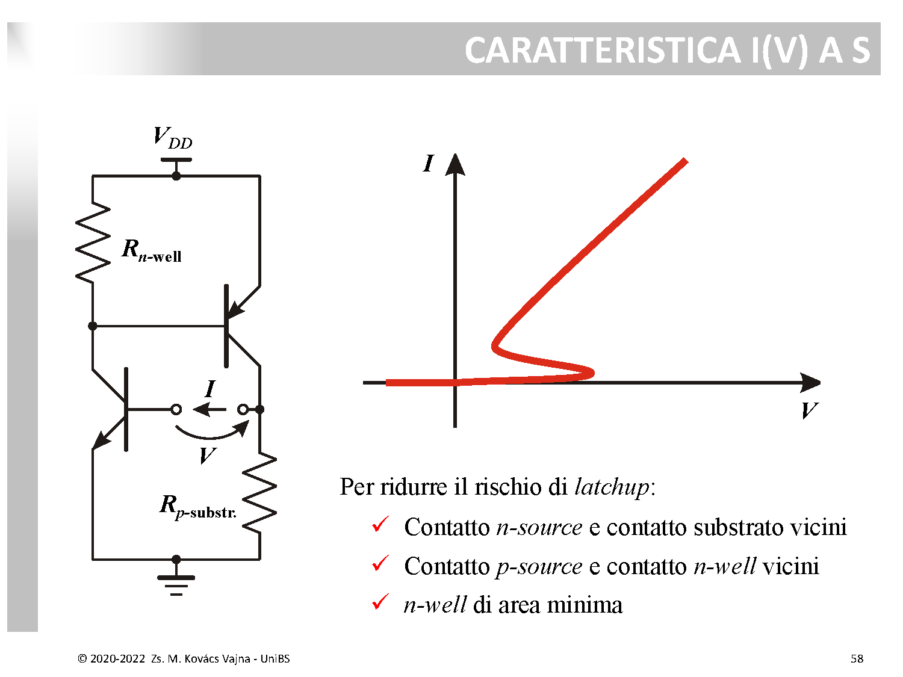

# Latchup nei Circuiti CMOS

Il **latchup** è uno dei fenomeni parassiti più critici e distruttivi nei circuiti integrati [CMOS](./Inverter%20CMOS%20e%20Regioni%20di%20Funzionamento.md) realizzati su silicio massivo (*bulk*). Consiste nell'innesco incontrollato di un percorso a bassissima impedenza (un vero e proprio cortocircuito) tra l'alimentazione $V_{DD}$ e massa ($\text{GND}$), provocando un passaggio anomalo di corrente che porta al blocco funzionale permanente del chip o alla sua distruzione termica (*thermal burnout*).

---

### 1. Origine Fisica e Struttura a Tiristore (Slide 57 di cmos.pdf)

In un processo CMOS standard su substrato di tipo $p$, il transistore [NMOS](../Dispositivi%20e%20Componenti/MOS.md) viene realizzato direttamente nel substrato $p$, mentre il transistore PMOS è alloggiato all'interno di una vasca di tipo $n$ ($n\text{-well}$).

Questa sequenza di diffusioni affiancate forma involontariamente una struttura a quattro strati $p^+-n-p-n^+$ equivalente a due [transistori bipolari (BJT)](../Dispositivi%20e%20Componenti/BJT.md) parassiti accoppiati a reazione positiva:

1. **BJT PNP parassita (verticale/laterale):**
   * **Emettitore:** diffusione $p^+$ del source del PMOS (collegata a $V_{DD}$).
   * **Base:** il silicio della $n\text{-well}$ (polarizzata a $V_{DD}$).
   * **Collettore:** il substrato di silicio $p$ (polarizzato a massa).
2. **BJT NPN parassita (laterale):**
   * **Emettitore:** diffusione $n^+$ del source dell'NMOS (collegata a $\text{GND}$).
   * **Base:** il substrato $p$.
   * **Collettore:** la $n\text{-well}$.
3. **Resistenze parassite del silicio:**
   * **$R_{n\text{-well}}$:** resistenza distribuita interna della well tra la base del PNP e la presa di contatto ohmico a $V_{DD}$.
   * **$R_{p\text{-substr}}$:** resistenza distribuita interna del substrato tra la base dell'NPN e la presa di contatto a massa ($\text{GND}$).

I due BJT sono incrociati: il collettore del PNP inietta corrente nella base dell'NPN, mentre il collettore dell'NPN drena corrente dalla base del PNP. Insieme alle resistenze $R_{n\text{-well}}$ e $R_{p\text{-substr}}$, formano la struttura classica di un **Tiristore (SCR - *Silicon Controlled Rectifier*)**.

---

### 2. Meccanismo di Innesco e Caratteristica $I(V)$ ad "S" (Slide 58)

In condizioni di normale funzionamento, i due BJT parassiti sono **interdetti (spenti)** e la corrente che scorre tra $V_{DD}$ e $\text{GND}$ attraverso di essi è rigorosamente nulla (a meno delle correnti di perdita inversa delle giunzioni).

#### La dinamica di innesco a catena:
Se per un disturbo transitorio (uno spike di rumore sull'alimentazione, sovratensioni sui pin di I/O, radiazioni ionizzanti o iniezione di cariche dalle giunzioni di drain in commutazione):
1. Una corrente spuria attraversa il substrato $p$, generando una caduta ohmica locale:
   $$\Delta V = I_{\text{disturbo}} \cdot R_{p\text{-substr}}$$
2. Quando $\Delta V \ge 0.6 \div 0.7\text{ V}$, la giunzione base-emettitore del BJT NPN si polarizza direttamente: **l'NPN si accende**.
3. L'NPN acceso richiama corrente dal proprio collettore (la $n\text{-well}$), facendo scorrere corrente attraverso $R_{n\text{-well}}$.
4. Non appena la caduta su $R_{n\text{-well}}$ supera a sua volta $0.7\text{ V}$, **anche il BJT PNP si accende**.
5. Il PNP acceso inietta ulteriore corrente nel substrato verso la base dell'NPN: **il ciclo si autoalimenta**.

Se il prodotto dei guadagni di corrente dei due BJT soddisfa la condizione di instabilità:
$$\beta_{NPN} \cdot \beta_{PNP} \ge 1$$
il circuito entra in uno stato bistabile a **feedback rigenerativo positivo**.

#### La Caratteristica $I(V)$ a forma di "S":
Se si misura la caratteristica aprendo l'anello (come illustrato a Slide 58), si osserva la classica curva a "S" a **resistenza differenziale negativa**:
* **Ramo orizzontale basso:** stato spento (alta tensione $V$, corrente $I \approx 0$).
* **Curva a ritroso ad "S":** transitorio di innesco a valanga.
* **Ramo ripido superiore ad altissima corrente:** stato acceso di latchup. La tensione ai capi crolla a valori ridottissimi (tensione di tenuta / *holding voltage*) e la corrente cresce vertiginosamente, limitata solo dalle piccolissime resistenze ohmiche dei metalli.

Il chip resta bloccato in questo stato di cortocircuito finché non viene tolta fisicamente l'alimentazione (sempre che l'eccesso termico non abbia già fuso il silicio).

---

### 3. Le Tre Regole d'Oro di Layout per Prevenire il Latchup (Slide 58)

Poiché non è possibile eliminare gli strati semiconduttori, l'obiettivo del progettista di [layout MOS](../Dispositivi%20e%20Componenti/Layout%20e%20Tecniche%20di%20Progettazione%20dei%20MOS.md) è **impedire che la tensione sulle resistenze parassite possa mai raggiungere $0.7\text{ V}$**, rendendo $R_{p\text{-substr}}$ e $R_{n\text{-well}}$ estremamente piccole e riducendo i guadagni $\beta$ dei BJT parassiti:

1. **Contatto n-source e contatto di substrato vicini:**
   * Posizionare la presa di massa del substrato ($p^+$ tap) il più vicino possibile alla sorgente $n^+$ dell'NMOS.
   * *Effetto fisico:* cortocircuita quasi idealmente la base dell'NPN al suo emettitore, abbattendo la resistenza parassita $R_{p\text{-substr}} \to 0$.
2. **Contatto p-source e contatto n-well vicini:**
   * Posizionare la presa di alimentazione della well ($n^+$ tap) a ridosso della sorgente $p^+$ del PMOS.
   * *Effetto fisico:* cortocircuita la base del PNP al suo emettitore, abbattendo $R_{n\text{-well}} \to 0$.
3. **$n\text{-well}$ di area minima:**
   * Progettare la vasca $n$ con la minima superficie geometrica indispensabile per contenere i PMOS.
   * *Effetto fisico:* riduce la resistenza distribuita interna della well, minimizza le capacità parassite e allontana opportunamente le giunzioni parassite riducendo il guadagno $\beta$.

---

### 4. Tecniche Tecnologiche di Processo

Oltre alle regole geometriche di layout delle celle logiche, le fonderie adottano accorgimenti di fabbricazione per sopprimere il fenomeno:
* **Anelli di Guardia (*Guard Rings*):** piste continue fortemente drogate ($p^+$ su substrato e $n^+$ su well) che circondano i transistor, raccogliendo i portatori minoritari prima che possano innescare le basi parassite.
* **Isolamento dielettrico profondo [STI](../Tecnologia%20e%20Fabbricazione/Isolamento.md):** trincee verticali di $\text{SiO}_2$ che spezzano i percorsi orizzontali di conduzione, riducendo $\beta$.
* **Substrati Epitassiali ($p/p^{++}$):** strato attivo sottile cresciuto sopra un substrato massivo $p^{++}$ ad altissima conducibilità, che devia e assorbe le correnti senza sviluppare cadute di tensione.
* **Tecnologia [SOI](../Dispositivi%20e%20Componenti/SOI.md) (*Silicon On Insulator*):** l'ossido sepolto continuo (BOX) isola completamente i singoli transistor dal substrato. **Il rischio di Latchup è azzerato al $100\%$ alla radice.**

---

*Pagine correlate:*
- [Inverter CMOS e Regioni di Funzionamento](./Inverter%20CMOS%20e%20Regioni%20di%20Funzionamento.md)
- [Isolamento](../Tecnologia%20e%20Fabbricazione/Isolamento.md)
- [SOI](../Dispositivi%20e%20Componenti/SOI.md)
- [Layout e Tecniche di Progettazione dei MOS](../Dispositivi%20e%20Componenti/Layout%20e%20Tecniche%20di%20Progettazione%20dei%20MOS.md)
- [BJT](../Dispositivi%20e%20Componenti/BJT.md)
- [Ritardo di Propagazione e Dimensionamento dell'Inverter CMOS](./Ritardo%20di%20Propagazione%20e%20Dimensionamento%20dell%27Inverter%20CMOS.md)
- [Dimensionamento Progressivo e Tapered Buffer](./Dimensionamento%20Progressivo%20e%20Tapered%20Buffer.md)
