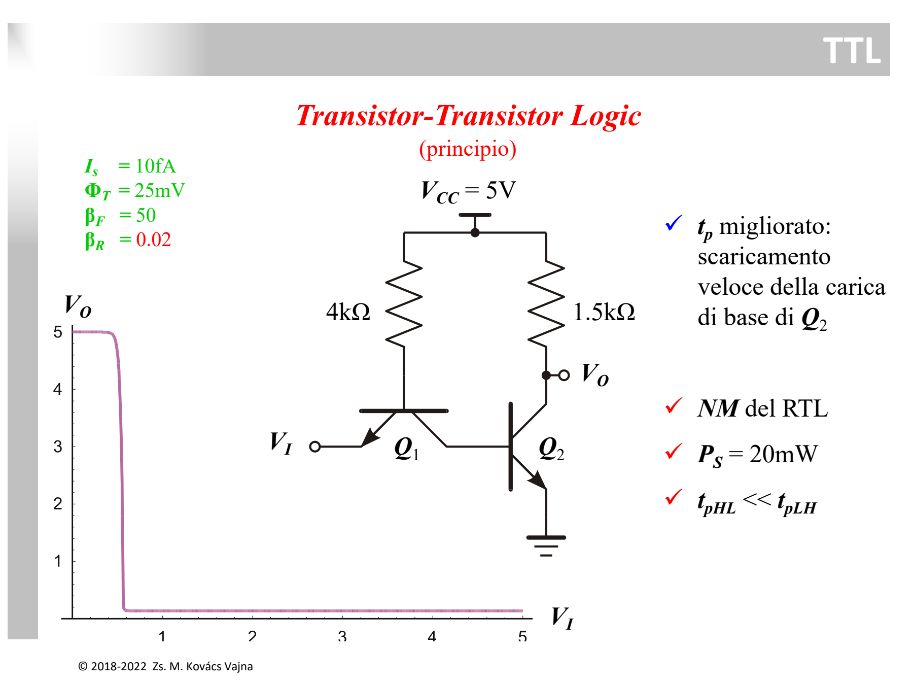
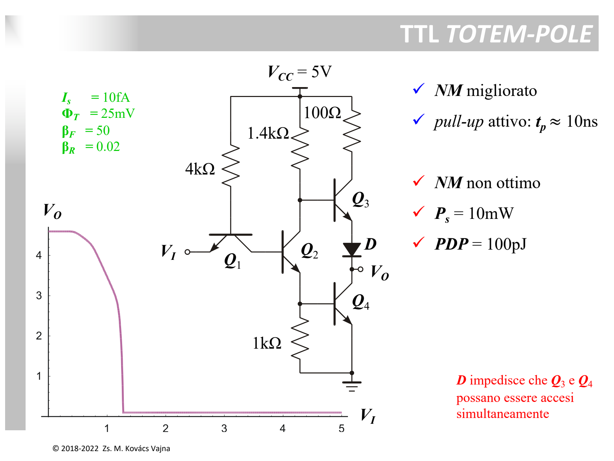
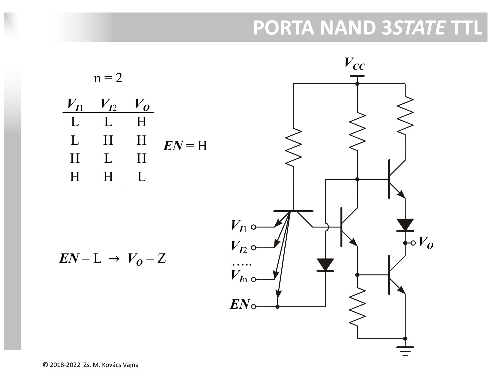
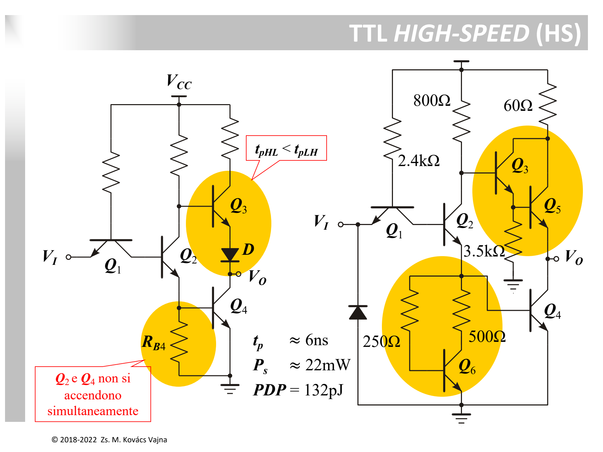
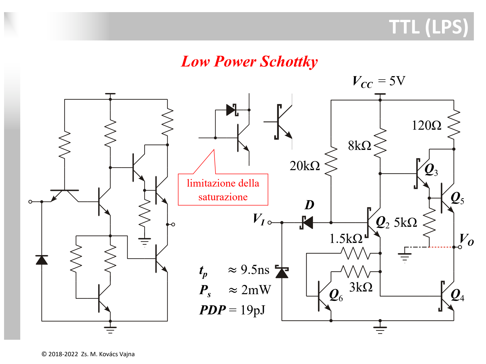

La famiglia **TTL (*Transistor-Transistor Logic*)** è stata la tecnologia dominante per i circuiti integrati digitali SSI/MSI (la serie storica **7400**), nata per superare i limiti di velocità della [DTL](./DTL%20%28Diode-Transistor%20Logic%29.md) e dell'[RTL](./RTL%20e%20Prodotto%20Ritardo-Consumo%20%28PDP%29.md).

---

### 1. TTL di Principio (Transistor a Emettitori Multipli)

Nella TTL, i [diodi](../Dispositivi%20e%20Componenti/Diodo.md) d'ingresso e di traslazione della DTL sono sostituiti da un unico [transistor BJT](../Dispositivi%20e%20Componenti/BJT.md) $Q_1$ a emettitori multipli.



```
              +Vcc = 5V
               │         │
             [4kΩ]    [1.5kΩ] (Rc)
               │         │
               ├── Base  ├────── Vo (Uscita)
             ┌─┴─┐       │
             │   │ Q1   ┌┴┐
    Vi o─────┤   ├──┬───┤ │ Q2 (Driver)
           Emett.│  │   └┬┘
                 │ Coll. │
                        GND
```

#### Meccanismo di Scarica Attiva della Base:
* **Ingresso ALTO ($V_I = 5\text{ V}$):** la giunzione $BE(Q_1)$ è interdetta. $Q_1$ lavora in **zona attiva inversa** ($\beta_R \approx 0.02$). La corrente da $V_{CC}$ attraversa la giunzione $BC(Q_1)$ polarizzata direttamente e si riversa nella base di $Q_2$, mandandolo in saturazione $\implies \mathbf{V_O \approx 0.2\text{ V}\ (LOW)}$.
* **Transizione verso BASSO ($V_I \to 0\text{ V}$):** la giunzione $BE(Q_1)$ conduce in diretta. $Q_1$ entra in **zona attiva diretta**: il suo collettore **aspira attivamente la carica immagazzinata nella base di $Q_2$** con elevata corrente $\beta_F I_B$. Questo spegne $Q_2$ in tempi brevissimi senza bisogno di alimentazioni negative!

---

### 2. TTL con Uscita "Totem-Pole"

Nei circuiti TTL con resistenza di pull-up passiva, il tempo di salita dell'uscita ($t_{pLH}$) era lento perché caricava le capacità parassite attraverso $R_C$. Lo stadio di uscita **Totem-Pole** (pull-up attivo) risolve questo problema.



```
                   +Vcc = 5V
                    │      │       │
                  [4kΩ] [1.4kΩ]  [100Ω]
                    │      │       │
                    │      ├──┐   ┌┴┐
                    │     ┌┴┐ │   │ │ Q3 (Pull-up attivo)
             Base   │     │ │Q2   └┬┘
           ┌──────┬─┴─┐   └┬┘(Phase Splitter)
    Vi o───┤      │Q1 │    ├──┐    │
         Emett.   └───┘    │  │    ▼ D (Diodo)
                    │ Coll.│ ┌┴┐   │
                    └──────┘ │ │Q4 ├────── Vo (Uscita)
                             └┬┘   │
                              │   ┌┴┐
                            [1kΩ] │ │ Q4 (Pull-down)
                              │   └┬┘
                             GND  GND
```

* **$Q_2$ (*Phase Splitter* / Invertitore di Fase):** quando è acceso manda in conduzione $Q_4$ (emettitore ALTO) e spegne $Q_3$ (collettore BASSO). Quando è spento, fa il contrario.
* **$Q_4$ (*Pull-Down*):** porta rapidamente l'uscita a massa $V_O \approx 0.2\text{ V}$.
* **$Q_3$ (*Pull-Up Attivo* a inseguitore di emettitore):** fornisce una corrente elevata a bassissima impedenza di uscita per caricare le capacità di carico $\implies \mathbf{t_p \approx 10\text{ ns}}$ e $PDP = 100\text{ pJ}$.

#### Ruolo del Diodo $D$ nel Totem-Pole
Il diodo $D$ **impedisce la conduzione simultanea di $Q_3$ e $Q_4$** quando l'uscita è a livello BASSO:
1. Con $V_O = \text{LOW}$, $Q_4$ e $Q_2$ sono entrambi saturi ($V_{BE4} \approx 0.7\text{ V}$, $V_{CE2,sat} \approx 0.2\text{ V}$).
2. La base di $Q_3$ si trova a $V_{B3} = V_{C2} = 0.7\text{ V} + 0.2\text{ V} = \mathbf{0.9\text{ V}}$.
3. **Senza diodo $D$:** la giunzione $BE(Q_3)$ vedrebbe $V_{BE3} = V_{B3} - V_O = 0.9\text{ V} - 0.2\text{ V} = 0.7\text{ V}$ e $Q_3$ si accenderebbe, causando un pesante cortocircuito tra $V_{CC}$ e massa.
4. **Con il diodo $D$:** per accendere il ramo servono $V_{B3} = V_O + V_D + V_{BE3} \approx 0.2\text{ V} + 0.7\text{ V} + 0.7\text{ V} = \mathbf{1.6\text{ V}}$. Poiché $0.9\text{ V} < 1.6\text{ V}$, $Q_3$ è **saldamente interdetto**.

---

### 3. TTL 3-State (Alta Impedenza $Z$)



Aggiungendo una linea di abilitazione $EN$ (*Enable*):
* **$EN = \text{HIGH}$:** normale funzionamento logico (porta NAND).
* **$EN = \text{LOW}$:** l'emettitore di abilitazione e il diodo dedicato spengono **contemporaneamente sia $Q_3$ che $Q_4$**. L'uscita è disconnessa dal circuito e va nello stato di **Alta Impedenza ($Z$)**, consentendo la condivisione del bus con altre porte.

---

### 4. TTL High-Speed (HS)



* Per accelerare la commutazione fino a **$t_p \approx 6\text{ ns}$**:
  * Il ramo pull-up viene sostituito da una **coppia Darlington ($Q_3 - Q_5$)**.
  * La resistenza di base di $Q_4$ è sostituita da una rete attiva con transistor **$Q_6$**, che scarica non-linearmente e rapidamente la base di $Q_4$.

---

### 5. TTL Low Power Schottky - 74LS (Il Salto di Qualità)

Il vero limite intrinseco della TTL classica era il tempo di immagazzinamento di carica ($t_s$) dovuto alla **saturazione profonda** dei BJT.



* **Il Clamp Schottky:** si integra un **[diodo](../Dispositivi%20e%20Componenti/Diodo.md) Schottky** a contatto metallo-semiconduttore ($V_D \approx 0.3 \div 0.4\text{ V}$) in antiparallelo tra la Base e il Collettore del BJT.
* **Come funziona:** quando il BJT sta per saturare e il collettore scende sotto la base, il diodo Schottky si accende prima della giunzione PN del BJT ($0.3\text{ V} < 0.7\text{ V}$) e drena la corrente di base in eccesso direttamente nel collettore.
* **Risultato:** il transistor **non satura mai** $\implies \mathbf{t_s \approx 0}$.
* **Vantaggi di 74LS:** è possibile impiegare resistenze di valore molto più alto per **abbattere la potenza a $P_s \approx 2\text{ mW}$** pur mantenendo $t_p \approx 9.5\text{ ns}$, raggiungendo un eccezionale:
  $$\mathbf{PDP = 19\text{ pJ}}\quad (\text{rispetto ai } 600\text{ pJ dell'RTL!})$$

---

### Tabella Comparativa Famiglie TTL

| Versione | Caratteristica | $t_p$ | $P_s$ | $PDP$ |
| :--- | :--- | :--- | :--- | :--- |
| **Principio** | BJT multi-emettitore | - | $20\text{ mW}$ | - |
| **Totem-Pole Standard** | Pull-up attivo con diodo $D$ | $10\text{ ns}$ | $10\text{ mW}$ | $100\text{ pJ}$ |
| **High-Speed (HS)** | Darlington + pull-down attivo $Q_6$ | $6\text{ ns}$ | $22\text{ mW}$ | $132\text{ pJ}$ |
| **Low-Power Schottky (LS)** | BJT con clamp Schottky anti-saturazione | $9.5\text{ ns}$ | **$2\text{ mW}$** | **$19\text{ pJ}$** |

---

*Pagine correlate:*
- [ECL (Emitter-Coupled Logic)](./ECL%20%28Emitter-Coupled%20Logic%29.md)
- [DTL (Diode-Transistor Logic)](./DTL%20%28Diode-Transistor%20Logic%29.md)
- [HTL (High-Threshold Logic)](./HTL%20%28High-Threshold%20Logic%29.md)
- [RTL e Prodotto Ritardo-Consumo (PDP)](./RTL%20e%20Prodotto%20Ritardo-Consumo%20%28PDP%29.md)
- [Soglia Logica e Margine di Rumore](./Soglia%20Logica%20e%20Margine%20di%20Rumore.md)
- [BJT](../Dispositivi%20e%20Componenti/BJT.md)
- [Diodo](../Dispositivi%20e%20Componenti/Diodo.md)
- [Resistore](../Dispositivi%20e%20Componenti/Resistore.md)
