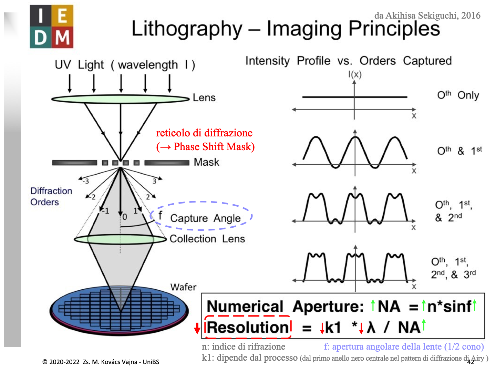
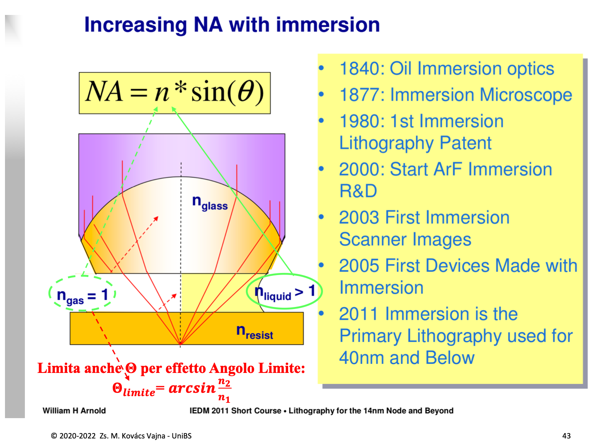

# Litografia Ottica e Litografia ad Immersione

Per rimpicciolire i transistor e aumentare la densità di integrazione è necessario stampare geometrie nanometriche sul wafer di silicio. La fotolitografia ottica trasferisce i pattern geometrici dalla fotomaschera al fotoresist tramite luce ultravioletta (UV), ma la natura ondulatoria della luce impone severi limiti fisici dovuti alla **diffrazione**.

---

### 1. Principi Fisici: La Maschera come Reticolo di Diffrazione

Nelle moderne tecnologie litografiche, le aperture e i dettagli opachi sulla maschera hanno dimensioni confrontabili con la lunghezza d'onda $\lambda$ della luce UV incidente:
* La maschera **non si comporta come un semplice stencil opaco**, ma agisce a tutti gli effetti come un **reticolo di diffrazione**.
* La luce che la attraversa non prosegue in linea retta, ma si separa in molteplici fasci discreti detti **ordini di diffrazione** ($0, \pm 1, \pm 2, \pm 3, \dots$).

* **Ordine zero ($0^{\text{th}}$):** è il raggio centrale non deviato. Porta soltanto l'informazione sull'intensità media dell'illuminazione (componente continua / DC), ma **nessuna informazione spaziale** sulla posizione dei bordi.
* **Ordini superiori ($\pm 1, \pm 2, \dots$):** vengono diffratti ad angoli via via più ampi secondo la legge del reticolo ($\sin\theta_m = m \frac{\lambda}{P}$, con $P$ periodo del reticolo). Più i dettagli sono piccoli e fitti ($P$ piccolo), più l'angolo di diffrazione $\theta_m$ è ampio.
* **Lente di Collezione / Obiettivo:** ha un cono di cattura finito definito dal semi-angolo $f$ (o $\theta$). Raccoglie solo i raggi che cadono all'interno della sua apertura; tutti gli ordini diffratti ad angoli maggiori escono fuori dalla lente e vanno **perduti**.

---

### 2. Formazione dell'Immagine sul Wafer: Serie di Fourier Ottica

Sul wafer l'immagine non si forma per semplice proiezione geometrica, ma per **interferenza dei diversi ordini diffratti** raccolti dalla lente (equivalente ottico della serie di Fourier):

1. **Solo Ordine $0$ ($0^{\text{th}}$ Only):**
   * Se la lente cattura solo il raggio centrale, sul wafer giunge un'illuminazione piatta e omogenea ($I(x) = \text{costante}$).
   * **Contrasto nullo:** non si imprime alcun pattern; il fotoresist vede solo una macchia di luce uniforme.
2. **Ordine $0$ e $1^\circ$ Ordine ($0^{\text{th}}$ & $1^{\text{st}}$):**
   * L'ordine zero interferisce con i primi ordini diffratti ($\pm 1$), generando un profilo di intensità sinusoidale (l'armonica fondamentale).
   * **Compare il contrasto:** si distinguono linee chiare e linee scure. I profili sono ancora arrotondati, ma il pattern è geometricamente risolto.
   * > **Regola d'oro:** Per poter risolvere un pattern qualsiasi, il sistema ottico **deve catturare almeno l'ordine 0 e il $1^\circ$ ordine di diffrazione**.
3. **Ordini Superiori ($2^\circ, 3^\circ, \dots$):**
   * L'aggiunta delle armoniche superiori rende i fronti di salita e discesa più ripidi, squadrando il profilo $I(x)$ fino ad approssimare l'onda quadra ideale della maschera.

---

### 3. Criterio di Rayleigh e Apertura Numerica (NA)

La minima dimensione stampabile (detta **Risoluzione** o *Critical Dimension*, $CD$) è regolata dalla formula di Rayleigh:

$$\text{Resolution} = k_1 \cdot \frac{\lambda}{NA} = k_1 \cdot \frac{\lambda}{n \cdot \sin(\theta)}$$

L'obiettivo è minimizzare la dimensione minima risolvibile ($\downarrow \text{Resolution}$):

* **$\downarrow \lambda$ (Lunghezza d'onda UV):** si è passati storicamente da $365\text{ nm}$ (i-line a mercurio) a $248\text{ nm}$ (laser a eccimeri $\text{KrF}$), fino a $193\text{ nm}$ (laser $\text{ArF}$) e infine a $13.5\text{ nm}$ (litografia EUV).
* **$\downarrow k_1$ (Fattore di processo):** parametro adimensionale legato alla larghezza del disco di diffrazione di Airy, alla chimica del fotoresist e alle tecniche di miglioramento ottico (RET: *Phase Shift Masks*, illuminazione disassata OAI, *Optical Proximity Correction* OPC). Il limite fisico invalicabile per singola esposizione è $k_1 = 0.25$.
* **$\uparrow NA$ (Apertura Numerica):** quantifica il potere di raccolta della lente ($NA = n \cdot \sin\theta$). Si incrementa allargando il cono di cattura angolare $\theta$ o aumentando l'indice di rifrazione $n$ del mezzo.

---

### 4. Perché $n$ si Riferisce al Mezzo SOTTO la Lente?

La litografia di produzione opera con **sistemi di riduzione ottica (tipicamente $4\times$)**:
* **Sopra la lente (lato Maschera):** i dettagli sono 4 volte più grandi e il cono di diffrazione è stretto. L'apertura numerica lato oggetto è bassa ($NA_{\text{sopra}} \approx 0.3 \div 0.35$), quindi l'aria non crea alcun collo di bottiglia.
* **Sotto la lente (lato Wafer):** la lente concentra la luce comprimendola in un cono ripido e largo per formare l'immagine rimpicciolita sul silicio ($NA_{\text{sotto}} = 4 \times NA_{\text{sopra}}$).

L'apertura numerica citata nelle specifiche litografiche e nella formula di Rayleigh è **sempre quella lato immagine ($NA_{\text{sotto}}$)**:

1. **La risoluzione si calcola sul wafer:** la domanda fisica è a quale distanza minima si possono separare due punti sul fotoresist.
2. **Contrazione reale della lunghezza d'onda nel mezzo:** la luce che tocca il fotoresist non viaggia nel vuoto o nell'aria, ma nel mezzo interposto tra lente e silicio. In un mezzo con indice di rifrazione $n$, la velocità dell'onda diminuisce ($v = c/n$) e la lunghezza d'onda **si contrae fisicamente**:
   $$\lambda_{\text{mezzo}} = \frac{\lambda_0}{n}$$
   Inserendo un liquido con $n > 1$, la luce che impressiona il silicio si comporta come se avesse una lunghezza d'onda nettamente più corta:
   $$\text{Resolution} = k_1 \cdot \frac{\lambda_{\text{mezzo}}}{\sin\theta} = k_1 \cdot \frac{\lambda_0}{n \cdot \sin\theta} = k_1 \cdot \frac{\lambda_0}{NA}$$

---

### 5. Litografia ad Immersione: Sblocco dell'Angolo Limite e $NA > 1$

Quando l'industria ha raggiunto la lunghezza d'onda di $193\text{ nm}$ con laser ad eccimeri $\text{ArF}$, scendere a lunghezze d'onda inferiori (es. $157\text{ nm}$) risultò impossibile per via dell'opacità delle ottiche di quarzo. L'unica via per aumentare la risoluzione fu **spingere $NA$ oltre l'unità**.

#### A. Il Limite della Litografia a Secco (Gas / Aria, $n_{\text{gas}} = 1$)
Quando sotto la lente c'è solo aria o gas ($n_{\text{gas}} = 1$), si manifestano due vincoli strettamente interconnessi dalla legge di conservazione ottica ($n_{\text{vetro}} \sin\theta_{\text{vetro}} = n_{\text{aria}} \sin\theta_{\text{aria}}$):
1. **Vincolo matematico:** $NA = 1 \cdot \sin\theta_{\text{aria}} \le 1$.
2. **Riflessione Totale Interna:** nel passaggio dal vetro della lente ($n_{\text{vetro}} \approx 1.56$) all'aria ($n_{\text{gas}} = 1$), per la legge di Snell i raggi deviano allontanandosi dalla normale. Esiste un **Angolo Limite** nel vetro oltre il quale la luce non può uscire nell'aria:
   $$\theta_{\text{limite}} = \arcsin\left(\frac{n_{\text{gas}}}{n_{\text{vetro}}}\right) = \arcsin\left(\frac{1}{1.56}\right) \approx 39.9^\circ$$
   Tutti i raggi con inclinazione superiore a circa $40^\circ$ all'interno del vetro **subiscono riflessione totale interna**, rimbalzano all'interno della lente e non raggiungono mai il wafer. In aria, i migliori scanner a secco non potevano superare $NA \approx 0.93$.

> Dire che *"in aria $NA \le 1$"* e dire che *"i raggi ad alto angolo sono bloccati dall'angolo limite"* è descrivere la **stessa identica legge fisica** in termini algebrici e in termini di ottica geometrica.

#### B. La Soluzione ad Immersione (Acqua Ultrapura, $n_{\text{liquid}} \approx 1.44$)
Interponendo una sottile lama di acqua ultrapura (UPW - *Ultrapure Water*, trasparente a $193\text{ nm}$ con $n \approx 1.44$) tra l'ultima lente e il wafer:
1. **L'angolo limite viene sbloccato:** il salto di indice tra vetro ($n \approx 1.56$) e acqua ($n \approx 1.44$) è ridottissimo. L'angolo limite sale a:
   $$\theta_{\text{limite}} = \arcsin\left(\frac{1.44}{1.56}\right) \approx 67.4^\circ$$
   I raggi con inclinazione elevata escono liberamente dal vetro senza riflessione totale, entrano nell'acqua e proseguono nel fotoresist ($n_{\text{resist}} \approx 1.7$).
2. **$NA$ supera l'unità:** con $n = 1.44$, il limite teorico diventa $NA_{\text{max}} = 1.44 \cdot 1 = 1.44$. Gli scanner industriali ArFi hanno raggiunto **$NA = 1.35$**.
3. **Risoluzione effettiva:** a parità di laser ($\lambda = 193\text{ nm}$), l'acqua accorcia la lunghezza d'onda effettiva a $\lambda_{\text{eff}} = \frac{193\text{ nm}}{1.44} \approx 134\text{ nm}$. Ciò ha permesso di stampare feature fino a circa **$38\text{ nm}$ a singolo passaggio**, consentendo l'evoluzione dei nodi tecnologici fino all'avvento dell'EUV.

---

### In sintesi:
* **Diffrazione e Maschera:** La maschera agisce come un reticolo. Per comporre l'immagine servono almeno l'ordine zero e il $1^\circ$ ordine diffratto.
* **Collo di bottiglia sul Wafer:** L'$NA$ rilevante è quella **lato immagine (sotto)**, dove il fascio converge con angoli ripidissimi per rimpicciolire il circuito.
* **Perché l'Acqua Funziona:** L'acqua ultrapura ($n=1.44$) accorcia la lunghezza d'onda locale a $134\text{ nm}$ ed elimina la riflessione totale interna del vetro, consentendo ad aperture numeriche estreme ($NA = 1.35$) di impressionare il silicio.

---

*Pagine correlate:*
- [Wafer produzione](./Wafer%20produzione.md)
- [Isolamento](./Isolamento.md)
- [Matching e Variabilita nei Componenti Integrati](../Dispositivi%20e%20Componenti/Matching%20e%20Variabilita%20nei%20Componenti%20Integrati.md)
- [Layout e Tecniche di Progettazione dei MOS](../Dispositivi%20e%20Componenti/Layout%20e%20Tecniche%20di%20Progettazione%20dei%20MOS.md)
- [Difficoltà nel fare un componente ideale](../Scaling%20e%20Limiti%20Fisici/Difficolt%C3%A0%20nel%20fare%20un%20componente%20ideale.md)
- [Analogico non si scende di dimensioni](../Scaling%20e%20Limiti%20Fisici/Analogico%20non%20si%20scende%20di%20dimensioni.md)
