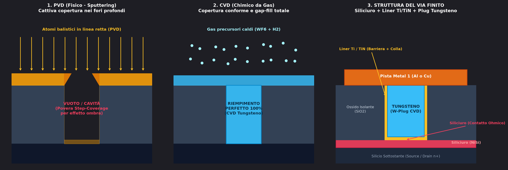
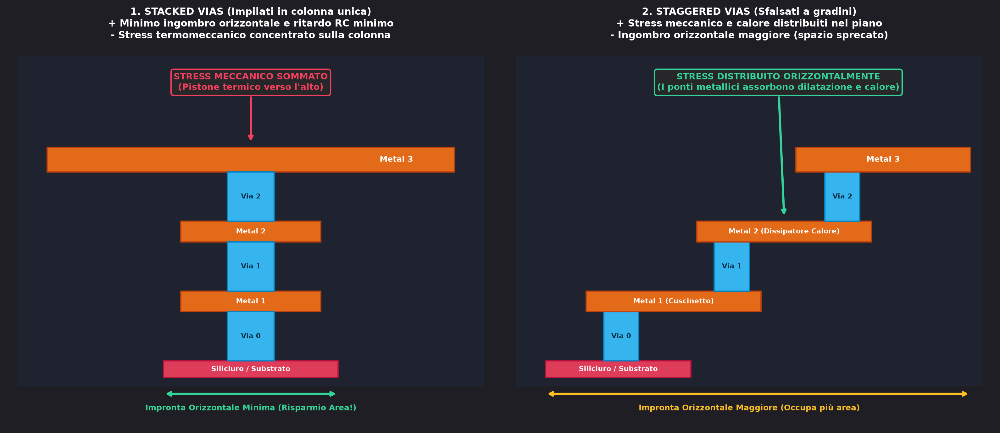

I **vias** (o contatti verticali) sono i pilastri metallici cilindrici che collegano verticalmente i vari livelli di metallizzazione tra di loro o collegano il primo livello metallico ($\text{Metal 1}$) al silicio sottostante (Source, Drain e Gate).

Hanno una geometria caratterizzata da un **alto rapporto d'aspetto** (*aspect ratio*): sono canali verticali molto profondi e strettissimi (diametro di poche decine di nanometri).

---

### 1. Perché si Usa il Tungsteno ($W$) e Non l'Alluminio o il Rame?

Nei fori di contatto verticali non si può usare l'alluminio o il rame a causa dei limiti di deposizione e affidabilità:
* **Immunità allo Spiking ed Elettromigrazione:** il Tungsteno fonde a $3422^\circ\text{C}$ ed è chimicamente stabile ad alte densità di corrente ($E_a > 1.6\text{ eV}$). Non risente dell'elettromigrazione e non scioglie il silicio sottostante.
  👉 Vedi: [Elettromigrazione e tossicità dei metalli](./Elettromigrazione%20e%20tossicit%C3%A0%20dei%20metalli.md)
* **Riempimento Conforme da Gas ([CVD](./CVD.md)):** se provassimo a depositare il metallo per via fisica ([PVD](./PVD.md)), gli atomi schizzerebbero in linea retta accumulandosi sui bordi superiori del foro per "effetto ombra", lasciando un'enorme cavità vuota all'interno. Con la deposizione chimica da fase vapore ([CVD](./CVD.md)) i gas precursori riempiono il foro dal fondo alle pareti senza creare bolle d'aria (*void-free fill*).

---

### 2. L'Anatomia del Via: Il Doppio Liner $\text{Ti}/\text{TiN}$

La reazione chimica per depositare il Tungsteno solido impiega un gas precursore:
$$\text{WF}_6\text{ (gas)} + 3\text{H}_2\text{ (gas)} \longrightarrow \text{W}\text{ (solido)} + 6\text{HF}\text{ (gas acido)}$$

Questo processo presenta due criticità:
1. **Attacco corrosivo del Fluoro:** l'acido fluoridrico ($\text{HF}$) e il fluoro gassoso corroderebbero voracemente il silicio e il siliciuro sul fondo, scavando cavità difettose (*wormholes*).
2. **Adesione alle pareti:** il Tungsteno metallico non aderisce spontaneamente all'ossido di silicio ($\text{SiO}_2$) delle pareti verticali del foro.

#### La Soluzione: Il Rivestimento di $\text{Ti}/\text{TiN}$
Prima di immettere il gas di Tungsteno, si deposita una sottilissima pellicola continua ($10-20\text{ nm}$) che riveste **sia il fondo che tutte le pareti verticali del via**:
* **Il Titanio ($\text{Ti}$):** funge da **colla conduttiva**, aderendo sia all'ossido $\text{SiO}_2$ delle pareti laterali sia al [Siliciuro](./Siliciuro.md) sul fondo.
* **Il Nitruro di Titanio ($\text{TiN}$):** è una ceramica metallica conduttiva e impermeabile che funge da **scudo protettivo**, bloccando l'attacco del fluoro sul silicio sottostante e offrendo la superficie ideale per far nucleare e crescere il Tungsteno.

---

### 3. Stacked Vias vs Staggered Vias (Vias Impilati vs Sfalsati)

Quando un collegamento deve attraversare più livelli metallici (es. da $\text{Metal 1}$ a $\text{Metal 3}$), esistono due strategie di layout:

#### A. Stacked Vias (Impilati in colonna unica)
I vias sono allineati esattamente l'uno sopra l'altro lungo lo stesso asse verticale:
* **Vantaggi:** 
  * **Risparmio enorme di area:** ingombro orizzontale minimo, fondamentale nei nodi nanometrici ad altissima densità di integrazione.
  * **Minimo ritardo $RC$:** il percorso del segnale è la linea retta più corta possibile.
* **Svantaggi e Rischi Fisici (Lo Stress Termomeccanico):**
  * **Somma delle dilatazioni ed Effetto Pistone (a caldo):** a causa della differenza di dilatazione termica ($\text{CTE}_{Cu} \approx 17\text{ ppm}/^\circ\text{C}$ contro $\text{CTE}_{SiO2} \approx 0.5\text{ ppm}/^\circ\text{C}$), il metallo vuole allungarsi molto più dell'ossido rigido circostante. Tutte le micro-dilatazioni $+\Delta L$ si sommano lungo la colonna verticale: la struttura si comporta come un **pistone idraulico che spinge verso l'alto**, generando **intensi sforzi di taglio (*shear stress*) laterali** all'interfaccia con il dielettrico che possono fessurare e spaccare l'ossido fragile.
  * **Forza di trazione e Delaminazione (a freddo):** quando il chip si raffredda (o a fine processo termico a $400^\circ\text{C}$ tornando a $25^\circ\text{C}$), il metallo si contrae molto più del dielettrico. La colonna "tira" verso l'interno con forti forze di trazione verticale che possono **strappare e scollare l'interfaccia tra i vias (delaminazione)**, aprendo micro-fessure e causando un circuito aperto.
  * **Dissipazione termica peggiore:** il calore generato per effetto Joule rimane confinato nella colonna isolata dal dielettrico.
  * **Sensibilità ai disallineamenti (*Overlay Error*):** un minimo errore fotolitografico crea spigoli vivi all'interfaccia con picchi di densità di corrente $J$ ed elettromigrazione accelerata.

#### B. Staggered Vias (Sfalsati a gradino / scala)
Ogni via è spostato lateralmente rispetto al precedente, raccordato da un ponte metallico orizzontale:
* **Vantaggi:** 
  * **I livelli metallici orizzontali fungono da cuscinetto elastico:** il tratto di metallo orizzontale tra un via e l'altro può flettersi leggermente nel piano, assorbendo sia le dilatazioni che le contrazioni termiche come una molla ed evitando che gli stress meccanici si sommino verticalmente lungo un unico asse.
  * **Vie di fuga termiche:** il metallo orizzontale disperde il calore per conduzione $100\times$ meglio del dielettrico circostante, raffreddando il via.
* **Svantaggi:** occupano molto più spazio orizzontale su ciascun livello metallico.

#### C. Quando Usare l'Uno o l'Altro?
* **Routing di segnale ad alta densità:** si usano gli **Stacked Vias** per massimizzare la compattezza e la velocità.
* **Linee di Alimentazione ($V_{DD}, GND$):** si usano **Matrici di Vias in parallelo** (*Via Arrays* $3\times 3$ o $4\times 4$) per dividere la corrente elevata.
* **Sotto i Pad di I/O esterni (Bonding Pads):** si usano gli **Staggered Vias** per evitare che la pressione meccanica della saldatura esterna frantumi la colonna di dielettrico sottostante (*pad cratering*).

---

*Pagine correlate:*
- [CVD](./CVD.md)
- [PVD](./PVD.md)
- [Siliciuro](./Siliciuro.md)
- [Elettromigrazione e tossicità dei metalli](./Elettromigrazione%20e%20tossicit%C3%A0%20dei%20metalli.md)
- [MOS](../Dispositivi%20e%20Componenti/MOS.md)
- [Difficoltà nel fare un componente ideale](../Scaling%20e%20Limiti%20Fisici/Difficolt%C3%A0%20nel%20fare%20un%20componente%20ideale.md)