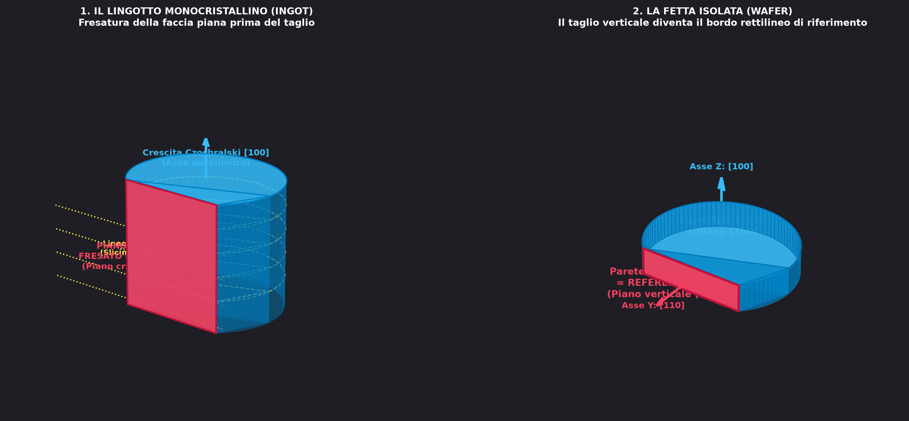
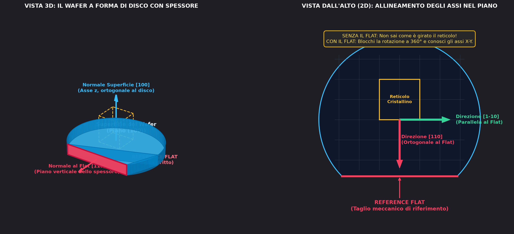

Per realizzare un substrato di silicio monocristallino si parte da un crogiolo ("pentolone") di silicio policristallino fuso ad altissima purezza. Si mette a contatto un piccolo seme monocristallino attaccato a un'asta, si tira su lentamente l'asta facendola ruotare (metodo Czochralski) e si ottiene un **lingotto cilindrico monocristallino** (*ingot*).

Prima di affettare il lingotto nei singoli wafer a disco, viene eseguito un taglio laterale longitudinale: il **Reference Flat**.

---

### 1. Dal Lingotto al Wafer: Perché il Flat è un "Piano Verticale"?

Il wafer ha uno spessore (forma a cilindro piatto / disco):
* **Nel lingotto (3D):** si fresa una faccia piana lungo tutta la lunghezza del cilindro. Questo taglio laterale è un **piano cristallografico verticale** (es. il piano $(110)$).
* **Nello slicing a fette:** tagliando il lingotto a dischi orizzontali, l'intersezione tra la superficie orizzontale e il piano verticale crea una **corda rettilinea sul bordo**: il *Reference Flat*.

> **In sintesi sullo spessore:** la parete piatta lungo lo spessore del wafer è a tutti gli effetti un piano cristallino verticale (es. $(110)$), mentre visto dall'alto sul disco appare come un bordo dritto.

---

### 2. A Cosa Serve il Reference Flat: Il Problema della Rotazione 3D

Per orientare univocamente un reticolo cristallino nello spazio servono due riferimenti indipendenti:

1. **La Superficie del Wafer (Faccia Orizzontale):**
   * Il produttore specifica che la faccia principale è orientata secondo un certo piano (es. piano $(100)$).
   * Questo fissa la **normale al disco** (la direzione ortogonale $[100]$ che "esce" dal wafer lungo l'asse $Z$).
   * *Il problema:* il wafer è un cerchio perfetto; può ruotare liberamente su se stesso di $360^\circ$. Guardando la superficie liscia a specchio è impossibile capire dove puntano gli assi reticolari nel piano del disco.

2. **Il Reference Flat (Bordo Dritto / Parete Laterale):**
   * Fissa la direzione degli atomi nel piano del disco: la direzione $[110]$ è **ortogonale alla parete piatta**, mentre $[1\bar{1}0]$ corre **parallela al taglio**.
   * Avendo fissato l'asse $Z$ ($[100]$) e l'asse nel piano ($[110]$), il reticolo 3D è bloccato e si conoscono tutte le altre direzioni per via geometrica (es. $[111]$).

---

### 3. Perché è Fondamentale nella Produzione

Conoscere l'orientamento nel piano serve per:
* **Taglio dei singoli chip (Dicing / Cleavage):** il silicio si spezza preferenzialmente lungo certi piani reticolari (piani $\{111\}$ o $\{110\}$). Allineare i tagli lungo queste direzioni evita fratture diagonali e scheggiature dei die, massimizzando la resa produttiva ([Yield e Costo per bit](../Famiglie%20Logiche/Famiglia%20Logica%20e%20Costo%20per%20Bit.md)).
* **Allineamento fotolitografico:** i macchinari usano il flat come riferimento meccanico e ottico per allineare le maschere rispetto al reticolo.
* **Attacco chimico anisotropo (Etching):** sostanze come $\text{KOH}$ scavano il silicio a velocità diverse a seconda dei piani cristallini.

---

*Pagine correlate:*
- [Famiglia Logica e Costo per Bit](../Famiglie%20Logiche/Famiglia%20Logica%20e%20Costo%20per%20Bit.md)
- [MOS](../Dispositivi%20e%20Componenti/MOS.md)
- [Resistore](../Dispositivi%20e%20Componenti/Resistore.md)
- [Condensatori](../Dispositivi%20e%20Componenti/Condensatori.md)
- [Difficoltà nel fare un componente ideale](../Scaling%20e%20Limiti%20Fisici/Difficolt%C3%A0%20nel%20fare%20un%20componente%20ideale.md)