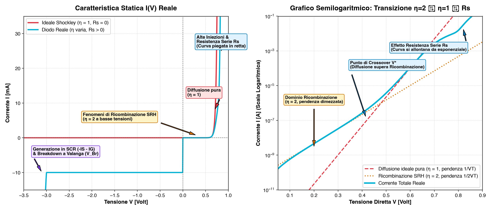
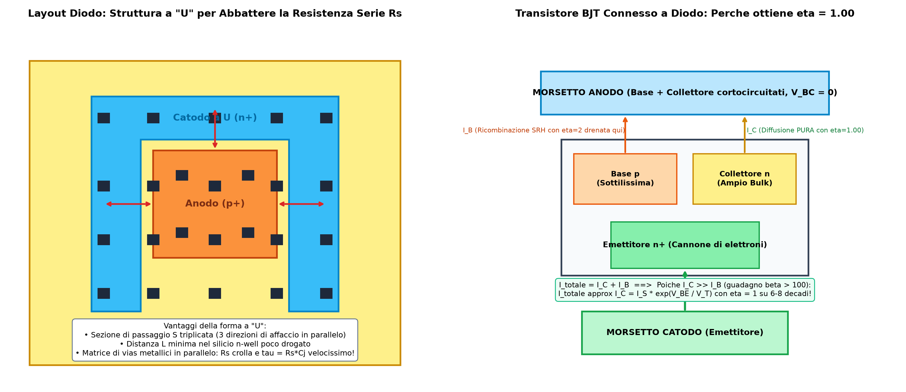

Il **diodo a giunzione $PN$** è la struttura fondamentale dell'elettronica a semiconduttore. 
Sul silicio integrato, il comportamento reale si discosta dal modello matematico ideale a causa di fenomeni di ricombinazione/generazione, effetti ad alte correnti e resistenze parassite distributive.

---

### 1. La Caratteristica Statica $I(V)$ Reale

L'equazione ideale di Shockley descrive la corrente come:
$$I = I_S \left( e^{\frac{V}{\eta V_T}} - 1 \right)$$
dove $V_T = \frac{k T}{q} \approx 26\text{ mV}$ è la tensione termica e $\eta$ è il **fattore di idealità** ($\eta = 1$ nel modello ideale).



Nel dispositivo reale si distinguono **4 regioni di funzionamento**:

#### A. Polarizzazione Inversa e Correnti di Fuga ($V < 0$)
In polarizzazione inversa la corrente totale è la somma di tre componenti distinte:
$$I_R = I_{diff} + I_{gen} + I_{leak}$$

* **Corrente di diffusione pura ($-I_{diff}$ o $-I_S$ ideale):** dovuta ai portatori minoritari generati termicamente nelle regioni neutre entro una lunghezza di diffusione ($L_n, L_p$) dalla giunzione. Diffondono verso la SCR e vengono spazzati dal campo elettrico. Scala con il quadrato della concentrazione intrinseca:
  $$I_{diff} \propto n_i^2 \propto \exp\left(-\frac{E_g}{k T}\right)$$
* **Corrente di generazione nella SCR ($-I_{gen}$ o $-I_G$):** nella zona di svuotamento non ci sono cariche libere ($p \cdot n \ll n_i^2$). I centri trappola SRH generano termicamente coppie elettrone-lacuna che il campo elettrico separa istantaneamente:
  $$I_{gen} = q \frac{n_i}{2 \tau_0} W(V_R) A \propto n_i \cdot \sqrt{V_{bi} + V_R}$$
* **Corrente di fuga superficiale / perimetrale ($I_{leak}$):** generata lungo il perimetro in cui la giunzione tocca l'ossido isolante superficiale ($\text{SiO}_2$), a causa dei difetti d'interfaccia.

> **Chi domina in silicio a $300\text{ K}$? Domina nettamente $I_{gen}$!**  
> Essendo $n_i \approx 10^{10}\text{ cm}^{-3}$ un numero piccolissimo, si ha $n_i \gg n_i^2$ (es. $10^{10} \gg 10^{20}$ a meno di costanti dimensionali). Di conseguenza $I_{diff}$ è dell'ordine dei $\text{fA}$ o $\text{pA}$, mentre $I_{gen}$ è di ordini di grandezza superiore ($\text{nA}$).  
> **Conseguenza pratica:** la corrente inversa reale **non è piatta**, ma cresce con la tensione inversa come $\sqrt{V_R}$ perché lo spessore $W$ si allarga.
* **Breakdown / Rottura Inversa ($V_{BR}$):** a tensioni elevate scattano l'effetto tunnel quantistico o la ionizzazione per impatto a valanga, facendo crollare la resistenza dinamica a zero ($r_z \approx 0$).
  👉 Approfondimento: [Breakdown e Diodo Zener](./Breakdown%20e%20Diodo%20Zener.md) per meccanismi microscopici, deriva termica e funzionamento da generatore di tensione.

#### B. Bassa Tensione Diretta e Ricombinazione SRH ($\eta = 2$)
A basse tensioni dirette ($0 < V < 0.4\text{ V}$), la barriera si abbassa appena: poche cariche entrano nella SCR e quasi tutte si ricombinano nei centri trappola a centro-gap prima di raggiungere le zone neutre.
* La corrente parassita di ricombinazione vale $I_{\text{rec}} = I_{R0} \cdot e^{\frac{V}{2 V_T}}$, con **fattore di idealità $\eta = 2$** (pendenza logaritmica dimezzata $q / 2kT$).
* **Diodo verticale (nel bulk) vs Diodo planare (superficiale):**
  * Nel **diodo verticale profondo** (o nel BJT), la giunzione è sepolta nel bulk monocristallino integro: la densità di trappole $N_t$ è bassissima e la vita media $\tau_0$ è alta $\implies I_{R0}$ è minuscolo.
  * Nel **diodo superficiale/laterale**, una frazione rilevante della giunzione confina con l'interfaccia $\text{Si}/\text{SiO}_2$: l'enorme quantità di legami pendenti (*dangling bonds*) e stati trappola superficiali (velocità di ricombinazione $s_0$) fa impennare $I_{R0}$, allargando la zona dominata da $\eta = 2$.
* **Perché $\eta = 2$ è un danno?**
  * **Peggior rapporto $I_{\text{on}}/I_{\text{off}}$ nel digitale:** la pendenza di sottosoglia vale $S = \eta \cdot \ln(10) \cdot V_T \approx \eta \cdot 60\text{ mV/decade}$. Con $\eta = 2$ servono $120\text{ mV}$ per ogni decade di spegnimento anziché $60\text{ mV}$: il componente è "pigro", si spegne male e genera elevate perdite a riposo.
    👉 Vedi: [Rapporto Ion Ioff e sottosoglia](../Introduzione/Effetti%20di%20canale%20corto/Rapporto%20Ion%20Ioff%20e%20sottosoglia.md)
  * **Perdita di precisione nell'analogico:** nei riferimenti di tensione Bandgap e circuiti PTAT, $\Delta V = \eta V_T \ln(I_1 / I_2)$ richiede $\eta = 1.00$ rigoroso.

#### C. Media Tensione Diretta e Diffusione Pura ($\eta = 1$)
Tra $0.4\text{ V} < V < 0.7\text{ V}$, la barriera di potenziale è sufficientemente abbattuta:
* La corrente utile di **diffusione ideale** scala con:
  $$I_{diff} \approx I_{S0} \cdot e^{\frac{V}{1 \cdot V_T}} \quad (\eta = 1)$$
* **Perché la diffusione "vince" sulla ricombinazione?**  
  Su scala semilogaritmica la pendenza di $I_{diff}$ ($q/kT$) è **doppia** rispetto a quella di ricombinazione ($q/2kT$). Crescendo molto più rapidamente, la corrente di diffusione supera nettamente quella di ricombinazione già prima dei $0.4\text{ V}$, dominando l'intera caratteristica nominale con $\eta = 1$.

#### D. Alta Tensione Diretta (Alte Iniezioni, Modulazione di Conducibilità e Resistenza Serie $R_s$)
Per tensioni $V > 0.7\text{--}0.8\text{ V}$ e correnti sostenute, la caratteristica abbandona l'andamento esponenziale a causa di fenomeni concorrenti:
1. **Alte iniezioni (*High-Level Injection* - HLI):** i minoritari iniettati eguagliano o superano il drogaggio di fondo del silicio ($p \approx n \ge N_D$). Per mantenere la neutralità di carica, la legge di giunzione si modifica e la corrente torna a dipendere da $\eta = 2$:
   $$I \propto e^{\frac{V}{2 V_T}}$$
   La pendenza logaritmica della giunzione dimezza di nuovo.
2. **Chi trasporta la corrente e incontra la resistenza? ($q N_A \mu_p$ vs $q N_D \mu_n$):**
   * Nel blocco neutro $P$, le cariche iniettate (elettroni minoritari) viaggiano per pura diffusione e si ricombinano entro una lunghezza di diffusione $L_n$.
   * Per la conservazione della carica, il morsetto metallico dell'Anodo deve iniettare costantemente nuove lacune per rimpiazzare quelle scomparse per ricombinazione.
   * Lontano dalla giunzione, la corrente è sostenuta al **$100\%$ dalle lacune maggioritarie che marciano per trascinamento (*drift*)** verso la giunzione.
   * La resistenza ohmica del blocco $P$ è quindi subita dalle **lacune maggioritarie** che urtano contro il reticolo: $\sigma_P \approx q \cdot N_A \cdot \mu_p$. Analogamente, nel blocco neutro $N$ la resistenza la incontrano gli **elettroni maggioritari**: $\sigma_N \approx q \cdot N_D \cdot \mu_n$.
3. **La Modulazione di Conducibilità (*Conductivity Modulation*):**
   * In forte iniezione, l'enorme massa di minoritari iniettati ($\Delta p \gg N_D$) costringe il silicio neutro a richiamare dal contatto altrettanti maggioritari per neutralità elettrostatica ($n \approx \Delta p \gg N_D$).
   * Il silicio neutro viene letteralmente "inondato" di cariche libere ($n$ e $p$): la conducibilità $\sigma = q(n \mu_n + p \mu_p)$ cresce di vari ordini di grandezza e la resistenza del blocco **crolla** (principio sfruttato nei dispositivi di potenza per non bruciare le regioni ad alta tensione).
4. **Resistenza serie parassita $R_s$ residua:** i contatti metallo-semiconduttore, le piste e il silicio neutro mantengono comunque una caduta ohmica $R_s \cdot I$. Poiché la tensione applicata si ripartisce come $V = V_{\text{giunzione}} + R_s I$:
   $$V_j = V - I \cdot R_s \implies I = I_S \exp\left(\frac{V - I R_s}{V_T}\right)$$
   Al crescere di $I$, la caduta ohmica sottrae tensione alla giunzione: **la componente lineare ohmica vince sull'esponenziale**:
   $$I \approx \frac{V - V_\gamma}{R_s}$$
   👉 Vedi: [Difficoltà nel fare un componente ideale](./Difficolt%C3%A0%20nel%20fare%20un%20componente%20ideale.md)

```text
 ln(I) ^
       |                                   / (Effetto Rs: piega lineare)
       |                                 / 
       |                               / (Alta iniezione: pendenza q/2kT, η=2)
       |                        /
       |                      /  (Diffusione pura: pendenza q/kT, η=1)
       |                    /
       |             / (Ricombinazione SRH: pendenza q/2kT, η=2)
       |           /
       |__________/ _________________________________
       |                                     V
```

---

### 2. Le Capacità di Giunzione e il Modello Circuitale Completo

Nel diodo a giunzione $PN$ operano **due capacità di natura fisica completamente diversa**:

```text
               POLARIZZAZIONE INVERSA (V < 0)         POLARIZZAZIONE DIRETTA (V > 0)
                   e bassissima diretta                      Media/alta diretta
                             │                                       │
                      Capacità di                             Capacità di
                   SVUOTAMENTO (Cj)                         DIFFUSIONE (Cd)
                             │                                       │
Origine:           Ioni fissi scoperti nella SCR           Portatori minoritari accumulati
                                                           nelle regioni neutre
Legge:             Cj ∝ 1 / √(Vbi - V)                     Cd ∝ ID ∝ exp(V / VT)
                   (variazione modesta)                    (esplosione esponenziale!)
```

#### A. Capacità di Svuotamento / Transizione ($C_j$ o $C_{dep}$)
* **Dove domina:** In **inversa ($V < 0$)** e a bassissima tensione diretta.
* **Origine fisica:** È una capacità puramente **elettrostatica**. Nella zona di carica spaziale (SCR) non ci sono cariche libere, ma solo ioni droganti scoperti ($N_D^+$ e $N_A^-$). Variando la tensione di $dV$, la larghezza $W$ si allarga o si restringe, scoprendo/ricoprendo ioni ai margini:
  $$C_j = \left| \frac{dQ_{SCR}}{dV} \right| = \frac{\epsilon_s A}{W(V)}$$
  È identica alla formula delle armature piane a distanza variabile $W(V)$:
  $$C_j(V) = \frac{C_{j0}}{\left(1 - \frac{V}{V_{bi}}\right)^m} \quad \left(m = \frac{1}{2} \text{ a gradino}, \ m = \frac{1}{3} \text{ graduale}\right)$$
* **Applicazione:** Diodi *Varicap* (capacità variabile controllata in tensione per filtri e oscillatori RF).
  👉 Vedi anche: [Condensatori](./Condensatori.md) per il confronto con i condensatori integrati MOS e PIP.

#### B. Capacità di Diffusione ($C_d$ o $C_{diff}$)
* **Dove domina:** In **polarizzazione diretta ($V > 0$)**.
* **Origine fisica:** **Non deriva dagli ioni fissi!** È dovuta alla carica di portatori minoritari stoccata nelle zone neutre durante la diffusione prima di ricombinarsi. La carica accumulata è proporzionale alla corrente:
  $$Q_{diff} = \tau_T \cdot I_D$$
  (con $\tau_T$ tempo di transito medio dei minoritari). Derivando rispetto alla tensione:
  $$C_d = \frac{dQ_{diff}}{dV} = \tau_T \frac{dI_D}{dV} = \tau_T \cdot g_d = \tau_T \frac{I_D}{V_T}$$
* **Impatto circuitale:** Poiché $I_D \propto e^{V/V_T}$, **$C_d$ esplode esponenzialmente** con la tensione (da $\text{pF}$ a centinaia di $\text{nF}$). Questa carica immagazzinata deve essere evacuata per spegnere il diodo, introducendo il **tempo di recupero inverso ($t_{rr}$)** che rende le giunzioni $PN$ lente a commutare rispetto ai diodi Schottky.
  👉 Approfondimento: [Transitori del diodo e capacità](./Transitori%20del%20diodo%20e%20capacita.md) per l'analisi dettagliata del regime quasi-stazionario, dei componenti anomali e delle due fasi dei transitori di accensione e spegnimento.

#### C. Circuito Equivalente Completo
Il modello a parametri concentrati riunisce tutti i rami fisici:
* La resistenza serie $R_s$ all'ingresso.
* Ai capi della giunzione intrinseca: il diodo ideale di Shockley ($\eta=1$) in parallelo con il ramo di ricombinazione SRH ($\eta=2$), il ramo di breakdown ($V_{BR}, r_z$), e le capacità dinamiche $C_{tot} = C_j(V) + C_d(I)$.

```text
                  Rs (Silicio neutro e contatti)
   Anodo o─────/\/\/\/\─────┬───────────────────────┬────────────o Catodo
                            │                       │
                       ┌────┴────┐             ┌────┴────┐
                       │  Diodo  │             │   Cj    │ (Svuotamento)
                       │ Ideale  │             └────┬────┘
                       │ Shockley│                  │
                       │ (η = 1) │             ┌────┴────┐
                       └────┬────┘             │   Cd    │ (Diffusione)
                            │                  └────┬────┘
                       ┌────┴────┐                  │
                       │ Ramo    │                  │
                       │ Ricomb. │                  │
                       │ (η = 2) │                  │
                       └────┬────┘                  │
                            │                       │
                       ┌────┴────┐                  │
                       │ Ramo    │                  │
                       │Breakdown│                  │
                       └────┬────┘                  │
                            └───────────────────────┘
```

---

### 3. Effetti di Seconda Dimensione (Fisica 2D nel Diodo Integrato)

Nei libri di base il diodo viene trattato come una sbarra unidimensionale (1D). Nei circuiti integrati è un dispositivo **planare bidimensionale (2D/3D)**:

```text
                           Finestra di diffusione
                              ┌─────────────┐
        Ossido (SiO2)         │  Contatto   │         Ossido (SiO2)
       ███████████████████████│   Metallo   │███████████████████████
       ───────────────────────┴─────────────┴───────────────────────
       Silicio:                 Anodo (p+)
                      ╭─────────────────────────────╮  <-- Raggio di curvatura rj
                      │                             │      sotto l'ossido!
                      │      CAMPO E PIATTO         │
       ═══════════════╪═════════════════════════════╪═══════════════
                      │                             │  <-- Bordo curvo:
                      │                             │      CAMPO E CONCENTRATO!
                      ╰─────────────────────────────╯      (Breakdown anticipato!)
                                   Catodo (n-well)
```

1. **Effetto Curvatura ai Bordi (*Junction Curvature*):**
   * I droganti diffondono anche lateralmente sotto la maschera di ossido, creando spigoli curvi cilindrici e sferici con raggio di curvatura $r_j$.
   * Per la legge di Gauss (*effetto punta*), le linee di campo elettrico si addensano sulla superficie curva: $\mathcal{E}_{bordo} > \mathcal{E}_{piano}$.
   * **Risultato:** il breakdown in inversa si innesca **prima sui bordi curvi che sul fondo piano**, abbassando la tensione di rottura reale del componente ($V_{BR, 2D} < V_{BR, 1D}$).
   👉 Approfondimento: [Breakdown e Diodo Zener](./Breakdown%20e%20Diodo%20Zener.md).
2. **Affollamento di Corrente (*Current Crowding*):**
   * Poiché Anodo e Catodo si trovano entrambi sulla superficie superiore del silicio, le cariche seguono il percorso a minima resistenza ohmica.
   * La corrente non si ripartisce uniformemente sul fondo, ma si ammucchia sul perimetro rivolto verso il contatto di Catodo. Questo impone geometrie di layout a "U" o interdigitate per distribuire il flusso.
3. **Ripartizione Area / Perimetro:**
   * Capacità e correnti non dipendono solo dall'area piana di fondo, ma si scompongono in:
     $$C_{tot} = C_{area} \cdot \text{Area} + C_{perim} \cdot \text{Perimetro}$$
     $$I_{leak} = J_{area} \cdot \text{Area} + J_{perim} \cdot \text{Perimetro}$$
   * Il perimetro tocca l'ossido $\text{SiO}_2$ carico di difetti e possiede uno spessore $W$ curvo, dominando le perdite a basse correnti.

---

### 4. Anatomia del Diodo Integrato: La Struttura $p^+ - n^- - n^+$

Nel flusso CMOS standard, il diodo viene ricavato all'interno di una $n\text{-well}$:



1. **La Giunzione $p^+ - n^-$ asimmetrica:**
   La giunzione attiva vera e propria è formata tra la sacca fortemente drogata $p^+$ (Anodo) e la $n\text{-well}$ poco drogata $n^-$.
   Poiché $N_A (p^+) \gg N_D (n\text{-well})$, la regione di svuotamento si estende quasi al $100\%$ all'interno della $n\text{-well}$ ($W \propto \sqrt{1/N_D}$).
2. **Il ruolo della sacca $n^+$ (Contatto Ohmico):**
   Non serve a creare una seconda giunzione, ma a garantire un **contatto ohmico a bassa resistenza con il metallo del Catodo**:
   * Se appoggiassimo il metallo direttamente sul silicio poco drogato della $n\text{-well}$, si formerebbe una barriera Schottky rettificante (un **diodo Schottky parassita** che bloccherebbe la corrente!).
   * L'iper-drogaggio $n^+$ rende la barriera metallo-silicio così sottile da essere scavalcata per **effetto tunnel** quantistico, azzerando la resistenza di contatto.
3. **Differenza rispetto a un vero Diodo PIN ($P-I-N$):**
   In un diodo PIN lo strato centrale è **silicio intrinseco (non drogato)** molto spesso:
   * **Capacità parassita $C_j \to 0$:** avendo $W$ grande, azzera la capacità per **interruttori e attenuatori RF/microonde**.
   * **Fotodiodi PIN:** la zona $I$ fa da enorme volume di cattura per generare coppie ottiche con la luce.
   * **Altissima tensione:** sopporta migliaia di Volt senza rottura.
   Nel CMOS standard, la $n\text{-well}$ è invece semplicemente poco drogata ($n^-$), realizzando un diodo $p^+-n$ asimmetrico.

---

### 5. Perché NON Drogare Forte la $n\text{-well}$ (Evitare la Giunzione $p^+-n^+$)?

Verrebbe spontaneo pensare di drogare forte la $n\text{-well}$ ($n^+$) per abbattere la resistenza parassita, ma fare una giunzione $p^+-n^+$ distruggerebbe il componente:

1. **Breakdown a soli $2-3\text{ V}$ ([Diodo Zener](./Breakdown%20e%20Diodo%20Zener.md)):**
   Con $N_A$ e $N_D$ entrambi elevati, la regione di svuotamento $W \approx \sqrt{1/N_A + 1/N_D}$ si riduce a pochi nanometri. A soli $2-3\text{ V}$ di tensione inversa il campo elettrico interno supera $10^6\text{ V/cm}$, innescando l'**effetto tunnel (rottura Zener)**: il diodo perde la capacità di bloccare tensioni inverse normali.
2. **Capacità Parassita $C_j$ Gigantesca ($C_j = \frac{\epsilon A}{W}$):**
   Essendo $W$ microscopica, la capacità parassita sale di $50-100$ volte, rallentando drasticamente il circuito con costanti di tempo $\tau = R C_j$ inaccettabili.
3. **Incompatibilità con i Transistori [MOS](./MOS.md) (PMOS):**
   La $n\text{-well}$ è la stessa sacca in cui vengono costruiti tutti i transistori **PMOS** del chip:
   * Con una $n\text{-well}$ drogata $n^+$, la tensione di soglia $|V_{thp}|$ salirebbe a $3-4\text{ V}$ (impossibile da accendere a tensioni logiche standard).
   * La mobilità delle lacune $\mu_p$ crollerebbe per l'eccessivo scattering ionico con i droganti.
   * Le giunzioni di Source e Drain dei PMOS andrebbero in breakdown a $2\text{ V}$.

---

### 6. Layout del Diodo Integrato: La Struttura a "U"

Per minimizzare la resistenza parassita della $n\text{-well}$ poco drogata e contrastare l'**affollamento di corrente (current crowding)** periferico, si ottimizza la geometria del layout:
* La resistenza parassita vale $R_s = \rho \frac{L}{S}$.
* **Sezione $S$ triplicata:** sagomando il Catodo a forma di "U" intorno all'Anodo, la corrente scorre su tre fronti in parallelo contemporaneamente.
* **Percorso $L$ ridotto al minimo:** Anodo e Catodo sono affacciati a distanza minima su tutto il perimetro.
* **Matrice di Vias:** contatti metallici multipli in parallelo azzerano la resistenza di contatto.
* **Risultato:** $R_s$ crolla, abbattendo il ritardo $R_s C_j$ per commutazioni ad altissima velocità.
  👉 Vedi: [Vias](./Vias.md) e [Siliciuro](./Siliciuro.md)

---

### 7. Diodo Realizzato da BJT (Transistore Connesso a Diodo)

Nei circuiti analogici di precisione si preferisce realizzare il diodo prendendo un transistore bipolare [BJT](./BJT.md) e **cortocircuitando la Base con il Collettore** ($V_{BC} = 0$).

#### Perché il BJT connesso a diodo garantisce $\eta \approx 1.00$ ideale?
1. **Filtro naturale della ricombinazione:**
   Le cariche che subiscono ricombinazione SRH nella zona di svuotamento vengono drenate sul morsetto di Base ($I_B$). La corrente principale che attraversa il dispositivo ed esce dal Collettore ($I_C$) è composta unicamente dalle cariche che hanno attraversato la base per pura diffusione:
   $$I_C = I_S \cdot e^{\frac{V_{BE}}{V_T}} \quad (\text{con } \eta = 1.00 \text{ esatto!})$$
   Poiché $I_C \gg I_B$ (grazie al guadagno $\beta > 100$), la corrente totale $I_{\text{tot}} \approx I_C$ mantiene $\eta = 1$ su oltre **6-8 decadi di corrente**.
2. **Giunzione sepolta nel bulk profondo:**
   Mentre in un diodo planare la giunzione tocca la superficie ricca di difetti sotto l'ossido $\text{SiO}_2$, in un [BJT](./BJT.md) verticale la giunzione attiva E-B si trova in profondità nel silicio monocristallino perfetto. La densità di trappole $N_t$ è quasi nulla $\implies I_{R0}$ è minuscolo e la ricombinazione è soppressa.

---

*Pagine correlate:*
- [Transitori del diodo e capacità](./Transitori%20del%20diodo%20e%20capacita.md)
- [Breakdown e Diodo Zener](./Breakdown%20e%20Diodo%20Zener.md)
- [BJT](./BJT.md)
- [MOS](./MOS.md)
- [Difficoltà nel fare un componente ideale](./Difficolt%C3%A0%20nel%20fare%20un%20componente%20ideale.md)
- [Siliciuro](./Siliciuro.md)
- [Vias](./Vias.md)
- [Resistore](./Resistore.md)
- [Rapporto Ion Ioff e sottosoglia](../Introduzione/Effetti%20di%20canale%20corto/Rapporto%20Ion%20Ioff%20e%20sottosoglia.md)
- [Analogico non si scende di dimensioni](../Introduzione/Analogico%20non%20si%20scende%20di%20dimensioni.md)
